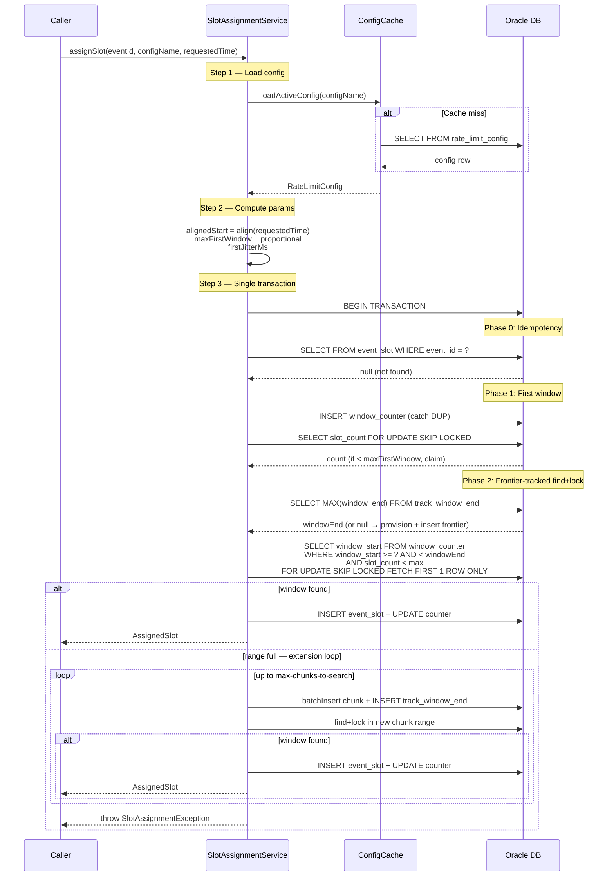
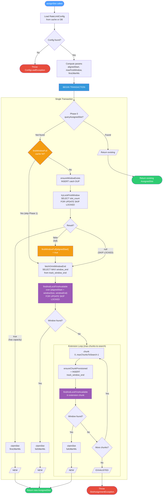

# Payments Rate Limiter

Oracle-based rate limiter for high-throughput event scheduling. Exposes a REST API that assigns
rate-limited time slots to events, enforcing a configurable maximum events per time window.

Two equivalent implementations with identical logic:
- **Kotlin/Exposed** (`SlotAssignmentServiceV3`) — single `transaction {}` block
- **PL/SQL** (`SlotAssignmentServiceV3Sql`) — single JDBC round trip

## Quick Start

### Prerequisites

- **JDK**: 21
- **Docker & Docker Compose**: For local Oracle 19c

### 1. Start Oracle and create the schema user

```bash
./scripts/setup-oracle.sh
```

This script:
- Starts Oracle 19c via Docker Compose (`codeassertion/oracledb-arm64-standalone`)
- Waits for the database to be ready (2-4 minutes on first run)
- Creates the `rate_limiter` user in the `ORCLPDB1` pluggable database
- Grants necessary permissions

### 2. Start the application

```bash
./gradlew quarkusDev
```

Flyway will automatically create the tables on startup.

### 3. Seed the default rate limit config

```bash
curl -X POST http://localhost:8080/admin/rate-limit/config \
  -H 'Content-Type: application/json' \
  -d '{
    "configName": "default",
    "maxPerWindow": 100,
    "windowSize": "PT4S"
  }'
```

### 4. Assign a slot

```bash
curl -X POST http://localhost:8080/api/v1/slots \
  -H 'Content-Type: application/json' \
  -d "{
    \"eventId\": \"$(uuidgen)\",
    \"configName\": \"default\",
    \"requestedTime\": \"2025-06-01T12:00:00Z\"
  }"
```

Response:
```json
{
  "eventId": "pay-123",
  "scheduledTime": "2025-06-01T12:00:02.371Z",
  "delayMs": 2371
}
```

## System Overview

```
                     CALLER (up to 1M events/day)
                                |
                                v
                +-------------------------------+
                |    POST /api/v1/slots          |
                |    SlotAssignmentResource      |
                +-------------------------------+
                                |
                  +-------------+-------------+
                  |                           |
           +-----------+               +-----------+
           | Kotlin/   |               | PL/SQL    |
           | Exposed   |               | Single    |
           | 1 txn     |               | round trip|
           +-----------+               +-----------+
                  |                           |
                  +-------------+-------------+
                                |
           +--------------------+--------------------+
           |                    |                    |
    +-----------+        +-----------+        +-----------+
    | Window 0  |        | Window 1  |        | Window N  |
    | t+0s..t+4s|        | t+4s..t+8s|        | ...       |
    | max 100   |        | max 100   |        | max 100   |
    +-----------+        +-----------+        +-----------+
                                |
                                v
                +-------------------------------+
                |  Response:                    |
                |    eventId, scheduledTime,     |
                |    delayMs                    |
                +-------------------------------+
```

## REST API

### Slot Assignment

**POST** `/api/v1/slots`

Assigns a rate-limited time slot for the given event. Idempotent: calling with the same
`eventId` returns the same slot.

**Request:**
```json
{
  "eventId": "pay-123",
  "configName": "default",
  "requestedTime": "2025-06-01T12:00:00Z"
}
```

**Response (200 OK):**
```json
{
  "eventId": "pay-123",
  "scheduledTime": "2025-06-01T12:00:02.371Z",
  "delayMs": 2371
}
```

| Field | Description |
|---|---|
| `eventId` | Echo of the input event ID |
| `scheduledTime` | Actual assigned execution time (ISO-8601) |
| `delayMs` | Milliseconds between `requestedTime` and `scheduledTime` |

**Error Responses:**
- `404` — Config not found for the given `configName`
- `503` — All windows within the search depth are full

### Admin: Config Management

**GET** `/admin/rate-limit/config?name=default` — Get active config

**POST** `/admin/rate-limit/config` — Create/update config (deactivates previous)
```json
{
  "configName": "default",
  "maxPerWindow": 100,
  "windowSize": "PT4S"
}
```

**POST** `/admin/rate-limit/cache/flush` — Force-evict in-memory config cache

---

## How the Rate Limiter Works

### Window Model

Time is divided into fixed-size windows (default: 4 seconds). Each window has a maximum
capacity (default: 100 events). When an event requests execution at time T:

1. **Snap** T to the epoch-aligned window boundary (floor): `windowStart = T - (T % windowSize)`
2. **Proportional capacity**: if T is mid-window, the first window's effective max = `floor(maxPerWindow * remainingTime / windowSize)`. Jitter is constrained to `[elapsedMs, windowSizeMs)` so `scheduledTime >= T`. Subsequent windows use full `maxPerWindow`.
3. **Lock** the window counter row
4. **Check** capacity
5. **If available**: insert slot record, increment counter, compute `scheduled_time = windowStart + jitter`
6. **If full or contended**: skip to next available window
7. **Return** the `AssignedSlot` with `scheduledTime` and `delay`

### Algorithm

Three-phase approach within a single transaction:

**Phase 0 — Idempotency**: Check if event already has a slot. If yes, return it.

**Phase 1 — First Window**: Try the epoch-aligned window at `alignedStart` with proportional capacity and constrained jitter. Uses `SELECT FOR UPDATE SKIP LOCKED` to acquire a lock.

**Phase 2 — Frontier-Tracked Find+Lock**:
1. **Get frontier**: Read `SELECT MAX(window_end) FROM track_window_end WHERE requested_time = alignedStart`. If null, provision the initial chunk and insert the frontier row.
2. **Full-range scan**: `findAndLockFirstAvailable(alignedStart + windowSize, windowEnd)` — a single `SELECT ... FOR UPDATE SKIP LOCKED FETCH FIRST 1 ROW ONLY` over the entire provisioned range.
3. **Extension loop**: If the range is full, extend from the frontier up to `max-chunks-to-search` (default 2) chunks. Each iteration: provision a chunk, append a new frontier row, and run find+lock over the new range. Client retries naturally extend further.

### Frontier Tracking (`track_window_end`)

The `track_window_end` table is **append-only** with a composite PK `(requested_time, window_end)`:
- **Read**: `SELECT MAX(window_end)` — returns the furthest provisioned boundary
- **Write**: `INSERT (alignedStart, chunkEnd)` — catch DUP silently
- **No UPDATEs**: Concurrent threads inserting the same frontier row deduplicate via the PK constraint. No contention.

This eliminates the tail-end scanning problem: instead of starting from chunk 0 every time, requests jump directly to the provisioning frontier.

### Concurrency

`SELECT ... FOR UPDATE SKIP LOCKED FETCH FIRST 1 ROW ONLY` — atomically finds the earliest non-full window while skipping any rows locked by other sessions. One query skips all contended rows (set-based), not one-by-one.

### Pre-Provisioning

Windows are batch-provisioned in chunks (`max-windows-in-chunk`, default 100). An existence-check guard on the last window in each chunk prevents thundering herd: the first thread provisions, subsequent threads skip via the guard.

### Random Jitter

Jitter is computed using `ThreadLocalRandom` and applied so events spread uniformly within each window:

```kotlin
// First window (partial): constrain jitter so scheduledTime >= requestedTime
firstJitterMs = ThreadLocalRandom.nextLong(elapsedMs, windowSizeMs)

// Subsequent windows (full): jitter spans entire window
fullJitterMs  = ThreadLocalRandom.nextLong(0, windowSizeMs)
```

Random jitter is used exclusively because when `max_per_window` is increased dynamically,
new events must not cluster on deterministic grid points left by previously assigned events.

### Idempotency

Each event is identified by a unique `event_id`. Calling `assignSlot()` twice with the
same `event_id` returns the same `AssignedSlot`. A UNIQUE constraint on `event_id`
prevents duplicate assignments under concurrent access.

### Config-Agnostic Counters

The `rate_limit_window_counter` table tracks total events assigned to each window,
regardless of which config version was active when each slot was assigned. This means:

- **Increasing capacity**: New config sees existing occupancy. If window has 80 slots
  and new config allows 200, 120 more slots are available.
- **Decreasing capacity**: Window with 80 slots under old max=100, new max=50: window
  is treated as full. Already-scheduled events are immutable.

---

## Sequence Diagram



---

## Flow Diagram



---

## Algorithm: Analysis

### Key Features

| Feature | Mechanism |
|---|---|
| **Epoch-aligned windows** | `windowStart = epochSec - (epochSec % windowSizeSecs)` — deterministic, no drift |
| **Proportional first-window capacity** | `maxFirstWindow = floor(maxPerWindow × remainingMs / windowSizeMs)` — prevents overscheduling in a partially-elapsed window |
| **Frontier-tracked search** | Append-only `track_window_end` table tracks the provisioned boundary per `alignedStart`. New requests jump directly to the frontier instead of scanning from chunk 0 |
| **Single find+lock query** | `SELECT ... WHERE slot_count < max ORDER BY window_start FOR UPDATE SKIP LOCKED` — atomically finds the earliest available window and locks it in one query |
| **Configurable chunk extensions** | `max-chunks-to-search` (default 2) controls how many additional chunks are provisioned and searched when the initial range is full |
| **Idempotency** | Phase 0 pre-check + `UNIQUE(event_id)` constraint with `DUP_VAL_ON_INDEX` recovery — duplicate calls return the same slot without incrementing counters |
| **SKIP LOCKED concurrency** | Row-level locking skips contended rows instead of blocking — concurrent threads don't wait for each other |
| **JVM-local first-window cache** | `ConcurrentHashMap<Instant, Boolean>` caches exhausted first windows to skip re-locking |
| **Config-agnostic counters** | `slot_count` tracks total usage regardless of which config version assigned each slot — capacity changes take effect immediately on existing windows |
| **Random jitter** | Events spread uniformly within windows via `ThreadLocalRandom`. First window: `[elapsedMs, windowSizeMs)`. Subsequent windows: `[0, windowSizeMs)` |

### Performance Bottlenecks

#### 1. Chunk Provisioning Cost

`ensureChunkProvisioned()` inserts `maxWindowsInChunk` (default 100) rows per chunk. The PL/SQL implementation uses a loop with individual INSERTs (each catching `DUP_VAL_ON_INDEX`). The Kotlin implementation uses `batchInsert` but still issues 100 rows per chunk. The first thread to hit an unprovisioned chunk pays the full provisioning cost; subsequent threads skip via the existence-check guard on the last window.

#### 2. Full-Range Scan Degradation

`findAndLockFirstAvailableWindow()` scans `WHERE slot_count < maxPerWindow ORDER BY window_start FOR UPDATE SKIP LOCKED`. As windows fill up, the query walks past all full rows before finding an available one. The index `idx_window_counter_slot_start` on `(slot_count, window_start)` helps when `slot_count < maxPerWindow` is selective, but degrades as most windows approach capacity.

#### 3. Sequential Extension Loop

Each extension chunk must be provisioned and scanned before the next. There is no parallelism between chunks — the loop is strictly sequential within one transaction.

#### 4. Long-Held Transaction Locks

A single transaction spans all phases: idempotency check, first-window lock, frontier read, chunk provisioning, find+lock scan, and extension loop. The locked window row is held for the entire duration, which includes provisioning new chunks (100 INSERTs each).

#### 5. Frontier Read Overhead

`SELECT MAX(window_end) FROM track_window_end WHERE requested_time = ?` scans all frontier rows for a given `requestedTime`. The row count grows linearly with extension iterations across all clients — each extension appends a new row.

#### 6. JVM-Local First-Window Cache

`firstWindowFull` is a `ConcurrentHashMap` — not shared across nodes. In a multi-node deployment, each node independently discovers full first-windows by attempting and failing the lock. There is no cross-node eviction.

### Functional Limitations

#### 1. First-Window Cache Memory Leak

`firstWindowFull` has no TTL eviction in production. `evictFirstWindowCache()` exists for tests only. Long-running instances accumulate stale entries for past windows that will never be used again.

#### 2. Other Limitations

See [Known Limitations](#known-limitations) for: shared windows across `requestedTime` values, config propagation delay (5s cache TTL), no business-hours awareness, and search depth exhaustion.

### Time Complexity

Let **W** = `max-windows-in-chunk` (default 100), **C** = `max-chunks-to-search` (default 2), **M** = `max_per_window`.

| Scenario | Time Complexity | DB Operations | Windows Scanned | Rows Provisioned |
|---|---|---|---|---|
| **Best: Idempotent hit** (Phase 0) | O(1) | 1 SELECT | 0 | 0 |
| **Best: First window available** (Phase 1) | O(1) | ~5 (SELECT + INSERT + SELECT FOR UPDATE + INSERT + UPDATE) | 1 | 0–1 |
| **Average: Slot in provisioned range** (Phase 2) | O(W) | ~5 + 1 SELECT MAX + 1 range scan | up to W | 0 (or W if first to provision) |
| **Worst: Extension loop** (Phase 3) | O(W × (1 + C)) | Phase 2 + C × (W INSERTs + 1 INSERT frontier + 1 range scan) | W × (1 + C) | C × W |
| **Worst: Exhaustion** | O(W × (1 + C)) | Same as Phase 3 | W × (1 + C) | C × W |

With defaults (W=100, C=2): worst case scans up to **300 windows** and provisions up to **200 additional rows**.

**Throughput ceiling**: At steady state with concurrent load, throughput is bounded by:
- **Lock contention**: Each `claimSlot()` holds a row lock for INSERT + UPDATE. With M slots per window and W windows provisioned, up to W concurrent threads can claim simultaneously (one per window).
- **Provisioning bottleneck**: The first thread to exhaust a range pays O(W) INSERTs while holding the transaction open. Other threads hitting the same range are either SKIP LOCKED'd or wait for provisioning.

---

## Configuration Reference

All properties are set in `src/main/resources/application.yaml`:

| Property | Description | Default |
|---|---|---|
| `rate-limiter.default-config-name` | Name of the default rate limit config | `default` |
| `rate-limiter.max-windows-in-chunk` | Windows per provisioning chunk | `100` |
| `rate-limiter.max-chunks-to-search` | Extension iterations after initial range scan | `2` |
| `rate-limiter.headroom-windows` | Legacy: windows beyond skip target to search | `100` |
| `quarkus.datasource.db-kind` | Database type | `oracle` |
| `quarkus.datasource.jdbc.url` | Oracle JDBC URL | `jdbc:oracle:thin:@localhost:1521/ORCLPDB1` |
| `quarkus.datasource.username` | Oracle username | `rate_limiter` |
| `quarkus.datasource.password` | Oracle password | `rate_limiter` |
| `quarkus.datasource.jdbc.min-size` | Minimum connection pool size | `5` |
| `quarkus.datasource.jdbc.max-size` | Maximum connection pool size | `30` |
| `quarkus.flyway.migrate-at-start` | Run Flyway migrations at startup | `true` |

## Docker Setup

The project includes a `docker-compose.yml` and setup script for Oracle 19c:

```bash
# Start Oracle and create the rate_limiter user
./scripts/setup-oracle.sh

# Or manually via docker-compose
docker compose up -d oracle
```

The Docker setup uses [`codeassertion/oracledb-arm64-standalone:19.3.0-enterprise`](https://hub.docker.com/r/codeassertion/oracledb-arm64-standalone),
which supports ARM64 (Apple Silicon M1/M2/M3).

**Connection details after setup:**

| Parameter | Value |
|---|---|
| JDBC URL | `jdbc:oracle:thin:@localhost:1521/ORCLPDB1` |
| Username | `rate_limiter` |
| Password | `rate_limiter` |

### Stopping and cleaning up

```bash
# Stop Oracle (data persists in Docker volume)
docker compose down

# Stop and remove data
docker compose down -v
```

## Dynamic Config Update Guide

### Increasing Capacity

To increase from 100 to 200 events per window:

```bash
curl -X POST http://localhost:8080/admin/rate-limit/config \
  -H 'Content-Type: application/json' \
  -d '{
    "configName": "default",
    "maxPerWindow": 200,
    "windowSize": "PT4S"
  }'
```

This inserts a new config row and deactivates the old one. The change takes effect
within 5 seconds (cache TTL) on all nodes.

**What happens**: Windows partially filled under the old config continue filling under
the new limit. Existing scheduled events are never modified.

### Decreasing Capacity

Same API, lower value. Windows already exceeding the new limit are treated as full.
No existing events are cancelled.

**What NOT to change**:
- Do not change `window_size` while events are in-flight. This changes the window
  boundaries and makes existing counter rows meaningless.
- Do not manually edit `rate_limit_window_counter` rows.
- Do not delete `rate_limit_config` rows — deactivate them instead.

### Cache Flush (Urgent Changes)

For immediate propagation across all nodes:

```bash
curl -X POST http://localhost:8080/admin/rate-limit/cache/flush
```

## Observability

### Key Log Messages

- `INFO  SlotAssignmentService - Assigned slot for eventId={} in window={}`
- `DEBUG SlotAssignmentService - Idempotent hit for eventId={}`
- `ERROR SlotAssignmentService - Could not assign slot for event {} after searching`
- `INFO  RateLimitConfigRepository - Config cache miss for {configName}, loaded from DB`

## Known Limitations

1. **TPS guarantee is statistical, not absolute**: Random jitter within windows means
   instantaneous bursts can theoretically exceed the per-window limit for brief
   sub-second intervals.

2. **Search depth exhaustion**: If a single burst exceeds `(max_windows_in_chunk + max_chunks_to_search * max_windows_in_chunk) * maxPerWindow`
   events per request, slot assignment fails. Client retries naturally extend the frontier further.

3. **Config propagation delay**: Config changes take up to 5 seconds (cache TTL) to
   propagate to all nodes. Use the cache flush endpoint for immediate propagation.

4. **No business-hours awareness**: The window model advances linearly through time
   with no concept of business hours or blackout periods.

5. **Shared windows across different `requestedTime` values**: When two requests with
   different `requestedTime` values share the same epoch-aligned window, the capacity
   limit applied depends on which request's phase touches the window first. For example,
   request A at `12:00:01` has `alignedStart=12:00:00` and overflows to window `12:00:04`
   using `maxPerWindow` (Phase 2). Request B at `12:00:05` has `alignedStart=12:00:04`
   and treats that same window as its first window with proportional capacity
   (`maxFirstWindow`). If request A already filled `12:00:04` to `maxPerWindow`, request B
   sees it as full even though its own proportional limit hasn't been reached. The
   `slot_count` column tracks total usage regardless of which `requestedTime` caused it,
   so per-requestedTime capacity enforcement on a shared window is not possible without a
   schema change (e.g., per-`requestedTime` slot tracking per window).

## Operational Runbook

### Windows Filling Up (Search Depth Approaching Limit)

**Symptom**: Logs show slot assignment exceptions or high search depths.

**Action**:
1. Check current config: `GET /admin/rate-limit/config`
2. If safe, increase `maxPerWindow`: `POST /admin/rate-limit/config`
3. Increase `max-chunks-to-search` to allow deeper in-request searching
4. Check logs for `SlotAssignmentException` — if present, events are being rejected. Client retries will naturally extend the frontier.

### Oracle Slow / Unavailable

**Symptom**: Logs show slow assignment times or connection pool exhaustion warnings.

**Action**:
1. Check Oracle AWR/ASH reports for contention.
2. Verify connection pool is not exhausted: check Quarkus Agroal datasource logs.
3. If Oracle is down, the caller should retry with backoff.
