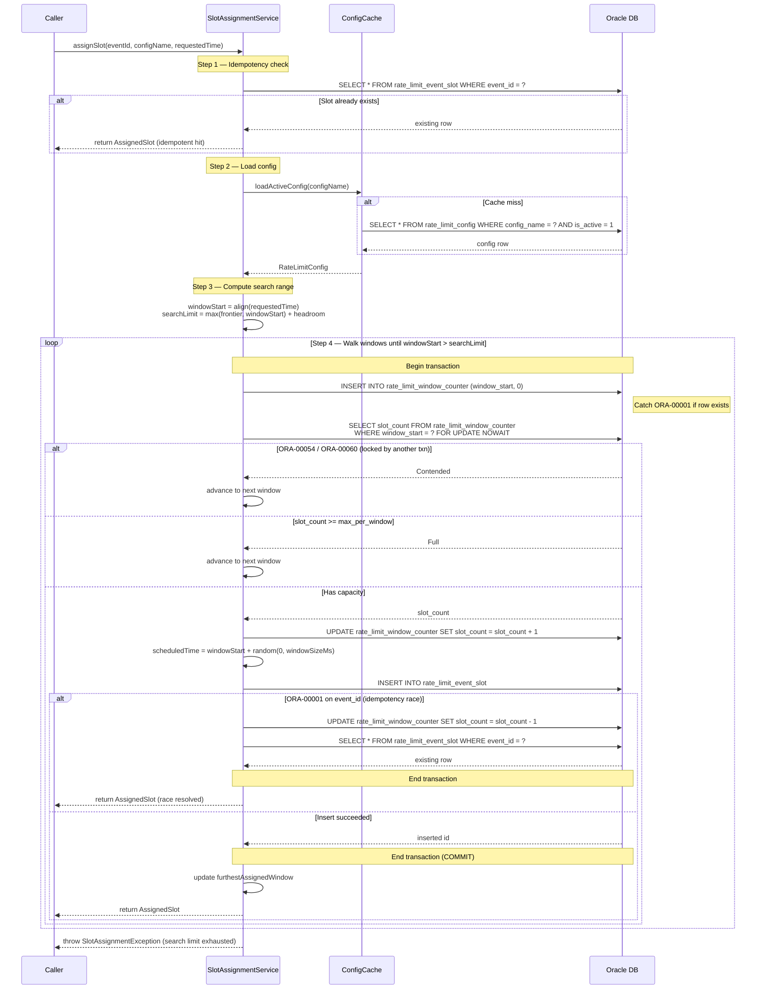

# Payments Rate Limiter

Oracle-based rate limiter for a high-throughput payments scheduling system using Temporal workflows.

## System Overview

```
                         BULK FEED (up to 1M events/day)
                                    |
                                    v
                    +-------------------------------+
                    |    PaymentInitWorkflow         |
                    |    (Temporal - Phase 1)        |
                    |                               |
                    |  1. Parse payment records     |
                    |  2. Persist context to Oracle  |
                    |  3. Call RateLimitedScheduler  |
                    +-------------------------------+
                                    |
                    +-------------------------------+
                    |   RateLimitedScheduler         |
                    |                               |
                    |  1. SlotAssignmentService      |
                    |     assigns time slot          |
                    |  2. Computes startDelay        |
                    |  3. Starts PaymentExecWorkflow |
                    +-------------------------------+
                                    |
           +------------------------+------------------------+
           |                        |                        |
    +-----------+            +-----------+            +-----------+
    | Window 0  |            | Window 1  |            | Window N  |
    | t+0s..t+4s|            | t+4s..t+8s|            | ...       |
    | max 100   |            | max 100   |            | max 100   |
    +-----------+            +-----------+            +-----------+
           |                        |                        |
           v                        v                        v
    +--------------------------------------------------------------+
    |              PaymentExecWorkflow (Phase 2)                   |
    |  - Starts at scheduled_time via Temporal startDelay          |
    |  - Executes payment via downstream API (<=50 TPS)            |
    |  - Writes audit log to Oracle                                |
    +--------------------------------------------------------------+
                                    |
                                    v
                        DOWNSTREAM PAYMENT API
                         (hard limit: 50 TPS)
```

### Architecture Rationale

The two-phase Temporal workflow design shifts long-lived state management out of Temporal
and into Oracle. Instead of one workflow sleeping until execution time (which keeps a Temporal
execution record alive for hours), we:

1. **Phase 1** (PaymentInitWorkflow): Quickly assigns a slot and starts Phase 2 with `startDelay`.
2. **Phase 2** (PaymentExecWorkflow): Short-lived — starts at the scheduled time, executes, and completes.

This achieves ~200x reduction in Temporal DB (Aurora Postgres) pressure.

## How the Rate Limiter Works

### Window Model

Time is divided into fixed-size windows (default: 4 seconds). Each window has a maximum
capacity (default: 100 events). When a payment event requests execution at time T:

1. **Snap** T to the nearest window boundary: `windowStart = T - (T % windowSize)`
2. **Lock** the window counter row with `SELECT FOR UPDATE NOWAIT`
3. **Check** if `slot_count < max_per_window`
4. **If yes**: increment counter, compute `scheduled_time = windowStart + random(0, windowSize)`, insert slot record
5. **If no (full)** or **contended (NOWAIT bounce)**: advance to the next window and repeat
6. **Return** the `scheduled_time`; caller computes `startDelay = scheduledTime - Instant.now()`

### Random Jitter

All offsets within a window use uniformly random jitter:

```
offset = Random.nextLong(0, windowSizeMs)
scheduled_time = windowStart + offset
```

Random jitter is used exclusively because when `max_per_window` is increased dynamically,
new events must not cluster on deterministic grid points left by previously assigned events.
At high volumes (100+ per window), random distribution is practically uniform.

### Config-Agnostic Counters

The `rate_limit_window_counter` table tracks total events assigned to each window,
regardless of which config version was active when each slot was assigned. This means:

- **Increasing capacity**: New config sees existing occupancy. If window has 80 slots
  and new config allows 200, 120 more slots are available.
- **Decreasing capacity**: Window with 80 slots under old max=100, new max=50: window
  is treated as full. Already-scheduled events still fire (immutable).

### Concurrency Control

- `SELECT FOR UPDATE NOWAIT` serializes concurrent writers per window row.
- `NOWAIT` means threads that lose the lock race immediately skip to the next window.
- This prevents thread convoys during bulk ingestion — essential when 10K+ events
  target the same time window.

### Idempotency

Each event is identified by a unique `event_id`. Calling `assignSlot()` twice with the
same `event_id` returns the same `AssignedSlot`. A UNIQUE constraint on `event_id`
prevents duplicate assignments under concurrent access.

### Slot Assignment Sequence Diagram



## Prerequisites

- **JDK**: 17 or later
- **Quarkus CLI**: 3.x (optional, for `quarkus dev`)
- **Oracle**: 19c or 21c (or Oracle XE for local development)
- **Oracle JDBC Driver**: ojdbc11 (included via Gradle dependency)
- **Temporal Server**: Latest, with Java SDK
- **Docker & Docker Compose**: For local Oracle XE and Temporal dev server

## Configuration Reference

All properties are set in `src/main/resources/application.properties`:

| Property | Description | Default |
|---|---|---|
| `rate-limiter.default-config-name` | Name of the default rate limit config | `default` |
| `rate-limiter.max-lookahead` | Maximum number of windows to search forward | `200` |
| `rate-limiter.cache-ttl-seconds` | In-memory config cache TTL | `5` |
| `rate-limiter.batch-size` | Number of slots to assign per DB transaction (batch mode) | `1` |
| `quarkus.datasource.db-kind` | Database type | `oracle` |
| `quarkus.datasource.jdbc.url` | Oracle JDBC URL | `jdbc:oracle:thin:@localhost:1521/XEPDB1` |
| `quarkus.datasource.username` | Oracle username | `rate_limiter` |
| `quarkus.datasource.password` | Oracle password | `rate_limiter` |
| `quarkus.datasource.jdbc.min-size` | Minimum connection pool size | `5` |
| `quarkus.datasource.jdbc.max-size` | Maximum connection pool size | `25` |
| `quarkus.flyway.migrate-at-start` | Run Flyway migrations at startup | `true` |
| `temporal.service-address` | Temporal server address | `localhost:7233` |
| `temporal.namespace` | Temporal namespace | `default` |
| `temporal.task-queue` | Temporal task queue for payment workflows | `payment-exec` |

## Running Locally

### 1. Start Oracle XE and Temporal

```bash
# Oracle XE (using Docker)
docker run -d --name oracle-xe \
  -p 1521:1521 \
  -e ORACLE_PASSWORD=rate_limiter \
  -e APP_USER=rate_limiter \
  -e APP_USER_PASSWORD=rate_limiter \
  gvenzl/oracle-xe:21-slim

# Temporal dev server
temporal server start-dev --db-filename temporal.db
```

### 2. Build and Run

```bash
./gradlew quarkusDev
```

### 3. Seed Initial Config

```bash
curl -X POST http://localhost:8080/admin/rate-limit/config \
  -H 'Content-Type: application/json' \
  -d '{
    "configName": "default",
    "maxPerWindow": 100,
    "windowSizeSecs": 4
  }'
```

## Dynamic Config Update Guide

### Increasing Capacity

To increase from 100 to 200 events per window:

```bash
curl -X POST http://localhost:8080/admin/rate-limit/config \
  -H 'Content-Type: application/json' \
  -d '{
    "configName": "default",
    "maxPerWindow": 200,
    "windowSizeSecs": 4
  }'
```

This inserts a new config row and deactivates the old one. The change takes effect
within `cache-ttl-seconds` (default 5s) on all nodes.

**What happens**: Windows partially filled under the old config continue filling under
the new limit. Existing scheduled events are never modified.

### Decreasing Capacity

Same API, lower value. Windows already exceeding the new limit are treated as full.
No existing events are cancelled.

**What NOT to change**:
- Do not change `window_size_secs` while events are in-flight. This changes the window
  boundaries and makes existing counter rows meaningless.
- Do not manually edit `rate_limit_window_counter` rows.
- Do not delete `rate_limit_config` rows — deactivate them instead.

### Cache Flush (Urgent Changes)

For immediate propagation across all nodes:

```bash
curl -X POST http://localhost:8080/admin/rate-limit/cache/flush
```

## Observability

### Metrics (MicroProfile)

| Metric | Type | Description |
|---|---|---|
| `rate_limiter_slot_assignment_duration_seconds` | Histogram | Total `assignSlot()` latency |
| `rate_limiter_window_contention_total` | Counter | NOWAIT bounces (lock contention events) |
| `rate_limiter_window_lookahead_depth` | Histogram | Windows searched before finding a slot |
| `rate_limiter_config_cache_hits_total` | Counter | Config cache hits |
| `rate_limiter_config_cache_misses_total` | Counter | Config cache misses |
| `rate_limiter_slot_assignment_failures_total` | Counter | Lookahead exhaustion (all windows full) |

Access via: `GET http://localhost:8080/q/metrics`

### Key Log Messages

- `WARN  SlotAssignmentService - Window contention on {windowStart}, skipping to next`
- `ERROR SlotAssignmentService - Lookahead exhausted for event {eventId}, searched {depth} windows`
- `INFO  RateLimitConfigRepository - Config cache miss for {configName}, loaded from DB`
- `INFO  RateLimitConfigRepository - Config updated: {configName} maxPerWindow={old}->{new}`

## Known Limitations

1. **TPS guarantee is statistical, not absolute**: Random jitter within windows means
   instantaneous bursts can theoretically exceed 50 TPS for brief sub-second intervals.
   A Phase 2 leaky bucket dispatcher provides hard enforcement.

2. **Lookahead exhaustion**: If a single burst exceeds `maxLookahead * maxPerWindow`
   events (default: 200 * 100 = 20,000), slot assignment fails for remaining events.

3. **Slot leakage**: If the application crashes between slot assignment and Temporal
   workflow start, the slot is consumed but no workflow fires. A reconciliation job
   (planned for Phase 2) will reclaim these slots.

4. **Config propagation delay**: Config changes take up to `cache-ttl-seconds` to
   propagate to all nodes. Use the cache flush endpoint for immediate propagation.

5. **No business-hours awareness**: The window model advances linearly through time
   with no concept of business hours or blackout periods.

## Operational Runbook

### Windows Filling Up (Lookahead Approaching Limit)

**Symptom**: `rate_limiter_window_lookahead_depth` histogram shows values approaching `maxLookahead`.

**Action**:
1. Check current config: `GET /admin/rate-limit/config`
2. If safe, increase `maxPerWindow`: `POST /admin/rate-limit/config`
3. Monitor `rate_limiter_slot_assignment_failures_total` — if non-zero, events are being rejected.

### Oracle Slow / Unavailable

**Symptom**: `rate_limiter_slot_assignment_duration_seconds` P99 > 1 second.

**Action**:
1. Check Oracle AWR/ASH reports for contention.
2. Verify connection pool is not exhausted: check Agroal metrics.
3. If Oracle is down, the calling workflow should retry with backoff.

### Suspected Slot Leakage

**Symptom**: Events in `rate_limit_event_slot` with no corresponding Temporal workflow.

**Action**:
1. Query: `SELECT * FROM rate_limit_event_slot WHERE created_at < SYSDATE - INTERVAL '10' MINUTE`
   and cross-reference with Temporal workflow history.
2. For confirmed leaked slots, manually decrement `rate_limit_window_counter.slot_count`.
3. (Phase 2) Automated reconciliation job handles this.
