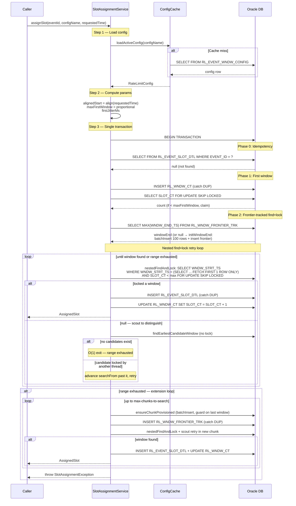

# Payments Rate Limiter

Oracle-based rate limiter for high-throughput event scheduling. Exposes a REST API that assigns
rate-limited time slots to events, enforcing a configurable maximum events per time window.

Two equivalent implementations with identical logic:
- **Kotlin/Exposed** (`SlotAssignmentServiceV3`) — single `transaction {}` block
- **PL/SQL** (`SlotAssignmentServiceV3Sql`) — single JDBC round trip

## Quick Start

### Prerequisites

- **JDK**: 21
- **Docker & Docker Compose**: For local Oracle 19c

### 1. Start Oracle and create the schema user

```bash
./scripts/setup-oracle.sh
```

This script:
- Starts Oracle 19c via Docker Compose (`codeassertion/oracledb-arm64-standalone`)
- Waits for the database to be ready (2-4 minutes on first run)
- Creates the `rate_limiter` user in the `ORCLPDB1` pluggable database
- Grants necessary permissions

### 2. Start the application

```bash
./gradlew quarkusDev
```

Flyway will automatically create the tables on startup.

### 3. Seed the default rate limit config

```bash
curl -X POST http://localhost:8080/admin/rate-limit/config \
  -H 'Content-Type: application/json' \
  -d '{
    "configName": "default",
    "maxPerWindow": 100,
    "windowSize": "PT4S"
  }'
```

### 4. Assign a slot

```bash
curl -X POST http://localhost:8080/api/v1/slots \
  -H 'Content-Type: application/json' \
  -d "{
    \"eventId\": \"$(uuidgen)\",
    \"configName\": \"default\",
    \"requestedTime\": \"2025-06-01T12:00:00Z\"
  }"
```

Response:
```json
{
  "eventId": "pay-123",
  "scheduledTime": "2025-06-01T12:00:02.371Z",
  "delayMs": 2371
}
```

## System Overview

```
                     CALLER (up to 1M events/day)
                                |
                                v
                +-------------------------------+
                |    POST /api/v1/slots          |
                |    SlotAssignmentResource      |
                +-------------------------------+
                                |
                  +-------------+-------------+
                  |                           |
           +-----------+               +-----------+
           | Kotlin/   |               | PL/SQL    |
           | Exposed   |               | Single    |
           | 1 txn     |               | round trip|
           +-----------+               +-----------+
                  |                           |
                  +-------------+-------------+
                                |
           +--------------------+--------------------+
           |                    |                    |
    +-----------+        +-----------+        +-----------+
    | Window 0  |        | Window 1  |        | Window N  |
    | t+0s..t+4s|        | t+4s..t+8s|        | ...       |
    | max 100   |        | max 100   |        | max 100   |
    +-----------+        +-----------+        +-----------+
                                |
                                v
                +-------------------------------+
                |  Response:                    |
                |    eventId, scheduledTime,     |
                |    delayMs                    |
                +-------------------------------+
```

## REST API

### Slot Assignment

**POST** `/api/v1/slots`

Assigns a rate-limited time slot for the given event. Idempotent: calling with the same
`eventId` returns the same slot.

**Request:**
```json
{
  "eventId": "pay-123",
  "configName": "default",
  "requestedTime": "2025-06-01T12:00:00Z"
}
```

**Response (200 OK):**
```json
{
  "eventId": "pay-123",
  "scheduledTime": "2025-06-01T12:00:02.371Z",
  "delayMs": 2371
}
```

| Field | Description |
|---|---|
| `eventId` | Echo of the input event ID |
| `scheduledTime` | Actual assigned execution time (ISO-8601) |
| `delayMs` | Milliseconds between `requestedTime` and `scheduledTime` |

**Error Responses:**
- `404` — Config not found for the given `configName`
- `503` — All windows within the search depth are full

### Admin: Config Management

**GET** `/admin/rate-limit/config?name=default` — Get active config

**POST** `/admin/rate-limit/config` — Create/update config (deactivates previous)
```json
{
  "configName": "default",
  "maxPerWindow": 100,
  "windowSize": "PT4S"
}
```

**POST** `/admin/rate-limit/cache/flush` — Force-evict in-memory config cache

---

## Database Schema

Flyway creates four tables on startup (`V1__rate_limiter_schema.sql`). Each serves a distinct role in the rate-limiting algorithm.

### `RL_EVENT_WNDW_CONFIG`

Versioned rate limit configuration. Supports dynamic updates — inserting a new config row automatically deactivates the previous one. Multiple config names can coexist (e.g., `"default"`, `"high-priority"`). Old rows are kept for audit; never deleted, only deactivated.

| Column | Type | Description |
|---|---|---|
| `RL_WNDW_CONFIG_ID` | `VARCHAR2(50)` PK | Config ID |
| `WNDW_CONFIG_NM` | `VARCHAR2(128)` | Logical config group name |
| `WNDW_MAX_EVENT_CT` | `NUMBER(10)` | Maximum events allowed per time window |
| `WNDW_SIZE_ISO_DUR_TX` | `VARCHAR2(25)` | ISO-8601 duration string (e.g., `PT4S`) |
| `CONFIG_EFF_STRT_DT` | `TIMESTAMP` | When this config version became effective |
| `ACT_IN` | `NUMBER(1)` | `1` = active, `0` = superseded |
| `CREAT_TS` | `TIMESTAMP` | Row creation time (default `SYSTIMESTAMP`) |

**Index**: `RL_EVENT_WNDW_CONFIG_I01X(WNDW_CONFIG_NM, ACT_IN)` — hot-path lookup for active config by name.

### `RL_WNDW_CT`

Lightweight concurrency control table. One row per epoch-aligned time window, acting as a semaphore. The `SLOT_CT` tracks how many events have been assigned to this window, regardless of which config version was active (config-agnostic). This is the lock target for `SELECT FOR UPDATE SKIP LOCKED` — keeping counters separate from event rows ensures O(1) lock acquisition per window.

| Column | Type | Description |
|---|---|---|
| `WNDW_STRT_TS` | `TIMESTAMP` PK | Epoch-aligned window boundary |
| `SLOT_CT` | `NUMBER(10)` | Current number of events assigned to this window |
| `CREAT_TS` | `TIMESTAMP(6)` | Row creation time (NOT NULL) |

**Primary key**: `RL_WNDW_CT_PK(WNDW_STRT_TS)`.

**Index**: `RL_WNDW_CT_I01X(WNDW_STRT_TS, SLOT_CT)` — supports the skip query that finds the first non-full window after a given timestamp.

### `RL_EVENT_SLOT_DTL`

Immutable audit record of every slot assignment. One row per event, never updated or deleted. Serves three purposes: **idempotency** (unique constraint on `EVENT_ID` ensures duplicate calls return the same slot), **audit trail** (records which window, scheduled time, and config each event received), and **reconciliation** (query recent unprocessed slots to detect leakage).

| Column | Type | Description |
|---|---|---|
| `WNDW_SLOT_ID` | `VARCHAR2(50)` PK | Slot ID |
| `EVENT_ID` | `VARCHAR2(50)` UNIQUE | Caller-provided event identifier |
| `REQ_TS` | `TIMESTAMP` | Original time requested by the caller |
| `WNDW_STRT_TS` | `TIMESTAMP` | Epoch-aligned window the event was assigned to |
| `COMPUTED_SCHED_TS` | `TIMESTAMP` | Actual execution time (window start + jitter) |
| `RL_WNDW_CONFIG_ID` | `VARCHAR2(50)` | Config version active at assignment time |
| `CREAT_TS` | `TIMESTAMP` | Row creation time (default `SYSTIMESTAMP`) |

**Indexes**: `RL_EVENT_SLOT_DTL_IUX(EVENT_ID)` (unique), `RL_EVENT_SLOT_DTL_I01X(WNDW_STRT_TS)`, `RL_EVENT_SLOT_DTL_I02X(CREAT_TS)`.

### `RL_WNDW_FRONTIER_TRK`

Append-only frontier tracker for provisioned window ranges. Eliminates tail-end scanning by recording how far windows have been provisioned for each `REQ_TS`. Read via `SELECT MAX(WNDW_END_TS)`; written via `INSERT` only — no `UPDATE` contention. Concurrent threads inserting the same frontier row deduplicate via the composite PK constraint.

| Column | Type | Description |
|---|---|---|
| `REQ_TS` | `TIMESTAMP` | The epoch-aligned start that triggered provisioning |
| `WNDW_END_TS` | `TIMESTAMP` | The furthest provisioned boundary for this start |
| `CREAT_TS` | `TIMESTAMP(6)` | Row creation time (NOT NULL) |

**Primary key**: `RL_WNDW_FRONTIER_TRK_PK(REQ_TS, WNDW_END_TS)` — composite, allows multiple frontier rows per `REQ_TS` (one per extension chunk).

---

## How the Rate Limiter Works

### Window Model

Time is divided into fixed-size windows (default: 4 seconds). Each window has a maximum
capacity (default: 100 events). When an event requests execution at time T:

1. **Snap** T to the epoch-aligned window boundary (floor): `windowStart = T - (T % windowSize)`
2. **Proportional capacity**: if T is mid-window, the first window's effective max = `floor(maxPerWindow * remainingTime / windowSize)`. Jitter is constrained to `[elapsedMs, windowSizeMs)` so `scheduledTime >= T`. Subsequent windows use full `maxPerWindow`.
3. **Lock** the window counter row
4. **Check** capacity
5. **If available**: insert slot record, increment counter, compute `COMPUTED_SCHED_TS = windowStart + jitter`
6. **If full or contended**: skip to next available window
7. **Return** the `AssignedSlot` with `scheduledTime` and `delay`

### Algorithm

Three-phase approach within a single transaction:

**Phase 0 — Idempotency**: Check if event already has a slot. If yes, return it.

**Phase 1 — First Window**: Try the epoch-aligned window at `alignedStart` with proportional capacity and constrained jitter. Uses `SELECT FOR UPDATE SKIP LOCKED` to acquire a lock.

**Phase 2 — Frontier-Tracked Find+Lock**:
1. **Get frontier**: Read `SELECT MAX(WNDW_END_TS) FROM RL_WNDW_FRONTIER_TRK WHERE REQ_TS = alignedStart`. If null, call `initWindowEnd()` which batch-provisions the initial chunk (`maxWindowsInChunk` rows, default 100) and inserts the frontier row.
2. **Nested find+lock with retry**: `findAndLockFirstAvailableWindow(alignedStart + windowSize, windowEnd)` uses a three-method pattern:
   - **`nestedFindAndLock()`** — a single SQL with nested subquery: inner `SELECT ... FETCH FIRST 1 ROW ONLY` finds the earliest candidate (no lock), outer `SELECT ... FOR UPDATE SKIP LOCKED` locks it by primary key and re-checks `SLOT_CT` under the lock. One round-trip on success.
   - **On null**: run **`findEarliestCandidateWindow()`** — a non-locking scout query that distinguishes "no candidates exist" (O(1) exit) from "candidate was locked by another session" (advance `searchFrom` past it and retry).
   - The retry loop continues until a window is locked or the range is exhausted.
3. **Extension loop**: If the range is full, extend from the frontier up to `max-chunks-to-search` (default 2) chunks. Each iteration: batch-provision a chunk (guard: skip if last window already exists), append a new frontier row (catch DUP), and run the same nested find+lock over the new range. Client retries naturally extend further.

### Frontier Tracking (`RL_WNDW_FRONTIER_TRK`)

The `RL_WNDW_FRONTIER_TRK` table is **append-only** with a composite PK `(REQ_TS, WNDW_END_TS)`:
- **Read**: `SELECT MAX(WNDW_END_TS)` — returns the furthest provisioned boundary
- **Write**: `INSERT (alignedStart, chunkEnd)` — catch DUP silently
- **No UPDATEs**: Concurrent threads inserting the same frontier row deduplicate via the PK constraint. No contention.

This eliminates the tail-end scanning problem: instead of starting from chunk 0 every time, requests jump directly to the provisioning frontier.

### Concurrency

Three-method pattern for zero-wait contention resolution:

1. **`nestedFindAndLock()`** — Nested subquery: inner `SELECT` finds earliest candidate (no lock, `FETCH FIRST 1 ROW ONLY`), outer `SELECT` locks exactly that row by PK (`FOR UPDATE SKIP LOCKED`) and re-checks `SLOT_CT < max` under the lock. One SQL round-trip on the success path.
2. **`findEarliestCandidateWindow()`** — Non-locking scout query. Runs only when `nestedFindAndLock()` returns null, to distinguish "no candidates exist" (O(1) exit) from "candidate was locked by another session" (advance past it).
3. **`findAndLockFirstAvailableWindow()`** — Retry loop combining the two: try nested find+lock → on null, scout → if locked, advance `searchFrom` past the locked candidate → retry. Terminates when a window is locked or the range is truly exhausted.

This ensures concurrent threads never block each other — each thread either acquires a different row or skips past locked rows atomically.

### Pre-Provisioning

Windows are batch-provisioned in chunks (`max-windows-in-chunk`, default 100). An existence-check guard on the last window in each chunk prevents thundering herd: the first thread provisions, subsequent threads skip via the guard.

### Random Jitter

Jitter is computed using `ThreadLocalRandom` and applied so events spread uniformly within each window:

```kotlin
// First window (partial): constrain jitter so scheduledTime >= requestedTime
firstJitterMs = ThreadLocalRandom.nextLong(elapsedMs, windowSizeMs)

// Subsequent windows (full): jitter spans entire window
fullJitterMs  = ThreadLocalRandom.nextLong(0, windowSizeMs)
```

Random jitter is used exclusively because when `WNDW_MAX_EVENT_CT` is increased dynamically,
new events must not cluster on deterministic grid points left by previously assigned events.

### Idempotency

Each event is identified by a unique `EVENT_ID`. Calling `assignSlot()` twice with the
same `EVENT_ID` returns the same `AssignedSlot`. A UNIQUE constraint on `EVENT_ID`
prevents duplicate assignments under concurrent access.

### Config-Agnostic Counters

The `RL_WNDW_CT` table tracks total events assigned to each window,
regardless of which config version was active when each slot was assigned. This means:

- **Increasing capacity**: New config sees existing occupancy. If window has 80 slots
  and new config allows 200, 120 more slots are available.
- **Decreasing capacity**: Window with 80 slots under old max=100, new max=50: window
  is treated as full. Already-scheduled events are immutable.

---

## Sequence Diagram



---

## Flow Diagram

```mermaid
flowchart TD
    A([assignSlot called]) --> D[Load RateLimitConfig<br/>from cache or DB]
    D --> E{Config found?}
    E -- No --> F([Throw ConfigLoadException])
    E -- Yes --> G[Compute params<br/>alignedStart, maxFirstWindow,<br/>firstJitterMs]

    G --> TXN[BEGIN TRANSACTION]

    subgraph TX ["Single Transaction"]
        IDEM{Phase 0<br/>queryAssignedSlot?}
        IDEM -- "Found" --> C2[/Return existing/]

        IDEM -- "Not found" --> CACHE_CHK{firstWindowFull<br/>cache hit?}

        CACHE_CHK -- "Yes (skip Phase 1)" --> FRONTIER

        CACHE_CHK -- "No" --> EW[ensureWindowExists<br/>INSERT catch DUP]
        EW --> TLF[tryLockFirstWindow<br/>SELECT SLOT_CT<br/>FOR UPDATE SKIP LOCKED]
        TLF --> TLF_C{Result?}
        TLF_C -- "true<br/>(has capacity)" --> CLAIM1[claimSlot<br/>firstJitterMs]
        CLAIM1 --> NEW1[/NEW/]
        TLF_C -- "false<br/>(full)" --> CACHE_SET["firstWindowFull[alignedStart] = true"]
        CACHE_SET --> FRONTIER
        TLF_C -- "null<br/>(SKIP LOCKED)" --> FRONTIER

        FRONTIER["fetchOrInitWindowEnd<br/>SELECT MAX(WNDW_END_TS)<br/>from RL_WNDW_FRONTIER_TRK<br/>null → initWindowEnd:<br/>batchInsert 100 rows + insert frontier"]

        FRONTIER --> FIND_LOCK

        subgraph FIND_LOCK ["findAndLockFirstAvailableWindow (retry loop)"]
            direction TB
            NFL["nestedFindAndLock<br/>Inner: SELECT ... FETCH FIRST 1 ROW ONLY (no lock)<br/>Outer: SELECT ... FOR UPDATE SKIP LOCKED"]
            NFL --> NFL_C{Result?}
            NFL_C -- "non-null<br/>(locked!)" --> LOCKED_WIN[Window locked]
            NFL_C -- "null" --> SCOUT["findEarliestCandidateWindow<br/>(non-locking scout query)"]
            SCOUT --> SCOUT_C{Candidate exists?}
            SCOUT_C -- "null<br/>(no candidates)" --> NO_WIN[Range exhausted]
            SCOUT_C -- "non-null<br/>(was locked)" --> ADVANCE["searchFrom =<br/>candidate + windowSize"]
            ADVANCE --> NFL
        end

        LOCKED_WIN --> CLAIM2[claimSlot<br/>fullJitterMs]
        CLAIM2 --> NEW2[/NEW/]

        NO_WIN --> EXT_LOOP

        subgraph EXT_LOOP ["Extension Loop (max-chunks-to-search)"]
            direction TB
            EXT_START[chunk 0..maxChunksToSearch-1]
            EXT_START --> EXT_PROV["ensureChunkProvisioned<br/>(guard: skip if last window exists)<br/>+ INSERT RL_WNDW_FRONTIER_TRK (catch DUP)"]
            EXT_PROV --> EXT_FIND["findAndLockFirstAvailableWindow<br/>(same retry loop)<br/>in extension chunk"]
            EXT_FIND --> EXT_C{Window found?}
            EXT_C -- Yes --> CLAIM3[claimSlot<br/>fullJitterMs]
            CLAIM3 --> NEW3[/NEW/]
            EXT_C -- No --> EXT_NEXT{More chunks?}
            EXT_NEXT -- Yes --> EXT_START
            EXT_NEXT -- No --> EXH[/EXHAUSTED/]
        end
    end

    TXN --> IDEM
    C2 --> RET_E([Return existing AssignedSlot])
    NEW1 --> RET_N([Return new AssignedSlot])
    NEW2 --> RET_N
    NEW3 --> RET_N
    EXH --> RET_X([Throw SlotAssignmentException])

    style A fill:#4a9eff,color:#fff
    style RET_E fill:#2ecc71,color:#fff
    style RET_N fill:#2ecc71,color:#fff
    style F fill:#e74c3c,color:#fff
    style RET_X fill:#e74c3c,color:#fff
    style TXN fill:#3498db,color:#fff
    style NFL fill:#9b59b6,color:#fff
    style EXT_FIND fill:#9b59b6,color:#fff
    style SCOUT fill:#e67e22,color:#fff
    style CACHE_CHK fill:#f39c12,color:#fff
    style CACHE_SET fill:#f39c12,color:#fff
```



---

## Algorithm: Analysis

### Key Features

| Feature | Mechanism |
|---|---|
| **Epoch-aligned windows** | `windowStart = epochSec - (epochSec % windowSizeSecs)` — deterministic, no drift |
| **Proportional first-window capacity** | `maxFirstWindow = floor(maxPerWindow × remainingMs / windowSizeMs)` — prevents overscheduling in a partially-elapsed window |
| **Frontier-tracked search** | Append-only `RL_WNDW_FRONTIER_TRK` table tracks the provisioned boundary per `alignedStart`. New requests jump directly to the frontier instead of scanning from chunk 0 |
| **Nested find+lock query** | Nested subquery: inner `SELECT ... FETCH FIRST 1 ROW ONLY` (no lock) finds earliest candidate; outer `SELECT ... FOR UPDATE SKIP LOCKED` locks it by PK. Retry loop with non-locking scout query advances past locked rows. One SQL round-trip on success |
| **Configurable chunk extensions** | `max-chunks-to-search` (default 2) controls how many additional chunks are provisioned and searched when the initial range is full |
| **Idempotency** | Phase 0 pre-check + `UNIQUE(EVENT_ID)` constraint with `DUP_VAL_ON_INDEX` recovery — duplicate calls return the same slot without incrementing counters |
| **SKIP LOCKED concurrency** | Row-level locking skips contended rows instead of blocking — concurrent threads don't wait for each other |
| **JVM-local first-window cache** | `ConcurrentHashMap<Instant, Boolean>` caches exhausted first windows to skip re-locking |
| **Config-agnostic counters** | `SLOT_CT` tracks total usage regardless of which config version assigned each slot — capacity changes take effect immediately on existing windows |
| **Random jitter** | Events spread uniformly within windows via `ThreadLocalRandom`. First window: `[elapsedMs, windowSizeMs)`. Subsequent windows: `[0, windowSizeMs)` |

### Performance Bottlenecks

#### 1. Chunk Provisioning Cost

`ensureChunkProvisioned()` inserts `maxWindowsInChunk` (default 100) rows per chunk. The PL/SQL implementation uses a loop with individual INSERTs (each catching `DUP_VAL_ON_INDEX`). The Kotlin implementation uses `batchInsert` but still issues 100 rows per chunk. The first thread to hit an unprovisioned chunk pays the full provisioning cost; subsequent threads skip via the existence-check guard on the last window.

#### 2. Nested Subquery Retry Cost

`findAndLockFirstAvailableWindow()` uses a retry loop: `nestedFindAndLock()` attempts an atomic find+lock, and on failure (SKIP LOCKED), a non-locking scout query identifies the locked row so `searchFrom` can advance past it. Under high contention (many threads locking adjacent windows simultaneously), this loop may execute multiple iterations — each iteration costs 2 SQL round-trips (one nested subquery + one scout query). The index `RL_WNDW_CT_I01X` on `(WNDW_STRT_TS, SLOT_CT)` helps the inner subquery find candidates efficiently, but degrades as most windows approach capacity.

#### 3. Sequential Extension Loop

Each extension chunk must be provisioned and scanned before the next. There is no parallelism between chunks — the loop is strictly sequential within one transaction.

#### 4. Long-Held Transaction Locks

A single transaction spans all phases: idempotency check, first-window lock, frontier read, chunk provisioning, find+lock scan, and extension loop. The locked window row is held for the entire duration, which includes provisioning new chunks (100 INSERTs each).

#### 5. Frontier Read Overhead

`SELECT MAX(WNDW_END_TS) FROM RL_WNDW_FRONTIER_TRK WHERE REQ_TS = ?` scans all frontier rows for a given `requestedTime`. The row count grows linearly with extension iterations across all clients — each extension appends a new row.

#### 6. JVM-Local First-Window Cache

`firstWindowFull` is a `ConcurrentHashMap` — not shared across nodes. In a multi-node deployment, each node independently discovers full first-windows by attempting and failing the lock. There is no cross-node eviction.

### Functional Limitations

#### 1. First-Window Cache Memory Leak

`firstWindowFull` has no TTL eviction in production. `evictFirstWindowCache()` exists for tests only. Long-running instances accumulate stale entries for past windows that will never be used again.

#### 2. Other Limitations

See [Known Limitations](#known-limitations) for: shared windows across `requestedTime` values, config propagation delay (5s cache TTL), no business-hours awareness, and search depth exhaustion.

### Design Accomplishments

1. **Zero-wait concurrency via nested subquery**: The `nestedFindAndLock()` pattern achieves atomic find+lock in a single SQL statement. The inner subquery finds the earliest candidate without acquiring a lock (`FETCH FIRST 1 ROW ONLY`), and the outer query locks exactly that row by primary key (`FOR UPDATE SKIP LOCKED`). This avoids the range-lock problem where a broad `WHERE ... FOR UPDATE SKIP LOCKED` acquires locks on rows that may not be the target, and achieves one round-trip on the success path.

2. **Disambiguating SKIP LOCKED null via scout query**: When `nestedFindAndLock()` returns null, it's ambiguous — either no candidates exist or the candidate was locked by another session. The non-locking `findEarliestCandidateWindow()` scout query resolves this in O(1) by checking if a candidate exists without acquiring a lock. If no candidate exists, the loop exits immediately instead of retrying fruitlessly.

3. **Append-only frontier tracking**: The `RL_WNDW_FRONTIER_TRK` table uses INSERT-only writes with a composite PK `(REQ_TS, WNDW_END_TS)`. No `UPDATE` contention — concurrent threads inserting the same frontier row deduplicate via the PK constraint. This eliminates the need for pessimistic locking on frontier rows.

4. **Existence-check guard on chunk provisioning**: `ensureChunkProvisioned()` checks if the last window in a chunk exists before batch-inserting. This single-row existence check (PK lookup, O(1)) prevents thundering herd: the first thread provisions, all others skip. Combined with `batchInsert` catching `ExposedSQLException`, this is safe under concurrent access.

5. **JVM-local first-window cache**: `ConcurrentHashMap<Instant, Boolean>` caches exhausted first windows. Once a first window is known to be full, subsequent requests skip the Phase 1 lock attempt entirely, avoiding a DB round-trip. This is a simple but effective optimization for steady-state load where the first window fills quickly.

6. **Idempotency without distributed state**: The unique constraint on `EVENT_ID` in `RL_EVENT_SLOT_DTL` plus the Phase 0 pre-check provides strong idempotency guarantees without needing Redis or any external coordination. The `claimSlot()` function also handles the rare case where a concurrent thread inserts the same `EVENT_ID` between the Phase 0 check and the INSERT — it catches the duplicate key and re-reads the existing slot without incrementing the counter.

7. **Config-agnostic counters**: By tracking `SLOT_CT` independently of config versions, the system handles dynamic config changes gracefully. Increasing capacity takes effect immediately on partially-filled windows. Decreasing capacity treats over-filled windows as full without modifying existing assignments.

### Design Trade-offs

| Decision | Benefit | Cost |
|---|---|---|
| **Single transaction for all phases** | Atomicity — no partial state if the transaction fails. The locked window row cannot be claimed by another thread between find and claim. | Long-held locks during chunk provisioning (100 INSERTs). Other threads hitting the same window are SKIP LOCKED'd but waste a round-trip. |
| **Append-only `RL_WNDW_FRONTIER_TRK`** | No UPDATE contention on frontier rows. Concurrent threads safely deduplicate. | Row count grows linearly with extension iterations. `SELECT MAX(WNDW_END_TS)` scans more rows over time. Could be mitigated with a covering index or periodic cleanup. |
| **Batch provisioning (100 rows per chunk)** | Amortizes the cost of provisioning — one thread pays upfront, all others benefit. Larger chunks mean less frequent provisioning. | First thread to hit an unprovisioned chunk pays O(W) INSERTs while holding the transaction open. With W=100 and 4s windows, this provisions 400 seconds into the future. |
| **JVM-local `firstWindowFull` cache** | Avoids a DB round-trip for a known-full first window. Simple `ConcurrentHashMap`, no external dependencies. | Not shared across nodes — each node independently discovers full first-windows. No TTL eviction — entries accumulate for past windows (memory leak in long-running instances). |
| **Random jitter (not deterministic grid)** | Safe under dynamic config changes — new events don't cluster on grid points left by previously assigned events under a different `maxPerWindow`. | Instantaneous TPS guarantee is statistical, not absolute. Sub-second bursts can theoretically exceed the per-window limit. |
| **Scout query on SKIP LOCKED null** | Distinguishes "no candidates" from "locked" in O(1), preventing infinite retry loops. | Extra round-trip on the contention path (2 queries instead of 1). Acceptable because contention is the exception, not the rule. |
| **`FETCH FIRST 1 ROW ONLY` in inner subquery** | Stops scanning after the first match — O(1) per invocation when candidates exist. The outer query then locks exactly one row. | If the found candidate is locked by another session (SKIP LOCKED), we need the scout query fallback. A full range scan would find the next candidate immediately but would acquire broader locks. |

### What Could Be Improved (and Why We Didn't)

#### 1. Split provisioning into a separate transaction

**Idea**: Move `ensureChunkProvisioned()` to a separate, short-lived transaction that commits immediately, then run the find+lock in the main transaction. This would shorten lock hold times — the locked window row wouldn't be held during the 100-row batch INSERT.

**Why we didn't**: The current single-transaction design guarantees atomicity — if the transaction fails after provisioning but before claiming, no counter is incremented. With split transactions, a crash between provisioning and claiming would leave provisioned-but-unclaimed rows (harmless, but adds complexity to reason about). The provisioning cost is also amortized — it's a one-time cost per chunk, not per request. The existence-check guard ensures subsequent threads skip provisioning entirely.

#### 2. Pre-provision windows asynchronously (background job)

**Idea**: A background scheduler could pre-provision window counter rows well ahead of time (e.g., 24 hours of windows). This would eliminate the provisioning cost from the hot path entirely.

**Why we didn't**: This would require coordinating between the background job and the main transaction (how far ahead to provision? how to handle config changes that affect window size?). The current lazy provisioning is self-tuning — it provisions exactly as far ahead as demand requires, with no configuration overhead. The existence-check guard makes repeated provisioning idempotent, so even without pre-provisioning, only the first thread per chunk pays the cost.

#### 3. Use `SELECT ... FOR UPDATE SKIP LOCKED` with `FETCH FIRST N ROWS ONLY` to lock multiple rows at once

**Idea**: Instead of locking one row per nested subquery call, lock a batch of N rows and iterate locally, returning the first non-full one.

**Why we didn't**: Locking N rows acquires locks on rows that may not be needed, increasing contention with other threads. The nested subquery pattern locks exactly one row — the minimum possible. Under typical load, the first `nestedFindAndLock()` call succeeds (one round-trip), and the retry loop only fires under genuine contention. Locking N rows would hurt the common case to optimize the rare contention case.

#### 4. Use advisory locks instead of `SELECT FOR UPDATE`

**Idea**: Oracle's `DBMS_LOCK` or PostgreSQL's advisory locks could provide lighter-weight coordination without locking actual rows.

**Why we didn't**: Advisory locks require manual lock management (acquire/release) and are database-specific. `SELECT FOR UPDATE SKIP LOCKED` is SQL-standard, works with Oracle's existing row-level locking, and automatically releases on transaction commit/rollback. The current approach also doubles as a read-consistency mechanism — the locked row's `SLOT_CT` is re-checked under the lock, preventing lost updates.

#### 5. Use a Redis-backed distributed counter instead of Oracle row locks

**Idea**: Replace `RL_WNDW_CT` with Redis atomic counters (`INCR`). O(1) per operation, no lock contention, sub-millisecond latency.

**Why we didn't**: This introduces a distributed systems consistency problem — Redis and Oracle can disagree on the count. If Redis says "capacity available" but the Oracle INSERT fails (or vice versa), the counter is permanently out of sync. The current design keeps all state in one database, within one transaction, with ACID guarantees. For the target throughput (1M events/day ≈ ~12 events/second average), Oracle row-level locking is more than sufficient.

#### 6. Use `MERGE` (upsert) instead of INSERT-catch-DUP for `ensureWindowExists()`

**Idea**: Replace the INSERT-catch-exception pattern with `MERGE INTO RL_WNDW_CT USING DUAL ON (WNDW_STRT_TS = ?) WHEN NOT MATCHED THEN INSERT ...`.

**Why we didn't**: `MERGE` in Oracle acquires a lock on the target row even in the `WHEN NOT MATCHED` path, which can cause contention when multiple threads try to create the same window simultaneously. The INSERT-catch-DUP pattern is optimistic — only the first thread succeeds, and the exception path is a lightweight no-op. Under typical load, the window already exists (provisioned by `ensureChunkProvisioned()`), so `ensureWindowExists()` only fires for the first window (Phase 1), not the provisioned range.

### Time Complexity

Let **W** = `max-windows-in-chunk` (default 100), **C** = `max-chunks-to-search` (default 2), **M** = `WNDW_MAX_EVENT_CT`.

| Scenario | Time Complexity | DB Operations | Windows Scanned | Rows Provisioned |
|---|---|---|---|---|
| **Best: Idempotent hit** (Phase 0) | O(1) | 1 SELECT | 0 | 0 |
| **Best: First window available** (Phase 1) | O(1) | ~5 (SELECT + INSERT + SELECT FOR UPDATE + INSERT + UPDATE) | 1 | 0–1 |
| **Average: Slot in provisioned range** (Phase 2) | O(K) where K=contended rows | ~5 + 1 SELECT MAX + K×(nested subquery + scout) + INSERT + UPDATE | K retries | 0 (or W if first to provision) |
| **Worst: Extension loop** (Phase 3) | O(W × (1 + C)) | Phase 2 + C × (W INSERTs + 1 INSERT frontier + nested find+lock retries) | W × (1 + C) | C × W |
| **Worst: Exhaustion** | O(W × (1 + C)) | Same as Phase 3 | W × (1 + C) | C × W |

With defaults (W=100, C=2): worst case scans up to **300 windows** and provisions up to **200 additional rows**.

**Throughput ceiling**: At steady state with concurrent load, throughput is bounded by:
- **Lock contention**: Each `claimSlot()` holds a row lock for INSERT + UPDATE. With M slots per window and W windows provisioned, up to W concurrent threads can claim simultaneously (one per window).
- **Provisioning bottleneck**: The first thread to exhaust a range pays O(W) INSERTs while holding the transaction open. Other threads hitting the same range are either SKIP LOCKED'd or wait for provisioning.

---

## Configuration Reference

All properties are set in `src/main/resources/application.yaml`:

| Property | Description | Default |
|---|---|---|
| `rate-limiter.default-config-name` | Name of the default rate limit config | `default` |
| `rate-limiter.max-windows-in-chunk` | Windows per provisioning chunk | `100` |
| `rate-limiter.max-chunks-to-search` | Extension iterations after initial range scan | `2` |
| `rate-limiter.headroom-windows` | Legacy: windows beyond skip target to search | `100` |
| `quarkus.datasource.db-kind` | Database type | `oracle` |
| `quarkus.datasource.jdbc.url` | Oracle JDBC URL | `jdbc:oracle:thin:@localhost:1521/ORCLPDB1` |
| `quarkus.datasource.username` | Oracle username | `rate_limiter` |
| `quarkus.datasource.password` | Oracle password | `rate_limiter` |
| `quarkus.datasource.jdbc.min-size` | Minimum connection pool size | `5` |
| `quarkus.datasource.jdbc.max-size` | Maximum connection pool size | `30` |
| `quarkus.flyway.migrate-at-start` | Run Flyway migrations at startup | `true` |

## Docker Setup

The project includes a `docker-compose.yml` and setup script for Oracle 19c:

```bash
# Start Oracle and create the rate_limiter user
./scripts/setup-oracle.sh

# Or manually via docker-compose
docker compose up -d oracle
```

The Docker setup uses [`codeassertion/oracledb-arm64-standalone:19.3.0-enterprise`](https://hub.docker.com/r/codeassertion/oracledb-arm64-standalone),
which supports ARM64 (Apple Silicon M1/M2/M3).

**Connection details after setup:**

| Parameter | Value |
|---|---|
| JDBC URL | `jdbc:oracle:thin:@localhost:1521/ORCLPDB1` |
| Username | `rate_limiter` |
| Password | `rate_limiter` |

### Stopping and cleaning up

```bash
# Stop Oracle (data persists in Docker volume)
docker compose down

# Stop and remove data
docker compose down -v
```

## Dynamic Config Update Guide

### Increasing Capacity

To increase from 100 to 200 events per window:

```bash
curl -X POST http://localhost:8080/admin/rate-limit/config \
  -H 'Content-Type: application/json' \
  -d '{
    "configName": "default",
    "maxPerWindow": 200,
    "windowSize": "PT4S"
  }'
```

This inserts a new config row and deactivates the old one. The change takes effect
within 5 seconds (cache TTL) on all nodes.

**What happens**: Windows partially filled under the old config continue filling under
the new limit. Existing scheduled events are never modified.

### Decreasing Capacity

Same API, lower value. Windows already exceeding the new limit are treated as full.
No existing events are cancelled.

**What NOT to change**:
- Do not change `WNDW_SIZE_ISO_DUR_TX` while events are in-flight. This changes the window
  boundaries and makes existing counter rows meaningless.
- Do not manually edit `RL_WNDW_CT` rows.
- Do not delete `RL_EVENT_WNDW_CONFIG` rows — deactivate them instead.

### Cache Flush (Urgent Changes)

For immediate propagation across all nodes:

```bash
curl -X POST http://localhost:8080/admin/rate-limit/cache/flush
```

## Observability

### Key Log Messages

- `INFO  SlotAssignmentService - Assigned slot for eventId={} in window={}`
- `DEBUG SlotAssignmentService - Idempotent hit for eventId={}`
- `ERROR SlotAssignmentService - Could not assign slot for event {} after searching`
- `INFO  RateLimitConfigRepository - Config cache miss for {configName}, loaded from DB`

## Known Limitations

1. **TPS guarantee is statistical, not absolute**: Random jitter within windows means
   instantaneous bursts can theoretically exceed the per-window limit for brief
   sub-second intervals.

2. **Search depth exhaustion**: If a single burst exceeds `(max_windows_in_chunk + max_chunks_to_search * max_windows_in_chunk) * maxPerWindow`
   events per request, slot assignment fails. Client retries naturally extend the frontier further.

3. **Config propagation delay**: Config changes take up to 5 seconds (cache TTL) to
   propagate to all nodes. Use the cache flush endpoint for immediate propagation.

4. **No business-hours awareness**: The window model advances linearly through time
   with no concept of business hours or blackout periods.

5. **Shared windows across different `requestedTime` values**: When two requests with
   different `requestedTime` values share the same epoch-aligned window, the capacity
   limit applied depends on which request's phase touches the window first. For example,
   request A at `12:00:01` has `alignedStart=12:00:00` and overflows to window `12:00:04`
   using `maxPerWindow` (Phase 2). Request B at `12:00:05` has `alignedStart=12:00:04`
   and treats that same window as its first window with proportional capacity
   (`maxFirstWindow`). If request A already filled `12:00:04` to `maxPerWindow`, request B
   sees it as full even though its own proportional limit hasn't been reached. The
   `SLOT_CT` column tracks total usage regardless of which `requestedTime` caused it,
   so per-requestedTime capacity enforcement on a shared window is not possible without a
   schema change (e.g., per-`requestedTime` slot tracking per window).

## Operational Runbook

### Windows Filling Up (Search Depth Approaching Limit)

**Symptom**: Logs show slot assignment exceptions or high search depths.

**Action**:
1. Check current config: `GET /admin/rate-limit/config`
2. If safe, increase `maxPerWindow`: `POST /admin/rate-limit/config`
3. Increase `max-chunks-to-search` to allow deeper in-request searching
4. Check logs for `SlotAssignmentException` — if present, events are being rejected. Client retries will naturally extend the frontier.

### Oracle Slow / Unavailable

**Symptom**: Logs show slow assignment times or connection pool exhaustion warnings.

**Action**:
1. Check Oracle AWR/ASH reports for contention.
2. Verify connection pool is not exhausted: check Quarkus Agroal datasource logs.
3. If Oracle is down, the caller should retry with backoff.
