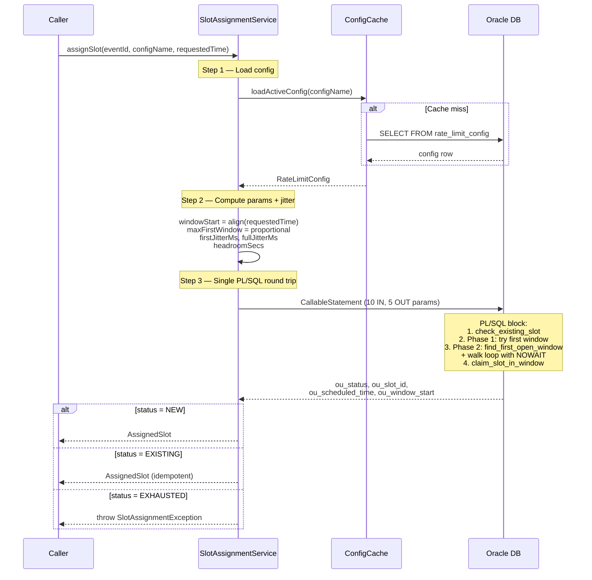
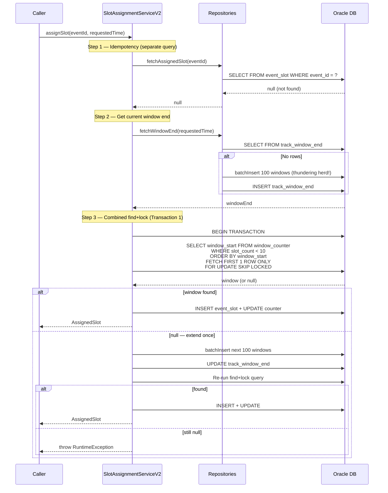
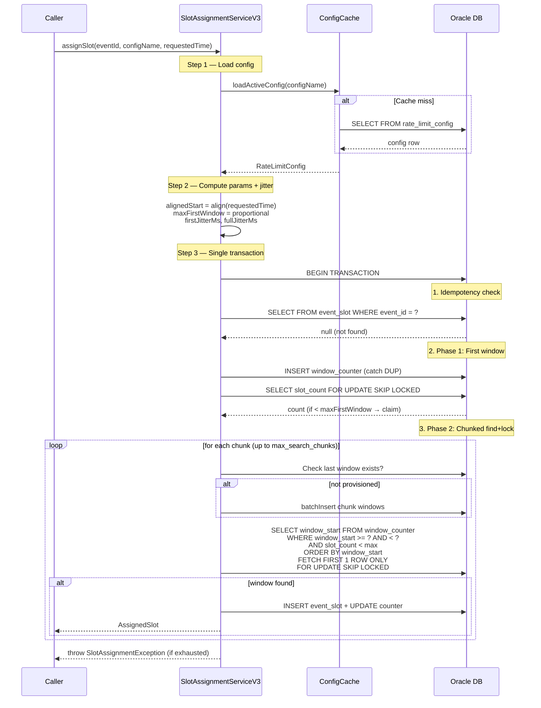
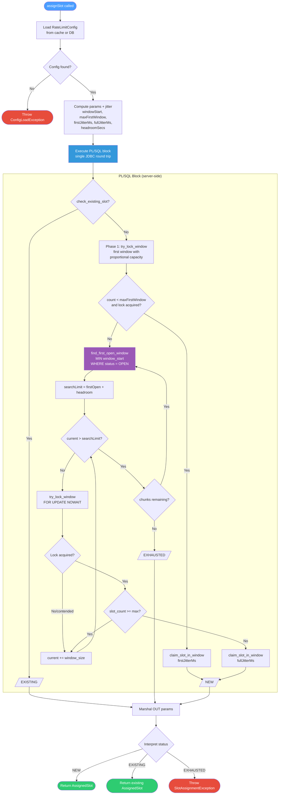
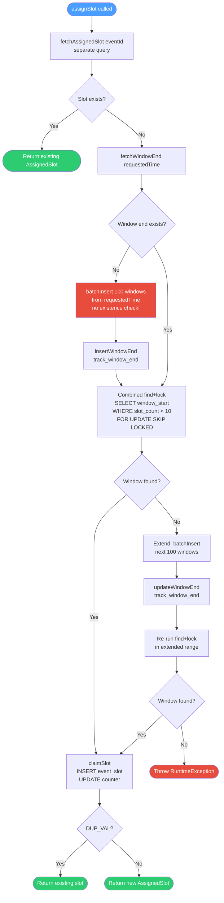
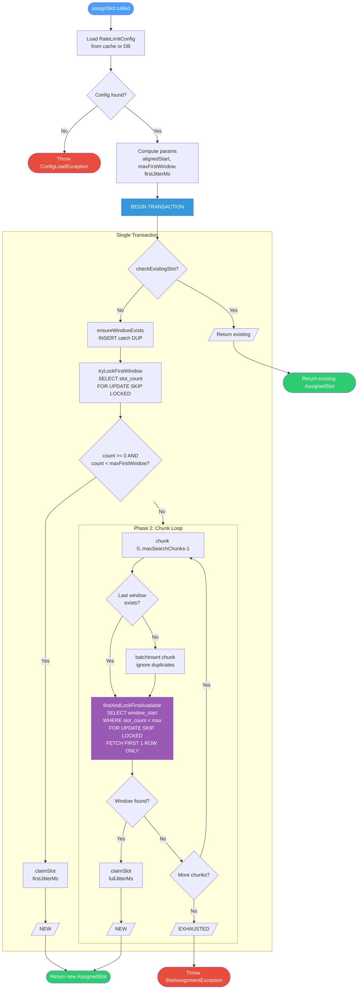

# Payments Rate Limiter

Oracle-based rate limiter for high-throughput event scheduling. Exposes a REST API that assigns
rate-limited time slots to events, enforcing a configurable maximum events per time window.

Three implementation versions exist with different trade-offs:
- **V1** — Single PL/SQL round trip with nested window-walk loop
- **V2** — Kotlin/Exposed with combined find+lock query
- **V3** — Hybrid: V2's combined find+lock elegance with V1's correctness guarantees (two implementations: PL/SQL and Kotlin/Exposed)

## Quick Start

### Prerequisites

- **JDK**: 21
- **Docker & Docker Compose**: For local Oracle 19c

### 1. Start Oracle and create the schema user

```bash
./scripts/setup-oracle.sh
```

This script:
- Starts Oracle 19c via Docker Compose (`codeassertion/oracledb-arm64-standalone`)
- Waits for the database to be ready (2-4 minutes on first run)
- Creates the `rate_limiter` user in the `ORCLPDB1` pluggable database
- Grants necessary permissions

### 2. Start the application

```bash
./gradlew quarkusDev
```

Flyway will automatically create the tables on startup.

### 3. Seed the default rate limit config

```bash
curl -X POST http://localhost:8080/admin/rate-limit/config \
  -H 'Content-Type: application/json' \
  -d '{
    "configName": "default",
    "maxPerWindow": 100,
    "windowSize": "PT4S"
  }'
```

### 4. Assign a slot

```bash
curl -X POST http://localhost:8080/api/v1/slots \
  -H 'Content-Type: application/json' \
  -d '{
    "eventId": "pay-123",
    "configName": "default",
    "requestedTime": "2025-06-01T12:00:00Z"
  }'
```

Response:
```json
{
  "eventId": "pay-123",
  "scheduledTime": "2025-06-01T12:00:02.371Z",
  "delayMs": 2371
}
```

## System Overview

```
                     CALLER (up to 1M events/day)
                                |
                                v
                +-------------------------------+
                |    POST /api/v1/slots          |
                |    SlotAssignmentResource      |
                +-------------------------------+
                                |
          +---------------------+---------------------+
          |                     |                     |
   +-----------+         +-----------+         +-----------+
   |    V1     |         |    V2     |         |    V3     |
   | PL/SQL    |         | Exposed   |         | PL/SQL or |
   | 1 round   |         | multi-txn |         | Exposed   |
   | trip      |         |           |         | 1 txn     |
   +-----------+         +-----------+         +-----------+
          |                     |                     |
          +---------------------+---------------------+
                                |
           +--------------------+--------------------+
           |                    |                    |
    +-----------+        +-----------+        +-----------+
    | Window 0  |        | Window 1  |        | Window N  |
    | t+0s..t+4s|        | t+4s..t+8s|        | ...       |
    | max 100   |        | max 100   |        | max 100   |
    +-----------+        +-----------+        +-----------+
                                |
                                v
                +-------------------------------+
                |  Response:                    |
                |    eventId, scheduledTime,     |
                |    delayMs                    |
                +-------------------------------+
```

## REST API

### Slot Assignment

**POST** `/api/v1/slots`

Assigns a rate-limited time slot for the given event. Idempotent: calling with the same
`eventId` returns the same slot.

**Request:**
```json
{
  "eventId": "pay-123",
  "configName": "default",
  "requestedTime": "2025-06-01T12:00:00Z"
}
```

**Response (200 OK):**
```json
{
  "eventId": "pay-123",
  "scheduledTime": "2025-06-01T12:00:02.371Z",
  "delayMs": 2371
}
```

| Field | Description |
|---|---|
| `eventId` | Echo of the input event ID |
| `scheduledTime` | Actual assigned execution time (ISO-8601) |
| `delayMs` | Milliseconds between `requestedTime` and `scheduledTime` |

**Error Responses:**
- `404` — Config not found for the given `configName`
- `503` — All windows within the dynamic lookahead range are full

### Admin: Config Management

**GET** `/admin/rate-limit/config?name=default` — Get active config

**POST** `/admin/rate-limit/config` — Create/update config (deactivates previous)
```json
{
  "configName": "default",
  "maxPerWindow": 100,
  "windowSize": "PT4S"
}
```

**POST** `/admin/rate-limit/cache/flush` — Force-evict in-memory config cache

---

## How the Rate Limiter Works

### Window Model

Time is divided into fixed-size windows (default: 4 seconds). Each window has a maximum
capacity (default: 100 events). When an event requests execution at time T:

1. **Snap** T to the epoch-aligned window boundary (floor): `windowStart = T - (T % windowSize)`
2. **Proportional capacity**: if T is mid-window, the first window's effective max = `floor(maxPerWindow * remainingTime / windowSize)`. Jitter is constrained to `[elapsedMs, windowSizeMs)` so `scheduledTime >= T`. Subsequent windows use full `maxPerWindow`.
3. **Lock** the window counter row
4. **Check** capacity
5. **If available**: insert slot record, increment counter, compute `scheduled_time = windowStart + jitter`
6. **If full or contended**: skip to next available window
7. **Return** the `AssignedSlot` with `scheduledTime` and `delay`

### Random Jitter

Jitter is computed using `ThreadLocalRandom` and applied so events spread uniformly within each window:

```kotlin
// First window (partial): constrain jitter so scheduledTime >= requestedTime
firstJitterMs = ThreadLocalRandom.nextLong(elapsedMs, windowSizeMs)

// Subsequent windows (full): jitter spans entire window
fullJitterMs  = ThreadLocalRandom.nextLong(0, windowSizeMs)
```

Random jitter is used exclusively because when `max_per_window` is increased dynamically,
new events must not cluster on deterministic grid points left by previously assigned events.

### Idempotency

Each event is identified by a unique `event_id`. Calling `assignSlot()` twice with the
same `event_id` returns the same `AssignedSlot`. A UNIQUE constraint on `event_id`
prevents duplicate assignments under concurrent access.

### Config-Agnostic Counters

The `rate_limit_window_counter` table tracks total events assigned to each window,
regardless of which config version was active when each slot was assigned. This means:

- **Increasing capacity**: New config sees existing occupancy. If window has 80 slots
  and new config allows 200, 120 more slots are available.
- **Decreasing capacity**: Window with 80 slots under old max=100, new max=50: window
  is treated as full. Already-scheduled events are immutable.

---

## V1: SlotAssignmentService (PL/SQL)

The entire slot assignment executes as a **single anonymous PL/SQL block** in one JDBC round trip.

**Algorithm**: Two-phase approach with nested loops:
- **Phase 1**: Try the first (floor-aligned) window with proportional capacity and constrained jitter
- **Phase 2**: If Phase 1 fails, use `find_first_open_window()` (indexed skip query via `status='OPEN'`) to jump past full windows. Then walk sequentially within a `headroom` range. If the headroom is exhausted, re-skip and start another chunk (up to `max_search_chunks` chunks).

**Concurrency**: `SELECT FOR UPDATE NOWAIT` — threads that lose the lock race immediately skip to the next window inside the PL/SQL loop (zero additional network hops).

**Key PL/SQL functions**: `check_existing_slot`, `find_first_open_window`, `try_lock_window`, `claim_slot_in_window`

### V1 Pros

- **Minimum latency**: Single JDBC round trip for entire operation. Network cost = 1 hop.
- **Epoch-aligned windows**: `windowStart = T - (T % windowSizeSecs)` ensures all concurrent requests agree on window boundaries regardless of arrival time. Critical for correctness.
- **Proportional first-window capacity**: When requestedTime falls mid-window, capacity is scaled down proportionally. Prevents over-scheduling in partial windows.
- **Constrained first-window jitter**: `jitter ∈ [elapsedMs, windowSizeMs)` guarantees `scheduledTime >= requestedTime`.
- **Dynamic config**: Config loaded from DB with 5-second cache. No hardcoded constants.
- **Multi-chunk adaptive search**: `find_first_open_window()` + re-skip across up to `max_search_chunks` chunks. Searches 1000+ windows without false exhaustion.
- **Skip query via status index**: O(log N) jump past full windows using `(status, window_start)` composite index.
- **Lazy provisioning**: Counter rows created on-demand, one at a time. No thundering herd.

### V1 Cons

- **Complex nested loop**: Outer chunk loop + inner window-walk + 3-tier skip heuristic. Hard to reason about.
- **PL/SQL maintenance**: Algorithm lives in SQL, not Kotlin. Harder to unit test and refactor.
- **Per-window locking**: `NOWAIT` bounces threads one window at a time. Under extreme contention, threads may walk many windows.
- **Status column overhead**: Requires maintaining `OPEN/CLOSED` status on every counter update. Extra write cost.

---

## V2: SlotAssignmentServiceV2 (Kotlin/Exposed)

Pure Kotlin implementation using Exposed ORM with a **combined find+lock query** that atomically locates and locks the first available window.

**Algorithm**: Single find+lock: `SELECT window_start FROM window_counter WHERE slot_count < max AND window_start >= ? ORDER BY window_start FETCH FIRST 1 ROW ONLY FOR UPDATE SKIP LOCKED`. If no window found, extend with one more chunk of pre-provisioned windows and retry once.

**Concurrency**: `SELECT FOR UPDATE SKIP LOCKED` — set-based lock skipping. One query skips all contended rows, not just the immediately next one.

### V2 Pros

- **Elegant find+lock**: Single query atomically finds AND locks the first available window. Replaces V1's entire inner loop.
- **Set-based SKIP LOCKED**: Skips all contended rows in one query (not one-by-one like V1's NOWAIT).
- **Pre-provisioned windows**: Batch-inserts window counter rows upfront. Less per-call provisioning overhead.
- **Pure Kotlin**: Algorithm lives in Kotlin, not PL/SQL. Easier to test and refactor.
- **No status column**: Uses `slot_count < max` directly — no OPEN/CLOSED state to maintain.

### V2 Cons

- **No epoch-aligned windows**: Uses raw `requestedTime` as window start. Two requests arriving 1ms apart may create different window boundaries. **Breaks rate-limiting guarantees.**
- **Thundering herd on provisioning**: Multiple threads call `batchInsertWindows()` simultaneously with no existence check. Each batch of 100 windows generates ~50M failed DUP_VAL_ON_INDEX inserts under 500K traffic.
- **Limited search depth**: Tries one chunk extension then throws. ~200 windows max. Not enough for production bursts.
- **Hardcoded constants**: `WINDOW_SIZE=4s`, `MAX_SLOTS_PER_WINDOW=10`, `CONFIG_ID=0`. No dynamic config.
- **Multiple transactions**: Idempotency check runs outside the main transaction (TOCTOU race between check and insert).
- **Extra coordination table**: `track_window_end` required to coordinate provisioning across threads.
- **No proportional first-window**: Full capacity assigned even when requestedTime is 3.9s into a 4s window.
- **Unconstrained jitter**: `jitter ∈ [0, windowSizeMs)` means scheduledTime can be before requestedTime.

---

## V3: SlotAssignmentServiceV3 / V3Sql (Hybrid)

Combines V2's combined find+lock elegance with V1's correctness guarantees. Two implementations with identical logic:
- `SlotAssignmentServiceV3` — Kotlin/Exposed (single `transaction {}` block)
- `SlotAssignmentServiceV3Sql` — PL/SQL (single JDBC round trip)

**Algorithm**:
1. **Idempotency check** (inside the transaction)
2. **Phase 1**: Try first window with proportional capacity. `ensureWindowExists()` + `tryLockFirstWindow()` via `SELECT FOR UPDATE SKIP LOCKED`.
3. **Phase 2**: Chunked find+lock loop. For each chunk: `ensureChunkProvisioned()` (batch insert with existence-check guard on last window) + `findAndLockFirstAvailable()` (combined find+lock query per chunk). Up to `max_search_chunks` chunks.

**Concurrency**: `SELECT FOR UPDATE SKIP LOCKED` — same set-based lock skipping as V2, but applied per-chunk across a much larger search space.

### V3 Pros

- **V2's elegance + V1's correctness**: Combined find+lock query replaces V1's nested inner loop. Epoch alignment, proportional capacity, and constrained jitter from V1.
- **Simpler than both**: Outer chunk loop only — no inner walk, no 3-tier skip heuristic, no status column.
- **Existence-check guard on provisioning**: First thread provisions a chunk, subsequent threads skip via check on last window. Eliminates thundering herd.
- **Deep search**: `max_search_chunks × max_windows_in_chunk` (default 1000 windows). Same depth as V1.
- **Dynamic config**: Loaded from DB with 5-second cache. No hardcoded constants.
- **Single transaction**: Entire operation (idempotency + search + claim) runs in one transaction. No TOCTOU.
- **No extra tables**: No `track_window_end` coordination table needed.
- **No status column**: Uses `slot_count < max` directly (from V2).
- **Dual implementation**: Choose PL/SQL (1 JDBC round trip) or Kotlin/Exposed (1 transaction, ~5-7 statements) based on preference.
- **Fresh jitter per claim**: Kotlin/Exposed version computes jitter inline via `ThreadLocalRandom` for each claim, avoiding stale pre-computed values.

### V3 Cons

- **Kotlin/Exposed version has more DB round trips**: ~5-7 statements vs V1's single PL/SQL call. Acceptable for most workloads but adds ~2-5ms latency.
- **Batch provisioning cost**: First request per chunk inserts up to 100 rows. Amortized across subsequent requests but the first thread pays the cost.
- **PL/SQL version shares V1's maintenance concern**: Algorithm in SQL is harder to test (though V3's PL/SQL is simpler than V1's).

---

## Side-by-Side Comparison

| Dimension | V1 (PL/SQL) | V2 (Exposed) | V3 (Hybrid) |
|---|---|---|---|
| **Window alignment** | Epoch-aligned | Raw requestedTime (broken) | Epoch-aligned |
| **Algorithm** | Nested loops: outer chunks + inner walk + 3-tier skip | Single find+lock, one extension attempt | Outer chunk loop + find+lock per chunk |
| **DB round trips** | 1 PL/SQL call | 3-5 transactions | V3-Exposed: 1 txn (~5-7 stmts). V3-SQL: 1 PL/SQL call |
| **Lock strategy** | `FOR UPDATE NOWAIT` (per-window) | `FOR UPDATE SKIP LOCKED` (set-based) | `FOR UPDATE SKIP LOCKED` (set-based) |
| **Provisioning** | Lazy per-window. No thundering herd | Batch upfront. Massive thundering herd | Batch + existence-check guard |
| **Search depth** | max_search_chunks × headroom (1000) | ~200 then throw | max_search_chunks × chunk_size (1000) |
| **First-window** | Proportional capacity + constrained jitter | None | Proportional capacity + constrained jitter |
| **Config** | Dynamic (DB + 5s cache) | Hardcoded constants | Dynamic (DB + 5s cache) |
| **Extra tables** | None | `track_window_end` | None |
| **Status column** | Required (`OPEN/CLOSED`) | Not used | Not used |
| **Complexity** | High (PL/SQL + nested loops) | Low (but incomplete) | Medium (cleanest correct solution) |

---

## Sequence Diagrams

### V1 Sequence Diagram



### V2 Sequence Diagram



### V3 Sequence Diagram



---

## Flow Diagrams

### V1 Flow Diagram



### V2 Flow Diagram



### V3 Flow Diagram



---

## Configuration Reference

All properties are set in `src/main/resources/application.yaml`:

| Property | Description | Default |
|---|---|---|
| `rate-limiter.default-config-name` | Name of the default rate limit config | `default` |
| `rate-limiter.headroom-windows` | V1: windows beyond skip target to search | `100` |
| `rate-limiter.max-windows-in-chunk` | V3: windows per provisioning chunk | `100` |
| `rate-limiter.max-search-chunks` | V1/V3: max chunks before giving up | `10` |
| `quarkus.datasource.db-kind` | Database type | `oracle` |
| `quarkus.datasource.jdbc.url` | Oracle JDBC URL | `jdbc:oracle:thin:@localhost:1521/ORCLPDB1` |
| `quarkus.datasource.username` | Oracle username | `rate_limiter` |
| `quarkus.datasource.password` | Oracle password | `rate_limiter` |
| `quarkus.datasource.jdbc.min-size` | Minimum connection pool size | `5` |
| `quarkus.datasource.jdbc.max-size` | Maximum connection pool size | `30` |
| `quarkus.flyway.migrate-at-start` | Run Flyway migrations at startup | `true` |

## Docker Setup

The project includes a `docker-compose.yml` and setup script for Oracle 19c:

```bash
# Start Oracle and create the rate_limiter user
./scripts/setup-oracle.sh

# Or manually via docker-compose
docker compose up -d oracle
```

The Docker setup uses [`codeassertion/oracledb-arm64-standalone:19.3.0-enterprise`](https://hub.docker.com/r/codeassertion/oracledb-arm64-standalone),
which supports ARM64 (Apple Silicon M1/M2/M3).

**Connection details after setup:**

| Parameter | Value |
|---|---|
| JDBC URL | `jdbc:oracle:thin:@localhost:1521/ORCLPDB1` |
| Username | `rate_limiter` |
| Password | `rate_limiter` |

### Stopping and cleaning up

```bash
# Stop Oracle (data persists in Docker volume)
docker compose down

# Stop and remove data
docker compose down -v
```

## Dynamic Config Update Guide

### Increasing Capacity

To increase from 100 to 200 events per window:

```bash
curl -X POST http://localhost:8080/admin/rate-limit/config \
  -H 'Content-Type: application/json' \
  -d '{
    "configName": "default",
    "maxPerWindow": 200,
    "windowSize": "PT4S"
  }'
```

This inserts a new config row and deactivates the old one. The change takes effect
within 5 seconds (cache TTL) on all nodes.

**What happens**: Windows partially filled under the old config continue filling under
the new limit. Existing scheduled events are never modified.

### Decreasing Capacity

Same API, lower value. Windows already exceeding the new limit are treated as full.
No existing events are cancelled.

**What NOT to change**:
- Do not change `window_size` while events are in-flight. This changes the window
  boundaries and makes existing counter rows meaningless.
- Do not manually edit `rate_limit_window_counter` rows.
- Do not delete `rate_limit_config` rows — deactivate them instead.

### Cache Flush (Urgent Changes)

For immediate propagation across all nodes:

```bash
curl -X POST http://localhost:8080/admin/rate-limit/cache/flush
```

## Observability

### Key Log Messages

- `INFO  SlotAssignmentService - Assigned slot for eventId={} in window={} after searching {} windows`
- `DEBUG SlotAssignmentService - Idempotent hit for eventId={}`
- `ERROR SlotAssignmentService - Could not assign slot for event {} after searching {} windows`
- `INFO  RateLimitConfigRepository - Config cache miss for {configName}, loaded from DB`

## Known Limitations

1. **TPS guarantee is statistical, not absolute**: Random jitter within windows means
   instantaneous bursts can theoretically exceed the per-window limit for brief
   sub-second intervals.

2. **Lookahead exhaustion**: If a single burst exceeds `max_search_chunks * max_windows_in_chunk * maxPerWindow`
   events (default: 10 * 100 * 100 = 100,000), slot assignment fails for remaining events.

3. **Config propagation delay**: Config changes take up to 5 seconds (cache TTL) to
   propagate to all nodes. Use the cache flush endpoint for immediate propagation.

4. **No business-hours awareness**: The window model advances linearly through time
   with no concept of business hours or blackout periods.

## Operational Runbook

### Windows Filling Up (Lookahead Approaching Limit)

**Symptom**: Logs show `Lookahead exhausted` errors or high lookahead depths.

**Action**:
1. Check current config: `GET /admin/rate-limit/config`
2. If safe, increase `maxPerWindow`: `POST /admin/rate-limit/config`
3. Check logs for `SlotAssignmentException` — if present, events are being rejected.

### Oracle Slow / Unavailable

**Symptom**: Logs show slow assignment times or connection pool exhaustion warnings.

**Action**:
1. Check Oracle AWR/ASH reports for contention.
2. Verify connection pool is not exhausted: check Quarkus Agroal datasource logs.
3. If Oracle is down, the caller should retry with backoff.
