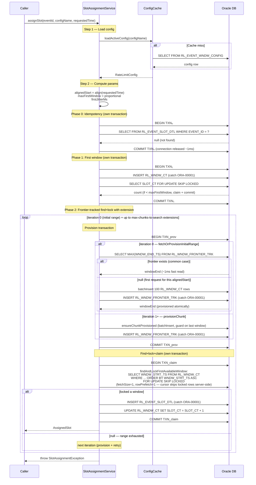
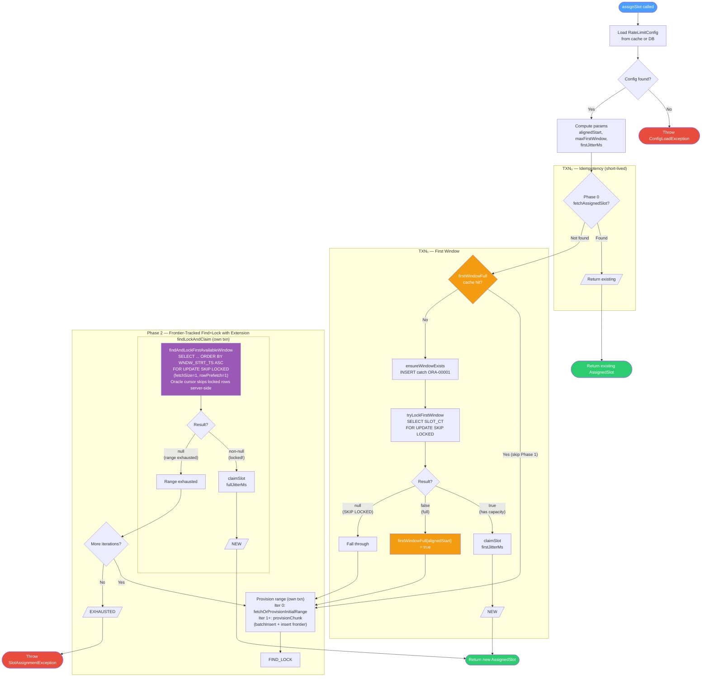

# Payments Rate Limiter

Oracle-based rate limiter for high-throughput event scheduling. Exposes a REST API that assigns
rate-limited time slots to events, enforcing a configurable maximum events per time window.

Implementation:
- **Kotlin/Exposed** (`SlotAssignmentServiceV3`) — split short-lived transactions for reduced connection hold time

## Quick Start

### Prerequisites

- **JDK**: 21
- **Docker & Docker Compose**: For local Oracle 19c

### 1. Start Oracle and create the schema user

```bash
./scripts/setup-oracle.sh
```

This script:
- Starts Oracle 19c via Docker Compose (`codeassertion/oracledb-arm64-standalone`)
- Waits for the database to be ready (2-4 minutes on first run)
- Creates the `rate_limiter` user in the `ORCLPDB1` pluggable database
- Grants necessary permissions

### 2. Start the application

```bash
./gradlew quarkusDev
```

Flyway will automatically create the tables on startup.

### 3. Seed the default rate limit config

```bash
curl -X POST http://localhost:8080/admin/rate-limit/config \
  -H 'Content-Type: application/json' \
  -d '{
    "configName": "default",
    "maxPerWindow": 100,
    "windowSize": "PT4S"
  }'
```

### 4. Assign a slot

```bash
curl -X POST http://localhost:8080/api/v1/slots \
  -H 'Content-Type: application/json' \
  -d "{
    \"eventId\": \"$(uuidgen)\",
    \"configName\": \"default\",
    \"requestedTime\": \"2025-06-01T12:00:00Z\"
  }"
```

Response:
```json
{
  "eventId": "pay-123",
  "scheduledTime": "2025-06-01T12:00:02.371Z",
  "delayMs": 2371
}
```

## System Overview

```
                     CALLER (up to 1M events/day)
                                |
                                v
                +-------------------------------+
                |    POST /api/v1/slots          |
                |    SlotAssignmentResource      |
                +-------------------------------+
                                |
                                |
           +--------------------+--------------------+
           |                    |                    |
    +-----------+        +-----------+        +-----------+
    | Window 0  |        | Window 1  |        | Window N  |
    | t+0s..t+4s|        | t+4s..t+8s|        | ...       |
    | max 100   |        | max 100   |        | max 100   |
    +-----------+        +-----------+        +-----------+
                                |
                                v
                +-------------------------------+
                |  Response:                    |
                |    eventId, scheduledTime,     |
                |    delayMs                    |
                +-------------------------------+
```

## Key Domain Concepts

### Windows

Fixed-duration time intervals used as the fundamental unit of rate limiting.

- **Duration**: Configurable, default 4 seconds (`windowSize` in config)
- **Epoch-aligned**: `windowStart = time - (time % windowSizeSecs)` — deterministic, no drift. All service instances agree on window boundaries without coordination.
- **Capacity**: Maximum `maxPerWindow` events per window (default: 100)
- **Example** (4-second windows):
  ```
  Window 0: 2025-06-01T12:00:00Z → 12:00:04Z
  Window 1: 2025-06-01T12:00:04Z → 12:00:08Z
  Window 2: 2025-06-01T12:00:08Z → 12:00:12Z
  ```

### Slots

Assigned execution times for events within a window.

- **Granularity**: Millisecond-precise (jitter applied within the window)
- **Idempotency**: One slot per unique `eventId` via `UNIQUE(EVENT_ID)` constraint
- **Immutability**: Once assigned, slots are never modified (only read in duplicate recovery)
- **Result**: `AssignedSlot(eventId, scheduledTime, delay)`

### Chunks

Batches of windows provisioned together to amortize provisioning cost.

- **Size**: Configurable via `max-windows-in-chunk` (default: 100 windows = 400 seconds at 4s window size)
- **Provisioning**: `ensureChunkProvisioned()` batch-inserts counter rows
- **Guard**: Existence check on last window prevents thundering herd — the first thread provisions, subsequent threads skip
- **Idempotency**: `batchInsert` catches duplicate exceptions silently

### Frontier

The furthest provisioned window boundary for a given `alignedStart`.

- **Storage**: `RL_WNDW_FRONTIER_TRK(REQ_TS, WNDW_END_TS)` table
- **Read**: `SELECT WNDW_END_TS ... ORDER BY DESC LIMIT 1` (replaced `MAX()` aggregate for better index utilization)
- **Write**: `INSERT (alignedStart, chunkEnd)` — append-only, deduplication via composite PK
- **JVM cache**: 5-second TTL `ConcurrentHashMap` avoids the DB read on the hot path; updated on both read and write
- **Benefit**: Eliminates tail-end scanning; requests jump directly to the provisioning frontier instead of scanning from window 0

### Jitter

Random offset within a window to spread load uniformly.

- **Implementation**: `ThreadLocalRandom.nextLong(lower, upper)`
- **First window**: `lower = elapsedMs` — constrains jitter so `scheduledTime >= requestedTime`
- **Subsequent windows**: `lower = 0` — full window width available
- **Why random**: When `maxPerWindow` is increased dynamically, new events must not cluster on deterministic grid points left by previously assigned events under a different capacity

---

## REST API

### Slot Assignment

**POST** `/api/v1/slots`

Assigns a rate-limited time slot for the given event. Idempotent: calling with the same
`eventId` returns the same slot.

**Request:**
```json
{
  "eventId": "pay-123",
  "configName": "default",
  "requestedTime": "2025-06-01T12:00:00Z"
}
```

**Response (200 OK):**
```json
{
  "eventId": "pay-123",
  "scheduledTime": "2025-06-01T12:00:02.371Z",
  "delayMs": 2371
}
```

| Field | Description |
|---|---|
| `eventId` | Echo of the input event ID |
| `scheduledTime` | Actual assigned execution time (ISO-8601) |
| `delayMs` | Milliseconds between `requestedTime` and `scheduledTime` |

**Error Responses:**
- `404` — Config not found for the given `configName`
- `503` — All windows within the search depth are full

### Admin: Config Management

**GET** `/admin/rate-limit/config?name=default` — Get active config

**POST** `/admin/rate-limit/config` — Create/update config (deactivates previous)
```json
{
  "configName": "default",
  "maxPerWindow": 100,
  "windowSize": "PT4S"
}
```

**POST** `/admin/rate-limit/cache/flush` — Force-evict in-memory config cache

---

## Database Schema

Flyway creates four tables on startup (`V1__rate_limiter_schema.sql`). Each serves a distinct role in the rate-limiting algorithm.

### `RL_EVENT_WNDW_CONFIG`

Versioned rate limit configuration. Supports dynamic updates — inserting a new config row automatically deactivates the previous one. Multiple config names can coexist (e.g., `"default"`, `"high-priority"`). Old rows are kept for audit; never deleted, only deactivated.

| Column | Type | Description |
|---|---|---|
| `RL_WNDW_CONFIG_ID` | `VARCHAR2(50)` PK | Config ID |
| `WNDW_CONFIG_NM` | `VARCHAR2(128)` | Logical config group name |
| `WNDW_MAX_EVENT_CT` | `NUMBER(10)` | Maximum events allowed per time window |
| `WNDW_SIZE_ISO_DUR_TX` | `VARCHAR2(25)` | ISO-8601 duration string (e.g., `PT4S`) |
| `CONFIG_EFF_STRT_DT` | `TIMESTAMP` | When this config version became effective |
| `ACT_IN` | `NUMBER(1)` | `1` = active, `0` = superseded |
| `CREAT_TS` | `TIMESTAMP` | Row creation time (default `SYSTIMESTAMP`) |

**Index**: `RL_EVENT_WNDW_CONFIG_I01X(WNDW_CONFIG_NM, ACT_IN)` — hot-path lookup for active config by name.

### `RL_WNDW_CT`

Lightweight concurrency control table. One row per epoch-aligned time window, acting as a semaphore. The `SLOT_CT` tracks how many events have been assigned to this window, regardless of which config version was active (config-agnostic). This is the lock target for `SELECT FOR UPDATE SKIP LOCKED` — keeping counters separate from event rows ensures O(1) lock acquisition per window.

| Column | Type | Description |
|---|---|---|
| `WNDW_STRT_TS` | `TIMESTAMP` PK | Epoch-aligned window boundary |
| `SLOT_CT` | `NUMBER(10)` | Current number of events assigned to this window |
| `CREAT_TS` | `TIMESTAMP(6)` | Row creation time (NOT NULL) |

**Primary key**: `RL_WNDW_CT_PK(WNDW_STRT_TS)`.

**Index**: `RL_WNDW_CT_I01X(WNDW_STRT_TS, SLOT_CT)` — supports the skip query that finds the first non-full window after a given timestamp.

### `RL_EVENT_SLOT_DTL`

Immutable audit record of every slot assignment. One row per event, never updated or deleted. Serves three purposes: **idempotency** (unique constraint on `EVENT_ID` ensures duplicate calls return the same slot), **audit trail** (records which window, scheduled time, and config each event received), and **reconciliation** (query recent unprocessed slots to detect leakage).

| Column | Type | Description |
|---|---|---|
| `WNDW_SLOT_ID` | `VARCHAR2(50)` PK | Slot ID |
| `EVENT_ID` | `VARCHAR2(50)` UNIQUE | Caller-provided event identifier |
| `REQ_TS` | `TIMESTAMP` | Original time requested by the caller |
| `WNDW_STRT_TS` | `TIMESTAMP` | Epoch-aligned window the event was assigned to |
| `COMPUTED_SCHED_TS` | `TIMESTAMP` | Actual execution time (window start + jitter) |
| `RL_WNDW_CONFIG_ID` | `VARCHAR2(50)` | Config version active at assignment time |
| `CREAT_TS` | `TIMESTAMP` | Row creation time (default `SYSTIMESTAMP`) |

**Indexes**: `RL_EVENT_SLOT_DTL_IUX(EVENT_ID)` (unique), `RL_EVENT_SLOT_DTL_I01X(WNDW_STRT_TS)`, `RL_EVENT_SLOT_DTL_I02X(CREAT_TS)`.

### `RL_WNDW_FRONTIER_TRK`

Append-only frontier tracker for provisioned window ranges. Eliminates tail-end scanning by recording how far windows have been provisioned for each `REQ_TS`. Read via `SELECT MAX(WNDW_END_TS)`; written via `INSERT` only — no `UPDATE` contention. Concurrent threads inserting the same frontier row deduplicate via the composite PK constraint.

| Column | Type | Description |
|---|---|---|
| `REQ_TS` | `TIMESTAMP` | The epoch-aligned start that triggered provisioning |
| `WNDW_END_TS` | `TIMESTAMP` | The furthest provisioned boundary for this start |
| `CREAT_TS` | `TIMESTAMP(6)` | Row creation time (NOT NULL) |

**Primary key**: `RL_WNDW_FRONTIER_TRK_PK(REQ_TS, WNDW_END_TS)` — composite, allows multiple frontier rows per `REQ_TS` (one per extension chunk).

---

## How the Rate Limiter Works

### Window Model

Time is divided into fixed-size windows (default: 4 seconds). Each window has a maximum
capacity (default: 100 events). When an event requests execution at time T:

1. **Snap** T to the epoch-aligned window boundary (floor): `windowStart = T - (T % windowSize)`
2. **Proportional capacity**: if T is mid-window, the first window's effective max = `floor(maxPerWindow * remainingTime / windowSize)`. Jitter is constrained to `[elapsedMs, windowSizeMs)` so `scheduledTime >= T`. Subsequent windows use full `maxPerWindow`.
3. **Lock** the window counter row
4. **Check** capacity
5. **If available**: insert slot record, increment counter, compute `COMPUTED_SCHED_TS = windowStart + jitter`
6. **If full or contended**: skip to next available window
7. **Return** the `AssignedSlot` with `scheduledTime` and `delay`

### Algorithm

Multi-phase approach with split short-lived transactions to minimize connection hold time:

**Phase 0 — Idempotency** *(own transaction)*: Check if event already has a slot via `fetchAssignedSlot()`. If yes, return it immediately. This runs in a separate short-lived transaction (~1ms) so duplicate/retry requests release their connection without competing with the heavier assignment phases.

**Phase 1 — First Window** *(own transaction)*: Try the epoch-aligned window at `alignedStart` with proportional capacity and constrained jitter. Uses `SELECT FOR UPDATE SKIP LOCKED` to acquire a lock. If locked and has capacity, `claimSlot()` runs in the same transaction.

**Phase 2 — Frontier-Tracked Find+Lock with Extension** *(provision and locking in separate transactions)*: A unified loop that provisions window ranges and searches them. Iteration 0 covers the initial range; iterations 1..`max-chunks-to-search` (default 2) extend beyond the frontier.
1. **Fetch or provision range** *(single transaction per iteration)*: Iteration 0 calls `fetchOrProvisionInitialRange()` — reads `SELECT MAX(WNDW_END_TS) FROM RL_WNDW_FRONTIER_TRK WHERE REQ_TS = alignedStart`. If the frontier exists, returns it immediately (fast read, ~1ms). If null (first request for this `alignedStart`), provisions the initial chunk (`maxWindowsInChunk` rows, default 100) and inserts the frontier row atomically. Subsequent iterations call `provisionChunk()` — batch-provision a chunk beyond the frontier (guard: skip if last window already exists; pre-filter existing windows before batch insert) + append a new frontier row (catch ORA-00001 via `isDuplicateKeyViolation()`).
2. **Find+lock+claim** *(own transaction per iteration)*: `findLockAndClaim()` runs `findAndLockFirstAvailableWindow()` + `claimSlot()` together in a focused transaction that holds the row lock only for the duration of the find+lock and the INSERT+UPDATE:
   - **`findAndLockFirstAvailableWindow()`** — Uses Oracle JDBC cursor control (`fetchSize=1`, `rowPrefetch=1`) with `SELECT ... FOR UPDATE SKIP LOCKED` (no `FETCH FIRST`). Oracle processes the cursor lazily: it scans the PK index in order, tries to lock each matching row, skips locked rows server-side, and returns the first successfully locked row. Only that one row is locked.
   - This is superior to `FETCH FIRST 1 ROW ONLY + FOR UPDATE SKIP LOCKED`, where Oracle picks 1 candidate before locking — two threads can pick the same candidate, one wins the lock, the other gets empty result and cascades to fallback. With `fetchSize=1`, concurrent threads naturally lock different rows because the skip-locked logic runs within the cursor scan.
3. **Next iteration or exhaustion**: If `findLockAndClaim()` returns null, advance `searchFrom` to the end of the current range and repeat from step 1 for the next iteration. If all iterations are exhausted, throw `SlotAssignmentException`. Client retries naturally extend the frontier further.

### Frontier Tracking (`RL_WNDW_FRONTIER_TRK`)

The `RL_WNDW_FRONTIER_TRK` table is **append-only** with a composite PK `(REQ_TS, WNDW_END_TS)`:
- **Read**: `SELECT WNDW_END_TS ... ORDER BY DESC LIMIT 1` — returns the furthest provisioned boundary. A 5-second JVM cache (`ConcurrentHashMap`) avoids hitting the DB on the hot path.
- **Write**: `INSERT (alignedStart, chunkEnd)` — duplicate keys detected via `isDuplicateKeyViolation()` (ORA-00001 only); unexpected SQL exceptions are re-thrown. The cache is updated on write (merge with max logic) so subsequent reads on the same pod skip the DB.
- **No UPDATEs**: Concurrent threads inserting the same frontier row deduplicate via the PK constraint. No contention.

This eliminates the tail-end scanning problem: instead of starting from chunk 0 every time, requests jump directly to the provisioning frontier.

### Concurrency

Cursor-based zero-wait contention resolution:

**`findAndLockFirstAvailableWindow()`** — Uses Oracle JDBC cursor control (`fetchSize=1`, `rowPrefetch=1`) with `SELECT ... ORDER BY WNDW_STRT_TS ASC FOR UPDATE SKIP LOCKED`. No `FETCH FIRST` — the row limiting is done at the JDBC level, not the SQL level. Oracle processes the cursor lazily through the PK index: for each matching row, it tries to acquire the row lock; if locked by another session, `SKIP LOCKED` skips it server-side and advances to the next row. The client reads one row (`rs.next()` once) and closes the cursor.

This ensures concurrent threads naturally lock different rows without blocking:
- Thread A scans → Window 5 → locks it ✓
- Thread B scans → Window 5 → locked → SKIP → Window 6 → locks it ✓
- Thread C scans → Window 5 → SKIP → Window 6 → SKIP → Window 7 → locks it ✓

This is superior to `FETCH FIRST 1 ROW ONLY + FOR UPDATE SKIP LOCKED`, where Oracle picks 1 candidate before locking — two threads can select the same candidate, one wins, the other gets an empty result and must fall back.

### Pre-Provisioning

Windows are batch-provisioned in chunks (`max-windows-in-chunk`, default 100). An existence-check guard on the last window in each chunk prevents thundering herd: the first thread provisions, subsequent threads skip via the guard. `batchInsertWindows()` also pre-filters existing windows (SELECT + filter) before inserting only new ones, reducing unnecessary duplicate key exceptions under concurrent provisioning.

### Random Jitter

Jitter is computed using `ThreadLocalRandom` and applied so events spread uniformly within each window:

```kotlin
// First window (partial): constrain jitter so scheduledTime >= requestedTime
firstJitterMs = ThreadLocalRandom.nextLong(elapsedMs, windowSizeMs)

// Subsequent windows (full): jitter spans entire window
fullJitterMs  = ThreadLocalRandom.nextLong(0, windowSizeMs)
```

Random jitter is used exclusively because when `WNDW_MAX_EVENT_CT` is increased dynamically,
new events must not cluster on deterministic grid points left by previously assigned events.

### Idempotency

Each event is identified by a unique `EVENT_ID`. Calling `assignSlot()` twice with the
same `EVENT_ID` returns the same `AssignedSlot`. A UNIQUE constraint on `EVENT_ID`
prevents duplicate assignments under concurrent access.

### Config-Agnostic Counters

The `RL_WNDW_CT` table tracks total events assigned to each window,
regardless of which config version was active when each slot was assigned. This means:

- **Increasing capacity**: New config sees existing occupancy. If window has 80 slots
  and new config allows 200, 120 more slots are available.
- **Decreasing capacity**: Window with 80 slots under old max=100, new max=50: window
  is treated as full. Already-scheduled events are immutable.

---

## Sequence Diagram


```mermaid
sequenceDiagram
    participant Caller
    participant SAS as SlotAssignmentService
    participant Cache as ConfigCache
    participant DB as Oracle DB

    Caller->>SAS: assignSlot(eventId, configName, requestedTime)

    Note over SAS: Step 1 — Load config
    SAS->>Cache: loadActiveConfig(configName)
    alt Cache miss
        Cache->>DB: SELECT FROM RL_EVENT_WNDW_CONFIG
        DB-->>Cache: config row
    end
    Cache-->>SAS: RateLimitConfig

    Note over SAS: Step 2 — Compute params
    SAS->>SAS: alignedStart = align(requestedTime)<br/>maxFirstWindow = proportional<br/>firstJitterMs

    Note over SAS: Phase 0: Idempotency (own transaction)
    SAS->>DB: BEGIN TXN₀
    SAS->>DB: SELECT FROM RL_EVENT_SLOT_DTL WHERE EVENT_ID = ?
    DB-->>SAS: null (not found)
    SAS->>DB: COMMIT TXN₀ (connection released ~1ms)

    Note over SAS: Phase 1: First window (own transaction)
    SAS->>DB: BEGIN TXN₁
    SAS->>DB: INSERT RL_WNDW_CT (catch ORA-00001)
    SAS->>DB: SELECT SLOT_CT FOR UPDATE SKIP LOCKED
    DB-->>SAS: count (if < maxFirstWindow, claim + commit)
    SAS->>DB: COMMIT TXN₁

    Note over SAS: Phase 2: Frontier-tracked find+lock with extension
    loop iteration 0 (initial range) + up to max-chunks-to-search extensions
        Note over SAS: Provision transaction
        SAS->>DB: BEGIN TXN_prov
        alt iteration 0 — fetchOrProvisionInitialRange
            SAS->>DB: SELECT MAX(WNDW_END_TS) FROM RL_WNDW_FRONTIER_TRK
            alt frontier exists (common case)
                DB-->>SAS: windowEnd (~1ms fast read)
            else null (first request for this alignedStart)
                SAS->>DB: batchInsert 100 RL_WNDW_CT rows
                SAS->>DB: INSERT RL_WNDW_FRONTIER_TRK (catch ORA-00001)
                DB-->>SAS: windowEnd (provisioned atomically)
            end
        else iteration 1+ — provisionChunk
            SAS->>DB: ensureChunkProvisioned (batchInsert, guard on last window)
            SAS->>DB: INSERT RL_WNDW_FRONTIER_TRK (catch ORA-00001)
        end
        SAS->>DB: COMMIT TXN_prov

        Note over SAS,DB: Find+lock+claim (own transaction)
        SAS->>DB: BEGIN TXN_claim
        SAS->>DB: findAndLockFirstAvailableWindow:<br/>SELECT WNDW_STRT_TS FROM RL_WNDW_CT<br/>WHERE ... ORDER BY WNDW_STRT_TS ASC<br/>FOR UPDATE SKIP LOCKED<br/>(fetchSize=1, rowPrefetch=1 — cursor skips locked rows server-side)
        alt locked a window
            SAS->>DB: INSERT RL_EVENT_SLOT_DTL (catch ORA-00001)
            SAS->>DB: UPDATE RL_WNDW_CT SET SLOT_CT = SLOT_CT + 1
            SAS->>DB: COMMIT TXN_claim
            SAS-->>Caller: AssignedSlot
        else null — range exhausted
            Note over SAS: next iteration (provision + retry)
        end
    end
    SAS-->>Caller: throw SlotAssignmentException
```

---

## Flow Diagram


```mermaid
flowchart TD
    A([assignSlot called]) --> D[Load RateLimitConfig<br/>from cache or DB]
    D --> E{Config found?}
    E -- No --> F([Throw ConfigLoadException])
    E -- Yes --> G[Compute params<br/>alignedStart, maxFirstWindow,<br/>firstJitterMs]

    subgraph TX0 ["TXN₀ — Idempotency (short-lived)"]
        IDEM{Phase 0<br/>fetchAssignedSlot?}
        IDEM -- "Found" --> C2[/Return existing/]
    end

    G --> IDEM

    IDEM -- "Not found" --> CACHE_CHK{firstWindowFull<br/>cache hit?}

    CACHE_CHK -- "Yes (skip Phase 1)" --> FRONTIER

    subgraph TX1 ["TXN₁ — First Window"]
        CACHE_CHK -- "No" --> EW[ensureWindowExists<br/>INSERT catch ORA-00001]
        EW --> TLF[tryLockFirstWindow<br/>SELECT SLOT_CT<br/>FOR UPDATE SKIP LOCKED]
        TLF --> TLF_C{Result?}
        TLF_C -- "true<br/>(has capacity)" --> CLAIM1[claimSlot<br/>firstJitterMs]
        CLAIM1 --> NEW1[/NEW/]
        TLF_C -- "false<br/>(full)" --> CACHE_SET["firstWindowFull[alignedStart] = true"]
        TLF_C -- "null<br/>(SKIP LOCKED)" --> SKIP1[Fall through]
    end

    CACHE_SET --> FRONTIER
    SKIP1 --> FRONTIER

    subgraph PHASE2 ["Phase 2 — Frontier-Tracked Find+Lock with Extension"]
        direction TB
        FRONTIER["Provision range (own txn)<br/>Iter 0: fetchOrProvisionInitialRange<br/>Iter 1+: provisionChunk<br/>(batchInsert + insert frontier)"]

        FRONTIER --> FIND_LOCK

        subgraph TX2 ["findLockAndClaim (own txn)"]
            CURSOR["findAndLockFirstAvailableWindow<br/>SELECT ... ORDER BY WNDW_STRT_TS ASC<br/>FOR UPDATE SKIP LOCKED<br/>(fetchSize=1, rowPrefetch=1)<br/>Oracle cursor skips locked rows server-side"]
            CURSOR --> CURSOR_C{Result?}
            CURSOR_C -- "non-null<br/>(locked!)" --> CLAIM2[claimSlot<br/>fullJitterMs]
            CLAIM2 --> NEW2[/NEW/]
            CURSOR_C -- "null<br/>(range exhausted)" --> NO_WIN[Range exhausted]
        end

        NO_WIN --> EXT_NEXT{More iterations?}
        EXT_NEXT -- "Yes" --> FRONTIER
        EXT_NEXT -- "No" --> EXH[/EXHAUSTED/]
    end

    C2 --> RET_E([Return existing AssignedSlot])
    NEW1 --> RET_N([Return new AssignedSlot])
    NEW2 --> RET_N
    EXH --> RET_X([Throw SlotAssignmentException])

    style A fill:#4a9eff,color:#fff
    style RET_E fill:#2ecc71,color:#fff
    style RET_N fill:#2ecc71,color:#fff
    style F fill:#e74c3c,color:#fff
    style RET_X fill:#e74c3c,color:#fff
    style CURSOR fill:#9b59b6,color:#fff
    style CACHE_CHK fill:#f39c12,color:#fff
    style CACHE_SET fill:#f39c12,color:#fff
```

---

## Algorithm: Analysis

### Key Features

| Feature | Mechanism |
|---|---|
| **Epoch-aligned windows** | `windowStart = epochSec - (epochSec % windowSizeSecs)` — deterministic, no drift |
| **Proportional first-window capacity** | `maxFirstWindow = floor(maxPerWindow × remainingMs / windowSizeMs)` — prevents overscheduling in a partially-elapsed window |
| **Frontier-tracked search** | Append-only `RL_WNDW_FRONTIER_TRK` table tracks the provisioned boundary per `alignedStart`. `fetchOrProvisionInitialRange()` reads or provisions the frontier atomically in a single transaction. A 5-second JVM cache on frontier reads avoids DB access on the hot path. New requests jump directly to the frontier instead of scanning from chunk 0 |
| **Cursor-based find+lock** | Oracle JDBC cursor with `fetchSize=1` + `rowPrefetch=1` and `SELECT ... FOR UPDATE SKIP LOCKED` (no `FETCH FIRST`). Oracle scans the PK index lazily, skips locked rows server-side, and returns the first successfully locked row. Concurrent threads naturally lock different rows — no cascading fallbacks |
| **Configurable chunk extensions** | `max-chunks-to-search` (default 2) controls how many additional chunks are provisioned and searched when the initial range is full |
| **Idempotency** | Phase 0 pre-transaction check via `fetchAssignedSlot()` (own short-lived txn, ~1ms) + `UNIQUE(EVENT_ID)` constraint with `isDuplicateKeyViolation()` recovery (ORA-00001 only) — duplicate calls return the same slot without incrementing counters and without entering the heavier assignment phases |
| **SKIP LOCKED concurrency** | Row-level locking skips contended rows instead of blocking — concurrent threads don't wait for each other |
| **JVM-local first-window cache** | `ConcurrentHashMap<Instant, Boolean>` caches exhausted first windows to skip re-locking |
| **JVM-local frontier cache** | `ConcurrentHashMap<Instant, CachedFrontier>` with 5-second TTL caches the provisioning frontier per `alignedStart`, avoiding a DB read on the hot path |
| **Precise exception handling** | `SqlExceptionUtils.isDuplicateKeyViolation()` checks Oracle error code (ORA-00001) specifically — unexpected SQL exceptions are re-thrown instead of silently swallowed |
| **Pre-filtered batch inserts** | `batchInsertWindows()` queries existing windows and inserts only new ones, reducing unnecessary duplicate key exceptions under concurrent provisioning |
| **Config-agnostic counters** | `SLOT_CT` tracks total usage regardless of which config version assigned each slot — capacity changes take effect immediately on existing windows |
| **Random jitter** | Events spread uniformly within windows via `ThreadLocalRandom`. First window: `[elapsedMs, windowSizeMs)`. Subsequent windows: `[0, windowSizeMs)` |

### Performance Bottlenecks

#### 1. Chunk Provisioning Cost

`ensureChunkProvisioned()` inserts `maxWindowsInChunk` (default 100) rows per chunk via `batchInsert`. The first thread to hit an unprovisioned chunk pays the full provisioning cost; subsequent threads skip via the existence-check guard on the last window.

#### 2. Cursor Scan Cost Under High Contention

`findAndLockFirstAvailableWindow()` uses an Oracle cursor with `fetchSize=1` that scans the PK index in order, skipping locked rows server-side via `FOR UPDATE SKIP LOCKED`. Under extreme contention (many threads locking adjacent windows simultaneously), Oracle may need to skip several locked rows before finding an available one. Each skip is a server-side operation (no additional round-trip), but the cursor holds the connection while scanning. The index `RL_WNDW_CT_I01X` on `(WNDW_STRT_TS, SLOT_CT)` helps filter candidates efficiently.

#### 3. Sequential Extension Loop

Each extension chunk must be provisioned and scanned before the next. There is no parallelism between chunks — the loop is strictly sequential. However, provisioning and find+lock+claim now run in separate short-lived transactions, so connection hold time per iteration is reduced.

#### 4. Multiple Short-Lived Transactions

Each phase runs in its own short-lived transaction to minimize connection hold time. Phase 2's `fetchOrProvisionInitialRange()` combines frontier read and initial provisioning in a single transaction (fast read on the common path). Extension loop chunk provisioning (100 INSERTs) runs in a separate transaction from the find+lock+claim, so row locks are only held for the focused claim operation. The trade-off is more connection checkouts, but each is held briefly — under high TPS this dramatically reduces pool contention compared to a single long-held transaction.

#### 5. Frontier Read Overhead

`fetchOrProvisionInitialRange()` reads the frontier via `SELECT WNDW_END_TS ... ORDER BY DESC LIMIT 1` (replaced the `MAX()` aggregate for better index utilization). A 5-second JVM cache (`ConcurrentHashMap`) on `WindowEndTrackerRepository` avoids hitting the DB entirely on the hot path — most requests serve the frontier from memory. The cache is updated on both reads and writes, so freshly provisioned frontiers are immediately visible on the same pod. The row count still grows linearly with extension iterations across all clients, but the DB query is now infrequent.

#### 6. JVM-Local Caches

Two JVM-local `ConcurrentHashMap` caches are used — neither is shared across nodes:
- **`firstWindowFull`** (`SlotAssignmentServiceV3`): Caches exhausted first windows. No TTL eviction — each node independently discovers full first-windows by attempting and failing the lock.
- **Frontier cache** (`WindowEndTrackerRepository`): Caches the provisioning frontier per `alignedStart` with a 5-second TTL. Updated on both reads and writes. Reduces DB round-trips for `fetchMaxWindowEnd()` on the hot path.

### Functional Limitations

#### 1. First-Window Cache Memory Leak

`firstWindowFull` has no TTL eviction in production. `evictFirstWindowCache()` exists for tests only. Long-running instances accumulate stale entries for past windows that will never be used again.

#### 2. Other Limitations

See [Known Limitations](#known-limitations) for: shared windows across `requestedTime` values, config propagation delay (5s cache TTL), no business-hours awareness, and search depth exhaustion.

### Design Accomplishments

1. **Zero-wait concurrency via cursor-based locking**: `findAndLockFirstAvailableWindow()` uses Oracle JDBC cursor control (`fetchSize=1`, `rowPrefetch=1`) with `SELECT ... FOR UPDATE SKIP LOCKED` — no `FETCH FIRST`. The row limiting is done at the JDBC level, not the SQL level. Oracle processes the cursor lazily through the PK index: for each matching row, it tries to acquire the row lock; if locked, `SKIP LOCKED` skips it server-side and advances to the next. The client reads one row and closes the cursor. This is superior to `FETCH FIRST 1 ROW ONLY + FOR UPDATE SKIP LOCKED`, where Oracle picks 1 candidate before locking — two threads can pick the same candidate, causing one to get an empty result and cascade to fallback. With `fetchSize=1`, concurrent threads naturally lock different rows because the skip-locked logic runs within the cursor scan — no retry loops, no scout queries, no disambiguation needed.

3. **Append-only frontier tracking**: The `RL_WNDW_FRONTIER_TRK` table uses INSERT-only writes with a composite PK `(REQ_TS, WNDW_END_TS)`. No `UPDATE` contention — concurrent threads inserting the same frontier row deduplicate via the PK constraint. This eliminates the need for pessimistic locking on frontier rows.

4. **Existence-check guard on chunk provisioning**: `ensureChunkProvisioned()` checks if the last window in a chunk exists before batch-inserting. This single-row existence check (PK lookup, O(1)) prevents thundering herd: the first thread provisions, all others skip. `batchInsertWindows()` also pre-filters existing windows (SELECT + filter) before inserting, and catches only ORA-00001 duplicate key violations via `isDuplicateKeyViolation()` — unexpected SQL exceptions are re-thrown.

5. **JVM-local first-window cache**: `ConcurrentHashMap<Instant, Boolean>` caches exhausted first windows. Once a first window is known to be full, subsequent requests skip the Phase 1 lock attempt entirely, avoiding a DB round-trip. This is a simple but effective optimization for steady-state load where the first window fills quickly.

6. **Idempotency without distributed state**: The unique constraint on `EVENT_ID` in `RL_EVENT_SLOT_DTL` plus the Phase 0 `fetchAssignedSlot()` pre-transaction check provides strong idempotency guarantees without needing Redis or any external coordination. Phase 0 runs in its own short-lived transaction (~1ms), so duplicate/retry requests release their connection immediately without entering the heavier assignment phases. The `claimSlot()` function also handles the rare case where a concurrent thread inserts the same `EVENT_ID` between the Phase 0 check and the INSERT — it detects the duplicate via `isDuplicateKeyViolation()` (ORA-00001 only) and re-reads the existing slot without incrementing the counter. Unexpected SQL exceptions are re-thrown.

7. **Config-agnostic counters**: By tracking `SLOT_CT` independently of config versions, the system handles dynamic config changes gracefully. Increasing capacity takes effect immediately on partially-filled windows. Decreasing capacity treats over-filled windows as full without modifying existing assignments.

### Design Trade-offs

| Decision | Benefit | Cost |
|---|---|---|
| **Split short-lived transactions** | Short connection hold times — each transaction releases its connection quickly, reducing pool contention under high TPS. Phase 2's `fetchOrProvisionInitialRange()` combines the frontier read and initial provisioning atomically in one transaction (fast read on the common path, provision on first request). Extension loop provisioning (batch INSERTs) doesn't block the lock-holding transaction. | More connection checkouts per request. A crash between provisioning and claiming leaves provisioned-but-unclaimed rows (harmless — provisioning is idempotent). Find+lock+claim still runs atomically in one transaction. |
| **Append-only `RL_WNDW_FRONTIER_TRK`** | No UPDATE contention on frontier rows. Concurrent threads safely deduplicate. A 5-second JVM cache avoids DB reads on the hot path. | Row count grows linearly with extension iterations. `SELECT ... ORDER BY DESC LIMIT 1` replaced `MAX()` for better index utilization. The JVM cache is pod-local (not shared across nodes). |
| **Batch provisioning (100 rows per chunk)** | Amortizes the cost of provisioning — one thread pays upfront, all others benefit. Larger chunks mean less frequent provisioning. | First thread to hit an unprovisioned chunk pays O(W) INSERTs while holding the transaction open. With W=100 and 4s windows, this provisions 400 seconds into the future. |
| **JVM-local caches (`firstWindowFull` + frontier)** | `firstWindowFull` avoids a DB round-trip for known-full first windows. Frontier cache (5-second TTL) avoids `SELECT` for the provisioning frontier. Both use `ConcurrentHashMap`, no external dependencies. | Not shared across nodes — each node independently discovers full first-windows and caches its own frontier. `firstWindowFull` has no TTL eviction — entries accumulate for past windows (memory leak in long-running instances). Frontier cache has 5-second TTL so stale entries are short-lived. |
| **Random jitter (not deterministic grid)** | Safe under dynamic config changes — new events don't cluster on grid points left by previously assigned events under a different `maxPerWindow`. | Instantaneous TPS guarantee is statistical, not absolute. Sub-second bursts can theoretically exceed the per-window limit. |
| **JDBC cursor control (`fetchSize=1`) instead of `FETCH FIRST`** | Oracle's cursor scans lazily, skipping locked rows server-side. Concurrent threads naturally lock different rows — no cascading fallbacks, no scout queries, no retry loops. Single round-trip on success. | Couples the find+lock method to Oracle's JDBC driver (`OracleConnection`, `OraclePreparedStatement`). The cursor holds the connection during the scan, though with short transactions this is negligible. |

### What Could Be Improved (and Why We Didn't)

#### 1. Pre-provision windows asynchronously (background job)

#### 2. Use `SELECT ... FOR UPDATE SKIP LOCKED` with `FETCH FIRST N ROWS ONLY` to lock multiple rows at once

**Idea**: Instead of locking one row via cursor control, lock a batch of N rows and iterate locally, returning the first non-full one.

**Why we didn't**: Locking N rows acquires locks on rows that may not be needed, increasing contention with other threads. The cursor-based approach with `fetchSize=1` locks exactly one row — the minimum possible. Oracle's cursor lazily skips locked rows server-side, so concurrent threads naturally lock different rows without retry loops. Locking N rows would hurt the common case to optimize a scenario that doesn't occur with cursor-based locking.

#### 3. Use advisory locks instead of `SELECT FOR UPDATE`

**Idea**: Oracle's `DBMS_LOCK` or PostgreSQL's advisory locks could provide lighter-weight coordination without locking actual rows.

**Why we didn't**: Advisory locks require manual lock management (acquire/release) and are database-specific. `SELECT FOR UPDATE SKIP LOCKED` is SQL-standard, works with Oracle's existing row-level locking, and automatically releases on transaction commit/rollback. The current approach also doubles as a read-consistency mechanism — the locked row's `SLOT_CT` is re-checked under the lock, preventing lost updates.

#### 4. Use a Redis-backed distributed counter instead of Oracle row locks

**Idea**: Replace `RL_WNDW_CT` with Redis atomic counters (`INCR`). O(1) per operation, no lock contention, sub-millisecond latency.

**Why we didn't**: This introduces a distributed systems consistency problem — Redis and Oracle can disagree on the count. If Redis says "capacity available" but the Oracle INSERT fails (or vice versa), the counter is permanently out of sync. The current design keeps all state in one database, within one transaction, with ACID guarantees. For the target throughput (1M events/day ≈ ~12 events/second average), Oracle row-level locking is more than sufficient.

#### 5. Use `MERGE` (upsert) instead of INSERT-catch-DUP for `ensureWindowExists()`

**Idea**: Replace the INSERT-catch-exception pattern with `MERGE INTO RL_WNDW_CT USING DUAL ON (WNDW_STRT_TS = ?) WHEN NOT MATCHED THEN INSERT ...`.

**Why we didn't**: `MERGE` in Oracle acquires a lock on the target row even in the `WHEN NOT MATCHED` path, which can cause contention when multiple threads try to create the same window simultaneously. The INSERT-catch-DUP pattern is optimistic — only the first thread succeeds, and the exception path is a lightweight no-op. Under typical load, the window already exists (provisioned by `ensureChunkProvisioned()`), so `ensureWindowExists()` only fires for the first window (Phase 1), not the provisioned range.

### Time Complexity

Let **W** = `max-windows-in-chunk` (default 100), **C** = `max-chunks-to-search` (default 2), **M** = `WNDW_MAX_EVENT_CT`.

| Scenario | Time Complexity | DB Operations | Windows Scanned | Rows Provisioned |
|---|---|---|---|---|
| **Best: Idempotent hit** (Phase 0) | O(1) | 1 SELECT | 0 | 0 |
| **Best: First window available** (Phase 1) | O(1) | ~5 (SELECT + INSERT + SELECT FOR UPDATE + INSERT + UPDATE) | 1 | 0–1 |
| **Average: Slot in initial range** (Phase 2, iteration 0) | O(1) amortized | ~5 + fetchOrProvisionInitialRange (1 txn: SELECT MAX + optional W INSERTs) + cursor scan (skips locked rows server-side) + INSERT + UPDATE | 1 (cursor skips locked rows) | 0 (or W if first to provision) |
| **Worst: Extension loop** (Phase 2, iterations 1+) | O(W × (1 + C)) | Phase 2 iter 0 + C × (W INSERTs + 1 INSERT frontier + nested find+lock retries) | W × (1 + C) | C × W |
| **Worst: Exhaustion** | O(W × (1 + C)) | Same as extension loop | W × (1 + C) | C × W |

With defaults (W=100, C=2): worst case scans up to **300 windows** and provisions up to **200 additional rows**.

**Throughput ceiling**: At steady state with concurrent load, throughput is bounded by:
- **Lock contention**: Each `claimSlot()` holds a row lock for INSERT + UPDATE in a focused transaction. With M slots per window and W windows provisioned, up to W concurrent threads can claim simultaneously (one per window). The cursor-based `fetchSize=1` approach ensures concurrent threads naturally lock different rows — Oracle skips locked rows server-side within the cursor scan.
- **Provisioning bottleneck**: The first thread to exhaust a range pays O(W) INSERTs in a separate provisioning transaction. This no longer blocks the lock-holding transaction — other threads can find+lock+claim concurrently while provisioning completes.

---

## Window Size Tuning

The `windowSize` parameter (set via `POST /admin/rate-limit/config`) is the single most impactful tuning lever. It controls how time is divided, and cascades through every phase of the algorithm.

### How Window Size Affects Each Dimension

All examples assume a constant scheduling rate of 25 TPS and `maxWindowsInChunk=100`.

| Dimension | 1s (max=25) | 4s (max=100) | 30s (max=750) | 60s (max=1500) |
|---|---|---|---|---|
| **Phase 1 success rate** | ~50% | ~50% | ~50% | ~50% |
| **Provisioning frequency** | Every ~100s | Every ~7 min | Every ~50 min | Every ~100 min |
| **`RL_WNDW_CT` rows/day** | 86,400 | 21,600 | 2,880 | 1,440 |
| **Extension search horizon** | 5 min | 20 min | 2.5 hrs | 5 hrs |
| **Scheduling delay (Phase 2)** | 0.5-1.5s | 2-6s | 15-45s | 30-90s |
| **500-event burst absorption** | 19 windows needed | 5 windows needed | Fits in Phase 1 | Fits in Phase 1 |
| **`firstWindowFull` cache entries/day** | 86,400 | 21,600 | 2,880 | 1,440 |

Phase 1 success rate (~50%) is independent of window size — the proportional capacity formula cancels out: events in the first half of a window succeed, events in the second half overflow. Similarly, lock contention ratio (`TPS * lockHoldTime / 1s`) is constant because the per-second rate is the same regardless of window duration.

### Why Larger Windows Are Generally Better

**Provisioning overhead scales inversely.** Each chunk provisions `100 * windowSize` of future time. With 1s windows, a chunk covers 100 seconds and reprovisioning recurs ~36 times/hour. With 30s windows, a chunk covers 50 minutes and reprovisioning recurs ~1.2 times/hour — a 30x reduction in batch INSERT work.

**Table growth scales inversely.** `RL_WNDW_CT` gains one row per window. 1s windows produce 86,400 rows/day; 30s windows produce 2,880. The index on `(WNDW_STRT_TS, SLOT_CT)` stays smaller, and `findAndLockFirstAvailableWindow()` scans fewer full rows before finding a non-full candidate.

**Burst absorption improves.** A 500-event burst arriving mid-window: with 30s windows (`maxPerWindow=750`), most or all events fit in Phase 1 (single transaction, no Phase 2/3 work). With 1s windows (`maxPerWindow=25`), 475 events overflow to Phase 2, consuming 19 additional windows and triggering multiple find+lock+claim transactions.

**Extension coverage deepens proportionally.** With `maxChunksToSearch=2`, the total search horizon is `3 * 100 * windowSize`. For 1s windows that's 5 minutes (7,500 events before exhaustion); for 30s windows that's 2.5 hours (225,000 events). Same config, dramatically different burst tolerance.

### The Upper Bound: Why Not 60s+

Beyond ~60s, two problems emerge:

1. **Hot row contention.** All concurrent events within a window target the same `RL_WNDW_CT` row for `FOR UPDATE SKIP LOCKED`. At 100 TPS with 3ms lock hold time, the cumulative lock pressure on a single row is significant — heavy SKIP LOCKED skipping occurs, pushing threads to the next window.

2. **SKIP LOCKED delay penalty.** When a thread is skipped, it jumps to the next window — 60+ seconds into the future. For a payments rate limiter, 30-90s scheduling delays on ~50% of events is operationally unacceptable.

**30s vs 60s**: Operational costs (provisioning frequency, table growth) are nearly identical — both are in the "rarely matters" range. The differentiator is delay: 30s gives half the scheduling delay for Phase 2 events, with no meaningful downside.

### The Lower Bound: Why Not <4s

Small windows cause:
- **Frequent provisioning** — batch INSERTs become a recurring hot-path cost instead of an amortized cold-path cost
- **Rapid table growth** — 86,400 rows/day for 1s windows, straining index scans
- **Shallow extension coverage** — 5 minutes of search horizon with 1s windows; a sustained burst of 75 events/sec for 100 seconds exhausts the entire search space
- **Cascading SKIP LOCKED spillover** — each window holds only 25 slots; when Thread A locks window W, Thread B skips to W+1, which fills in <1 second, cascading further. Larger windows (750 slots) absorb spillover without cascading
- **Cache memory leak** — `firstWindowFull` accumulates 86,400 entries/day with no TTL eviction

The only advantage of small windows is **tighter instantaneous rate control** — jitter spreads events over the full window, so a 1s window provides near-exact per-second delivery rates. A 30s window allows sub-second bursts within the window.

### Recommendation

| Requirement | Recommended Window Size |
|---|---|
| Strict per-second rate precision (payment gateway with hard per-second limit) | 1-4s |
| General rate limiting with moderate precision | 4-10s |
| Throughput-optimized, delay-tolerant | 10-30s |

The default `PT4S` is a good general-purpose choice. If sub-second rate precision isn't critical, increasing to 10-30s reduces provisioning overhead, table growth, and Phase 3 frequency while improving burst absorption.

### Chunk Provisioning Size

The `max-windows-in-chunk` parameter (default 100) controls how many windows are batch-provisioned at once. With 30s windows at 25-30 TPS scheduling / 100 TPS incoming:

| Chunk Size | Initial Range Duration | Phase 3 Trigger Interval | Batch INSERT Cost |
|---|---|---|---|
| 20 | ~3 min | ~3 min | ~2-5ms |
| 50 | ~7 min | ~7 min | ~3-8ms |
| **100** | **~14-18 min** | **~14-18 min** | **~5-15ms** |
| 200 | ~28-36 min | ~28-36 min | ~10-30ms |

**100 is the sweet spot.** It provides 14-18 minutes of capacity before any extension is needed, and the 5-15ms batch INSERT in a separate short transaction is negligible in a 150-connection pool. Going higher than 200 risks recreating the connection-hold-time problem that split transactions were designed to fix (50-150ms provisioning transactions). Below 30 increases Phase 3 frequency without meaningful benefit.

---

## Configuration Reference

All properties are set in `src/main/resources/application.yaml`:

| Property | Description | Default |
|---|---|---|
| `rate-limiter.default-config-name` | Name of the default rate limit config | `default` |
| `rate-limiter.max-windows-in-chunk` | Windows per provisioning chunk | `100` |
| `rate-limiter.max-chunks-to-search` | Extension iterations after initial range scan | `2` |
| `rate-limiter.headroom-windows` | Legacy: windows beyond skip target to search | `100` |
| `quarkus.datasource.db-kind` | Database type | `oracle` |
| `quarkus.datasource.jdbc.url` | Oracle JDBC URL | `jdbc:oracle:thin:@localhost:1521/ORCLPDB1` |
| `quarkus.datasource.username` | Oracle username | `rate_limiter` |
| `quarkus.datasource.password` | Oracle password | `rate_limiter` |
| `quarkus.datasource.jdbc.min-size` | Minimum connection pool size | `5` |
| `quarkus.datasource.jdbc.max-size` | Maximum connection pool size | `30` |
| `quarkus.flyway.migrate-at-start` | Run Flyway migrations at startup | `true` |

## Docker Setup

The project includes a `docker-compose.yml` and setup script for Oracle 19c:

```bash
# Start Oracle and create the rate_limiter user
./scripts/setup-oracle.sh

# Or manually via docker-compose
docker compose up -d oracle
```

The Docker setup uses [`codeassertion/oracledb-arm64-standalone:19.3.0-enterprise`](https://hub.docker.com/r/codeassertion/oracledb-arm64-standalone),
which supports ARM64 (Apple Silicon M1/M2/M3).

**Connection details after setup:**

| Parameter | Value |
|---|---|
| JDBC URL | `jdbc:oracle:thin:@localhost:1521/ORCLPDB1` |
| Username | `rate_limiter` |
| Password | `rate_limiter` |

### Stopping and cleaning up

```bash
# Stop Oracle (data persists in Docker volume)
docker compose down

# Stop and remove data
docker compose down -v
```

## Dynamic Config Update Guide

### Increasing Capacity

To increase from 100 to 200 events per window:

```bash
curl -X POST http://localhost:8080/admin/rate-limit/config \
  -H 'Content-Type: application/json' \
  -d '{
    "configName": "default",
    "maxPerWindow": 200,
    "windowSize": "PT4S"
  }'
```

This inserts a new config row and deactivates the old one. The change takes effect
within 5 seconds (cache TTL) on all nodes.

**What happens**: Windows partially filled under the old config continue filling under
the new limit. Existing scheduled events are never modified.

### Decreasing Capacity

Same API, lower value. Windows already exceeding the new limit are treated as full.
No existing events are cancelled.

**What NOT to change**:
- Do not change `WNDW_SIZE_ISO_DUR_TX` while events are in-flight. This changes the window
  boundaries and makes existing counter rows meaningless.
- Do not manually edit `RL_WNDW_CT` rows.
- Do not delete `RL_EVENT_WNDW_CONFIG` rows — deactivate them instead.

### Cache Flush (Urgent Changes)

For immediate propagation across all nodes:

```bash
curl -X POST http://localhost:8080/admin/rate-limit/cache/flush
```

## Observability

### Key Log Messages

- `INFO  SlotAssignmentService - Assigned slot for eventId={} in window={}`
- `DEBUG SlotAssignmentService - Idempotent hit for eventId={}`
- `ERROR SlotAssignmentService - Could not assign slot for event {} after searching`
- `INFO  RateLimitConfigRepository - Config cache miss for {configName}, loaded from DB`

## Known Limitations

1. **TPS guarantee is statistical, not absolute**: Random jitter within windows means
   instantaneous bursts can theoretically exceed the per-window limit for brief
   sub-second intervals.

2. **Search depth exhaustion**: If a single burst exceeds `(max_windows_in_chunk + max_chunks_to_search * max_windows_in_chunk) * maxPerWindow`
   events per request, slot assignment fails. Client retries naturally extend the frontier further.

3. **Config propagation delay**: Config changes take up to 5 seconds (cache TTL) to
   propagate to all nodes. Use the cache flush endpoint for immediate propagation.

4. **No business-hours awareness**: The window model advances linearly through time
   with no concept of business hours or blackout periods.

5. **Shared windows across different `requestedTime` values**: When two requests with
   different `requestedTime` values share the same epoch-aligned window, the capacity
   limit applied depends on which request's phase touches the window first. For example,
   request A at `12:00:01` has `alignedStart=12:00:00` and overflows to window `12:00:04`
   using `maxPerWindow` (Phase 2). Request B at `12:00:05` has `alignedStart=12:00:04`
   and treats that same window as its first window with proportional capacity
   (`maxFirstWindow`). If request A already filled `12:00:04` to `maxPerWindow`, request B
   sees it as full even though its own proportional limit hasn't been reached. The
   `SLOT_CT` column tracks total usage regardless of which `requestedTime` caused it,
   so per-requestedTime capacity enforcement on a shared window is not possible without a
   schema change (e.g., per-`requestedTime` slot tracking per window).

## Operational Runbook

### Windows Filling Up (Search Depth Approaching Limit)

**Symptom**: Logs show slot assignment exceptions or high search depths.

**Action**:
1. Check current config: `GET /admin/rate-limit/config`
2. If safe, increase `maxPerWindow`: `POST /admin/rate-limit/config`
3. Increase `max-chunks-to-search` to allow deeper in-request searching
4. Check logs for `SlotAssignmentException` — if present, events are being rejected. Client retries will naturally extend the frontier.

### Oracle Slow / Unavailable

**Symptom**: Logs show slow assignment times or connection pool exhaustion warnings.

**Action**:
1. Check Oracle AWR/ASH reports for contention.
2. Verify connection pool is not exhausted: check Quarkus Agroal datasource logs.
3. If Oracle is down, the caller should retry with backoff.
