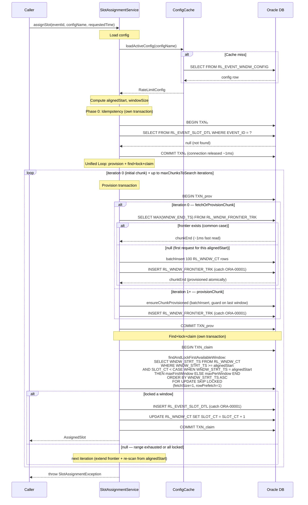
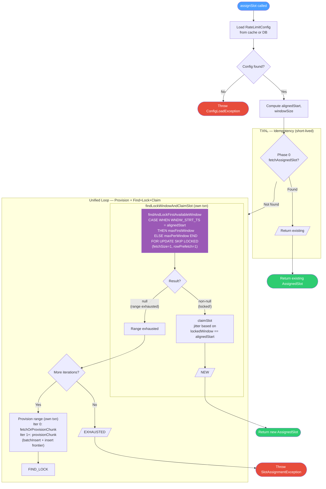

# Payments Rate Limiter

Oracle-based rate limiter for high-throughput event scheduling. Exposes a REST API that assigns
rate-limited time slots to events, enforcing a configurable maximum events per time window.

Implementation:
- **Kotlin/Exposed** (`SlotAssignmentServiceV3`) — split short-lived transactions for reduced connection hold time

## Quick Start

### Prerequisites

- **JDK**: 21
- **Docker & Docker Compose**: For local Oracle 19c

### 1. Start Oracle and create the schema user

```bash
./scripts/setup-oracle.sh
```

This script:
- Starts Oracle 19c via Docker Compose (`codeassertion/oracledb-arm64-standalone`)
- Waits for the database to be ready (2-4 minutes on first run)
- Creates the `rate_limiter` user in the `ORCLPDB1` pluggable database
- Grants necessary permissions

### 2. Start the application

```bash
./gradlew quarkusDev
```

Flyway will automatically create the tables on startup.

### 3. Seed the default rate limit config

```bash
curl -X POST http://localhost:8080/admin/rate-limit/config \
  -H 'Content-Type: application/json' \
  -d '{
    "configName": "default",
    "maxPerWindow": 100,
    "windowSize": "PT4S"
  }'
```

### 4. Assign a slot

```bash
curl -X POST http://localhost:8080/api/v1/slots \
  -H 'Content-Type: application/json' \
  -d "{
    \"eventId\": \"$(uuidgen)\",
    \"configName\": \"default\",
    \"requestedTime\": \"2025-06-01T12:00:00Z\"
  }"
```

Response:
```json
{
  "eventId": "pay-123",
  "scheduledTime": "2025-06-01T12:00:02.371Z",
  "delayMs": 2371
}
```

## System Overview

```
                     CALLER (up to 1M events/day)
                                |
                                v
                +-------------------------------+
                |    POST /api/v1/slots          |
                |    SlotAssignmentResource      |
                +-------------------------------+
                                |
                                |
           +--------------------+--------------------+
           |                    |                    |
    +-----------+        +-----------+        +-----------+
    | Window 0  |        | Window 1  |        | Window N  |
    | t+0s..t+4s|        | t+4s..t+8s|        | ...       |
    | max 100   |        | max 100   |        | max 100   |
    +-----------+        +-----------+        +-----------+
                                |
                                v
                +-------------------------------+
                |  Response:                    |
                |    eventId, scheduledTime,     |
                |    delayMs                    |
                +-------------------------------+
```

## Key Domain Concepts

### Windows

Fixed-duration time intervals used as the fundamental unit of rate limiting.

- **Duration**: Configurable, default 4 seconds (`windowSize` in config)
- **Epoch-aligned**: `windowStart = time - (time % windowSizeSecs)` — deterministic, no drift. All service instances agree on window boundaries without coordination.
- **Capacity**: Maximum `maxPerWindow` events per window (default: 100)
- **Example** (4-second windows):
  ```
  Window 0: 2025-06-01T12:00:00Z → 12:00:04Z
  Window 1: 2025-06-01T12:00:04Z → 12:00:08Z
  Window 2: 2025-06-01T12:00:08Z → 12:00:12Z
  ```

### Slots

Assigned execution times for events within a window.

- **Granularity**: Millisecond-precise (jitter applied within the window)
- **Idempotency**: One slot per unique `eventId` via `UNIQUE(EVENT_ID)` constraint
- **Immutability**: Once assigned, slots are never modified (only read in duplicate recovery)
- **Result**: `AssignedSlot(eventId, scheduledTime, delay)`

### Chunks

Batches of windows provisioned together to amortize provisioning cost.

- **Size**: Configurable via `max-windows-in-chunk` (default: 100 windows = 400 seconds at 4s window size)
- **Provisioning**: `ensureChunkProvisioned()` batch-inserts counter rows
- **Guard**: Existence check on last window prevents thundering herd — the first thread provisions, subsequent threads skip
- **Idempotency**: `batchInsert` catches duplicate exceptions silently

### Frontier

The furthest provisioned window boundary for a given `alignedStart`.

- **Storage**: `RL_WNDW_FRONTIER_TRK(REQ_TS, WNDW_END_TS)` table
- **Read**: `SELECT WNDW_END_TS ... ORDER BY DESC LIMIT 1` — a 5-second JVM cache avoids DB reads on the hot path
- **Write**: `INSERT (alignedStart, chunkEnd)` — append-only, deduplication via composite PK
- **Benefit**: Eliminates tail-end scanning; requests jump directly to the provisioning frontier instead of scanning from window 0

### Jitter

Random offset within a window to spread load uniformly.

- **Implementation**: `ThreadLocalRandom.nextLong(lower, upper)` via unified `computeJitterMs(lowerBoundMs, upperBoundMs)`
- **First window** (`lockedWindow == alignedStart`): `lower = max(elapsedMs, 0)` — constrains jitter so `scheduledTime >= requestedTime`
- **Subsequent windows**: `lower = 0` — full window width available
- **Why random**: When `maxPerWindow` is increased dynamically, new events must not cluster on deterministic grid points left by previously assigned events under a different capacity

---

## REST API

### Slot Assignment

**POST** `/api/v1/slots`

Assigns a rate-limited time slot for the given event. Idempotent: calling with the same
`eventId` returns the same slot.

**Request:**
```json
{
  "eventId": "pay-123",
  "configName": "default",
  "requestedTime": "2025-06-01T12:00:00Z"
}
```

**Response (200 OK):**
```json
{
  "eventId": "pay-123",
  "scheduledTime": "2025-06-01T12:00:02.371Z",
  "delayMs": 2371
}
```

| Field | Description |
|---|---|
| `eventId` | Echo of the input event ID |
| `scheduledTime` | Actual assigned execution time (ISO-8601) |
| `delayMs` | Milliseconds between `requestedTime` and `scheduledTime` |

**Error Responses:**
- `404` — Config not found for the given `configName`
- `503` — All windows within the search depth are full

### Admin: Config Management

**GET** `/admin/rate-limit/config?name=default` — Get active config

**POST** `/admin/rate-limit/config` — Create/update config (deactivates previous)
```json
{
  "configName": "default",
  "maxPerWindow": 100,
  "windowSize": "PT4S"
}
```

**POST** `/admin/rate-limit/cache/flush` — Force-evict in-memory config cache

---

## Database Schema

Flyway creates four tables on startup (`V1__rate_limiter_schema.sql`). Each serves a distinct role in the rate-limiting algorithm.

### `RL_EVENT_WNDW_CONFIG`

Versioned rate limit configuration. Supports dynamic updates — inserting a new config row automatically deactivates the previous one. Multiple config names can coexist (e.g., `"default"`, `"high-priority"`). Old rows are kept for audit; never deleted, only deactivated.

| Column | Type | Description |
|---|---|---|
| `RL_WNDW_CONFIG_ID` | `VARCHAR2(50)` PK | Config ID |
| `WNDW_CONFIG_NM` | `VARCHAR2(128)` | Logical config group name |
| `WNDW_MAX_EVENT_CT` | `NUMBER(10)` | Maximum events allowed per time window |
| `WNDW_SIZE_ISO_DUR_TX` | `VARCHAR2(25)` | ISO-8601 duration string (e.g., `PT4S`) |
| `CONFIG_EFF_STRT_DT` | `TIMESTAMP` | When this config version became effective |
| `ACT_IN` | `NUMBER(1)` | `1` = active, `0` = superseded |
| `CREAT_TS` | `TIMESTAMP` | Row creation time (default `SYSTIMESTAMP`) |

**Index**: `RL_EVENT_WNDW_CONFIG_I01X(WNDW_CONFIG_NM, ACT_IN)` — hot-path lookup for active config by name.

### `RL_WNDW_CT`

Lightweight concurrency control table. One row per epoch-aligned time window, acting as a semaphore. The `SLOT_CT` tracks how many events have been assigned to this window, regardless of which config version was active (config-agnostic). This is the lock target for `SELECT FOR UPDATE SKIP LOCKED` — keeping counters separate from event rows ensures O(1) lock acquisition per window.

| Column | Type | Description |
|---|---|---|
| `WNDW_STRT_TS` | `TIMESTAMP` PK | Epoch-aligned window boundary |
| `SLOT_CT` | `NUMBER(10)` | Current number of events assigned to this window |
| `CREAT_TS` | `TIMESTAMP(6)` | Row creation time (NOT NULL) |

**Primary key**: `RL_WNDW_CT_PK(WNDW_STRT_TS)`.

**Index**: `RL_WNDW_CT_I01X(WNDW_STRT_TS, SLOT_CT)` — supports the skip query that finds the first non-full window after a given timestamp.

### `RL_EVENT_SLOT_DTL`

Immutable audit record of every slot assignment. One row per event, never updated or deleted. Serves three purposes: **idempotency** (unique constraint on `EVENT_ID` ensures duplicate calls return the same slot), **audit trail** (records which window, scheduled time, and config each event received), and **reconciliation** (query recent unprocessed slots to detect leakage).

| Column | Type | Description |
|---|---|---|
| `WNDW_SLOT_ID` | `VARCHAR2(50)` PK | Slot ID |
| `EVENT_ID` | `VARCHAR2(50)` UNIQUE | Caller-provided event identifier |
| `REQ_TS` | `TIMESTAMP` | Original time requested by the caller |
| `WNDW_STRT_TS` | `TIMESTAMP` | Epoch-aligned window the event was assigned to |
| `COMPUTED_SCHED_TS` | `TIMESTAMP` | Actual execution time (window start + jitter) |
| `RL_WNDW_CONFIG_ID` | `VARCHAR2(50)` | Config version active at assignment time |
| `CREAT_TS` | `TIMESTAMP` | Row creation time (default `SYSTIMESTAMP`) |

**Indexes**: `RL_EVENT_SLOT_DTL_IUX(EVENT_ID)` (unique), `RL_EVENT_SLOT_DTL_I01X(WNDW_STRT_TS)`, `RL_EVENT_SLOT_DTL_I02X(CREAT_TS)`.

### `RL_WNDW_FRONTIER_TRK`

Append-only frontier tracker for provisioned window ranges. Eliminates tail-end scanning by recording how far windows have been provisioned for each `REQ_TS`. Read via `SELECT MAX(WNDW_END_TS)`; written via `INSERT` only — no `UPDATE` contention. Concurrent threads inserting the same frontier row deduplicate via the composite PK constraint.

| Column | Type | Description |
|---|---|---|
| `REQ_TS` | `TIMESTAMP` | The epoch-aligned start that triggered provisioning |
| `WNDW_END_TS` | `TIMESTAMP` | The furthest provisioned boundary for this start |
| `CREAT_TS` | `TIMESTAMP(6)` | Row creation time (NOT NULL) |

**Primary key**: `RL_WNDW_FRONTIER_TRK_PK(REQ_TS, WNDW_END_TS)` — composite, allows multiple frontier rows per `REQ_TS` (one per extension chunk).

---

## How the Rate Limiter Works

### Window Model

Time is divided into fixed-size windows (default: 4 seconds). Each window has a maximum
capacity (default: 100 events). When an event requests execution at time T:

1. **Snap** T to the epoch-aligned window boundary (floor): `windowStart = T - (T % windowSize)`
2. **Proportional capacity**: if T is mid-window, the first window's effective max = `floor(maxPerWindow * remainingTime / windowSize)`. Subsequent windows use full `maxPerWindow`.
3. **Search** the provisioned range `[alignedStart, frontier)` using a CASE-based SQL query that applies proportional capacity to `alignedStart` and full capacity to all other windows
4. **Lock** the first available window counter row via `FOR UPDATE SKIP LOCKED`
5. **If available**: insert slot record, increment counter, compute `COMPUTED_SCHED_TS = windowStart + jitter`
6. **If full or contended**: cursor advances to next window automatically; if all exhausted, extend frontier
7. **Return** the `AssignedSlot` with `scheduledTime` and `delay`

### Algorithm

Two-phase approach with a unified search loop:

**Phase 0 — Idempotency** *(own transaction)*: Check if event already has a slot via `fetchAssignedSlot()`. If yes, return it immediately. This runs in a separate short-lived transaction (~1ms) so duplicate/retry requests release their connection immediately.

**Unified Loop — Provision + Find+Lock+Claim** *(separate transactions per iteration)*: A loop that provisions window ranges and searches them. Iteration 0 reads the frontier (or provisions the initial chunk); iterations 1..`max-chunks-to-search` extend beyond.

1. **Provision** *(single transaction per iteration)*: Iteration 0 calls `fetchOrProvisionChunk()` — reads the frontier. If null (first request for this `alignedStart`), provisions the initial chunk (`maxWindowsInChunk` rows, default 100) starting from `alignedStart` and inserts the frontier row. Subsequent iterations call `provisionChunk()` — batch-provision a new chunk beyond the current frontier.

2. **Find+Lock+Claim** *(own transaction per iteration)*: `findLockWindowAndClaimSlot()` searches `[alignedStart, chunkEnd)` — the full range from the beginning, not just the newly provisioned chunk. This re-scanning picks up windows that were `SKIP LOCKED` in previous iterations.
   - **CASE-based SQL**: `SLOT_CT < CASE WHEN WNDW_STRT_TS = alignedStart THEN maxFirstWindow ELSE maxPerWindow END` — applies proportional capacity to the first window and full capacity to all others in a single query.
   - **Cursor control**: Oracle JDBC `fetchSize=1` + `rowPrefetch=1` with `FOR UPDATE SKIP LOCKED`. Oracle processes the cursor lazily, skipping locked rows server-side. Concurrent threads naturally lock different rows.
   - **Jitter**: If `lockedWindow == alignedStart`, jitter is constrained to `[elapsedMs, windowSizeMs)`. Otherwise, `[0, windowSizeMs)`.

3. **Next iteration or exhaustion**: If find+lock returns null, advance the provisioning frontier and repeat. If all iterations exhausted, throw `SlotAssignmentException`. Client retries extend the frontier further.

### Concurrency

Cursor-based zero-wait contention resolution:

**`findAndLockFirstAvailableWindow()`** — Uses Oracle JDBC cursor control (`fetchSize=1`, `rowPrefetch=1`) with `SELECT ... ORDER BY WNDW_STRT_TS ASC FOR UPDATE SKIP LOCKED`. Oracle processes the cursor lazily through the PK index: for each matching row, it tries to acquire the row lock; if locked by another session, `SKIP LOCKED` skips it server-side and advances to the next row. The client reads one row (`rs.next()` once) and closes the cursor.

This ensures concurrent threads naturally lock different rows without blocking:
- Thread A scans → Window 0 → locks it ✓
- Thread B scans → Window 0 → locked → SKIP → Window 1 → locks it ✓
- Thread C scans → Window 0 → SKIP → Window 1 → SKIP → Window 2 → locks it ✓

This is superior to `FETCH FIRST 1 ROW ONLY + FOR UPDATE SKIP LOCKED`, where Oracle picks 1 candidate before locking — two threads can select the same candidate, one wins, the other gets an empty result and must fall back.

### Pre-Provisioning

Windows are batch-provisioned in chunks (`max-windows-in-chunk`, default 100). An existence-check guard on the last window in each chunk prevents thundering herd: the first thread provisions, subsequent threads skip via the guard. `batchInsertWindows()` pre-filters existing windows (SELECT + filter) before inserting only new ones, reducing unnecessary duplicate key exceptions.

### Idempotency

Each event is identified by a unique `EVENT_ID`. Calling `assignSlot()` twice with the
same `EVENT_ID` returns the same `AssignedSlot`. A UNIQUE constraint on `EVENT_ID`
prevents duplicate assignments under concurrent access.

### Config-Agnostic Counters

The `RL_WNDW_CT` table tracks total events assigned to each window,
regardless of which config version was active when each slot was assigned. This means:

- **Increasing capacity**: New config sees existing occupancy. If window has 80 slots
  and new config allows 200, 120 more slots are available.
- **Decreasing capacity**: Window with 80 slots under old max=100, new max=50: window
  is treated as full. Already-scheduled events are immutable.

---

## Sequence Diagram


```mermaid
sequenceDiagram
    participant Caller
    participant SAS as SlotAssignmentService
    participant Cache as ConfigCache
    participant DB as Oracle DB

    Caller->>SAS: assignSlot(eventId, configName, requestedTime)

    Note over SAS: Load config
    SAS->>Cache: loadActiveConfig(configName)
    alt Cache miss
        Cache->>DB: SELECT FROM RL_EVENT_WNDW_CONFIG
        DB-->>Cache: config row
    end
    Cache-->>SAS: RateLimitConfig

    Note over SAS: Compute alignedStart, windowSize

    Note over SAS: Phase 0: Idempotency (own transaction)
    SAS->>DB: BEGIN TXN₀
    SAS->>DB: SELECT FROM RL_EVENT_SLOT_DTL WHERE EVENT_ID = ?
    DB-->>SAS: null (not found)
    SAS->>DB: COMMIT TXN₀ (connection released ~1ms)

    Note over SAS: Unified Loop: provision + find+lock+claim
    loop iteration 0 (initial chunk) + up to maxChunksToSearch iterations
        Note over SAS: Provision transaction
        SAS->>DB: BEGIN TXN_prov
        alt iteration 0 — fetchOrProvisionChunk
            SAS->>DB: SELECT MAX(WNDW_END_TS) FROM RL_WNDW_FRONTIER_TRK
            alt frontier exists (common case)
                DB-->>SAS: chunkEnd (~1ms fast read)
            else null (first request for this alignedStart)
                SAS->>DB: batchInsert 100 RL_WNDW_CT rows
                SAS->>DB: INSERT RL_WNDW_FRONTIER_TRK (catch ORA-00001)
                DB-->>SAS: chunkEnd (provisioned atomically)
            end
        else iteration 1+ — provisionChunk
            SAS->>DB: ensureChunkProvisioned (batchInsert, guard on last window)
            SAS->>DB: INSERT RL_WNDW_FRONTIER_TRK (catch ORA-00001)
        end
        SAS->>DB: COMMIT TXN_prov

        Note over SAS,DB: Find+lock+claim (own transaction)
        SAS->>DB: BEGIN TXN_claim
        SAS->>DB: findAndLockFirstAvailableWindow:<br/>SELECT WNDW_STRT_TS FROM RL_WNDW_CT<br/>WHERE WNDW_STRT_TS >= alignedStart<br/>AND SLOT_CT < CASE WHEN WNDW_STRT_TS = alignedStart<br/>  THEN maxFirstWindow ELSE maxPerWindow END<br/>ORDER BY WNDW_STRT_TS ASC<br/>FOR UPDATE SKIP LOCKED<br/>(fetchSize=1, rowPrefetch=1)
        alt locked a window
            SAS->>DB: INSERT RL_EVENT_SLOT_DTL (catch ORA-00001)
            SAS->>DB: UPDATE RL_WNDW_CT SET SLOT_CT = SLOT_CT + 1
            SAS->>DB: COMMIT TXN_claim
            SAS-->>Caller: AssignedSlot
        else null — range exhausted or all locked
            Note over SAS: next iteration (extend frontier + re-scan from alignedStart)
        end
    end
    SAS-->>Caller: throw SlotAssignmentException
```

---

## Flow Diagram


```mermaid
flowchart TD
    A([assignSlot called]) --> D[Load RateLimitConfig<br/>from cache or DB]
    D --> E{Config found?}
    E -- No --> F([Throw ConfigLoadException])
    E -- Yes --> G[Compute alignedStart,<br/>windowSize]

    subgraph TX0 ["TXN₀ — Idempotency (short-lived)"]
        IDEM{Phase 0<br/>fetchAssignedSlot?}
        IDEM -- "Found" --> C2[/Return existing/]
    end

    G --> IDEM

    IDEM -- "Not found" --> LOOP

    subgraph LOOP ["Unified Loop — Provision + Find+Lock+Claim"]
        direction TB
        PROVISION["Provision range (own txn)<br/>Iter 0: fetchOrProvisionChunk<br/>Iter 1+: provisionChunk<br/>(batchInsert + insert frontier)"]

        PROVISION --> FIND_LOCK

        subgraph TX_CLAIM ["findLockWindowAndClaimSlot (own txn)"]
            CASE_SQL["findAndLockFirstAvailableWindow<br/>CASE WHEN WNDW_STRT_TS = alignedStart<br/>  THEN maxFirstWindow<br/>  ELSE maxPerWindow END<br/>FOR UPDATE SKIP LOCKED<br/>(fetchSize=1, rowPrefetch=1)"]
            CASE_SQL --> CURSOR_C{Result?}
            CURSOR_C -- "non-null<br/>(locked!)" --> CLAIM[claimSlot<br/>jitter based on<br/>lockedWindow == alignedStart]
            CLAIM --> NEW[/NEW/]
            CURSOR_C -- "null<br/>(range exhausted)" --> NO_WIN[Range exhausted]
        end

        NO_WIN --> EXT_NEXT{More iterations?}
        EXT_NEXT -- "Yes" --> PROVISION
        EXT_NEXT -- "No" --> EXH[/EXHAUSTED/]
    end

    C2 --> RET_E([Return existing AssignedSlot])
    NEW --> RET_N([Return new AssignedSlot])
    EXH --> RET_X([Throw SlotAssignmentException])

    style A fill:#4a9eff,color:#fff
    style RET_E fill:#2ecc71,color:#fff
    style RET_N fill:#2ecc71,color:#fff
    style F fill:#e74c3c,color:#fff
    style RET_X fill:#e74c3c,color:#fff
    style CASE_SQL fill:#9b59b6,color:#fff
```

---

## Algorithm: Analysis

### Key Features

| Feature | Mechanism |
|---|---|
| **Epoch-aligned windows** | `windowStart = epochSec - (epochSec % windowSizeSecs)` — deterministic, no drift |
| **Proportional first-window capacity** | `maxFirstWindow = floor(maxPerWindow × remainingMs / windowSizeMs)` — prevents overscheduling in a partially-elapsed window |
| **CASE-based unified search** | Single SQL query applies proportional capacity to `alignedStart` and full capacity to all other windows via `SLOT_CT < CASE WHEN WNDW_STRT_TS = ? THEN ? ELSE ? END` |
| **Re-scanning from alignedStart** | Each iteration searches `[alignedStart, chunkEnd)` — re-scans earlier windows to pick up rows that were `SKIP LOCKED` in previous passes |
| **Frontier-tracked search** | Append-only `RL_WNDW_FRONTIER_TRK` table tracks the provisioned boundary per `alignedStart`. A 5-second JVM cache on frontier reads avoids DB access on the hot path |
| **Cursor-based find+lock** | Oracle JDBC cursor with `fetchSize=1` + `rowPrefetch=1` and `FOR UPDATE SKIP LOCKED` (no `FETCH FIRST`). Concurrent threads naturally lock different rows — no cascading fallbacks |
| **Configurable chunk extensions** | `max-chunks-to-search` (default 2) controls how many chunks are provisioned and searched |
| **Idempotency** | Phase 0 pre-transaction check via `fetchAssignedSlot()` + `UNIQUE(EVENT_ID)` constraint with `isDuplicateKeyViolation()` recovery |
| **JVM-local frontier cache** | `ConcurrentHashMap<Instant, CachedFrontier>` with 5-second TTL caches the provisioning frontier per `alignedStart` |
| **Pre-filtered batch inserts** | `batchInsertWindows()` queries existing windows and inserts only new ones |
| **Config-agnostic counters** | `SLOT_CT` tracks total usage regardless of config version — capacity changes take effect immediately |

### Performance Bottlenecks

#### 1. Chunk Provisioning Cost

`ensureChunkProvisioned()` inserts `maxWindowsInChunk` (default 100) rows per chunk via `batchInsert`. The first thread to hit an unprovisioned chunk pays the full provisioning cost; subsequent threads skip via the existence-check guard on the last window.

#### 2. Cursor Scan Cost Under High Contention

Under extreme contention (many threads locking adjacent windows simultaneously), Oracle may need to skip several locked rows before finding an available one. Each skip is a server-side operation (no additional round-trip), but the cursor holds the connection while scanning.

#### 3. Re-scanning Overhead

Each iteration searches from `alignedStart` (not from the end of the previous iteration's range). This means previously-full windows are re-checked. Under default settings (2 iterations), iteration 1 scans ~200 windows instead of ~100. The trade-off: re-scanning recovers windows that were SKIP LOCKED in previous passes, but scans more rows total.

#### 4. Multiple Short-Lived Transactions

Each phase runs in its own short-lived transaction to minimize connection hold time. The trade-off is more connection checkouts, but each is held briefly — under high TPS this reduces pool contention compared to a single long-held transaction.

### Design Trade-offs

| Decision | Benefit | Cost |
|---|---|---|
| **Split short-lived transactions** | Short connection hold times — each transaction releases its connection quickly. Provisioning doesn't block lock-holding transactions. | More connection checkouts per request. A crash between provisioning and claiming leaves provisioned-but-unclaimed rows (harmless — provisioning is idempotent). |
| **CASE-based unified search** | Single query handles proportional first-window capacity and full capacity for all other windows. No separate phase for the first window. Cursor naturally advances past full/locked windows. | CASE expression adds a timestamp comparison per row during the scan (negligible cost). |
| **Re-scanning from alignedStart** | Recovers windows that were SKIP LOCKED in previous iterations — avoids wasting capacity under high contention. | Scans previously-full windows again. O(n²) total rows across iterations vs O(n) for forward-only scanning. Modest with default `maxChunksToSearch=2`. |
| **Append-only `RL_WNDW_FRONTIER_TRK`** | No UPDATE contention. Concurrent threads safely deduplicate via PK. JVM cache avoids DB reads on the hot path. | Row count grows linearly with extension iterations. |
| **Batch provisioning (100 rows per chunk)** | Amortizes provisioning — one thread pays upfront, all others benefit. | First thread pays O(W) INSERTs while holding the transaction open. |
| **JDBC cursor control (`fetchSize=1`)** | Oracle cursor scans lazily, skipping locked rows server-side. Concurrent threads lock different rows — no retry loops or scout queries. | Couples find+lock to Oracle's JDBC driver (`OracleConnection`, `OraclePreparedStatement`). |
| **Random jitter** | Safe under dynamic config changes — new events don't cluster on grid points. | Instantaneous TPS guarantee is statistical, not absolute. |

### Time Complexity

Let **W** = `max-windows-in-chunk` (default 100), **C** = `max-chunks-to-search` (default 2), **M** = `WNDW_MAX_EVENT_CT`.

| Scenario | DB Operations | Windows Scanned |
|---|---|---|
| **Best: Idempotent hit** (Phase 0) | 1 SELECT | 0 |
| **Best: Slot in first chunk** | ~4 (frontier read + cursor + INSERT + UPDATE) | 1 (cursor skips locked rows server-side) |
| **Worst: Extension loop** | Per iteration: optional W INSERTs + cursor scan + INSERT + UPDATE | Iteration 0: W, Iteration 1: 2W (re-scans from alignedStart) |
| **Worst: Exhaustion** | C iterations of provisioning + scanning | C × W (cumulative, with re-scanning) |

With defaults (W=100, C=2): worst case scans up to **300 windows** (100 + 200) and provisions up to **200 rows**.

---

## V3 Evolution: Unified Loop vs Two-Phase Architecture

The current unified-loop design replaced an earlier two-phase architecture. This section documents the key differences and performance trade-offs.

### What Changed

| Aspect | Previous (Two-Phase) | Current (Unified Loop) |
|---|---|---|
| **First window handling** | Dedicated Phase 1: `ensureWindowExists()` + `tryLockFirstWindow()` in own transaction | First window included in CASE-based search query alongside all others |
| **First window cache** | `ConcurrentHashMap<Instant, Boolean>` cached known-full first windows to skip Phase 1 | Removed — CASE expression filters full first windows at the SQL level |
| **Search start** | Phase 2 searched from `alignedStart + windowSize` (skipped first window) | Every iteration searches from `alignedStart` (includes first window) |
| **Re-scanning** | Each iteration searched only its own range; `searchFrom` advanced forward | Each iteration re-scans from `alignedStart` to `chunkEnd` |
| **Initial provisioning** | First window created separately via `ensureWindowExists()`; chunk started at `alignedStart + windowSize` (101 windows total) | First window included in chunk provisioning from `alignedStart` (100 windows total) |
| **Jitter** | Two functions: `computeFirstWindowJitterMs()`, `computeFullWindowJitterMs()` | Unified `computeJitterMs(lowerBoundMs, upperBoundMs)` |

### Functional Equivalence

All core guarantees are preserved:

- **Proportional capacity**: CASE expression applies `maxFirstWindow` to `alignedStart`, `maxPerWindow` to all others — identical formula
- **Jitter ranges**: First window `[max(elapsedMs, 0), windowSizeMs)`, others `[0, windowSizeMs)` — identical
- **Idempotency**: Phase 0 + UNIQUE constraint + duplicate-key catch — unchanged
- **Frontier tracking**: Append-only with composite PK — unchanged

### Performance Comparison at High TPS

| Factor | Previous (Two-Phase) | Current (Unified Loop) | Winner |
|---|---|---|---|
| **Happy path transactions** (first window available, no contention) | 2 txn (Phase 0 + Phase 1) | 3 txn (Phase 0 + frontier + find+lock) | Previous |
| **Contention on first window** (SKIP LOCKED) | 4 txn (Phase 0 + wasted Phase 1 + frontier + find+lock) | 3 txn (Phase 0 + frontier + find+lock, cursor advances past locked window) | **Current** |
| **First window full** (steady state, cache warm) | 3 txn (Phase 0 + frontier + find+lock) | 3 txn | Tie |
| **`ensureWindowExists` overhead** | Every Phase 1 entry throws+catches duplicate key exception after first insert. At 5000 TPS: ~20K exceptions/window generating GC pressure + Oracle redo/undo churn | Eliminated — first window provisioned as part of batch `batchInsertWindows()` | **Current** |
| **Lock fan-out under contention** | Phase 1 serializes all threads on one row; N-1 losers waste the entire Phase 1 transaction | Cursor-based SKIP LOCKED naturally distributes threads across windows in a single query | **Current** |
| **Extension scan cost** | Each iteration scans only its own range: O(n) total rows | Re-scans from alignedStart: O(n²) total rows across iterations | Previous |
| **SKIP LOCKED recovery** | Forward-only scanning — windows locked in iteration 0 are never retried | Re-scanning recovers previously SKIP LOCKED windows | **Current** |
| **Latency predictability** | Variable: 2-4 txn depending on cache state and contention | Consistent: 3 txn always | **Current** |

**Summary**: The unified loop is better suited for high TPS. The dominant bottlenecks at scale are contention handling and wasted transactions — both improved by the cursor-based fan-out. The previous architecture's only meaningful advantage (forward-only scanning) applies to extension iterations, which are relatively rare events, and the cost (100 extra logical reads from buffer cache) is ~100-500μs.

---

## Window Size Tuning

The `windowSize` parameter (set via `POST /admin/rate-limit/config`) is the single most impactful tuning lever. It controls how time is divided, and cascades through every phase of the algorithm.

### How Window Size Affects Each Dimension

All examples assume a constant scheduling rate of 25 TPS and `maxWindowsInChunk=100`.

| Dimension | 1s (max=25) | 4s (max=100) | 30s (max=750) | 60s (max=1500) |
|---|---|---|---|---|
| **Provisioning frequency** | Every ~100s | Every ~7 min | Every ~50 min | Every ~100 min |
| **`RL_WNDW_CT` rows/day** | 86,400 | 21,600 | 2,880 | 1,440 |
| **Extension search horizon** | 5 min | 20 min | 2.5 hrs | 5 hrs |
| **Scheduling delay (overflow)** | 0.5-1.5s | 2-6s | 15-45s | 30-90s |
| **500-event burst absorption** | 19 windows needed | 5 windows needed | Fits in 1 window | Fits in 1 window |

### Why Larger Windows Are Generally Better

**Provisioning overhead scales inversely.** With 1s windows, a chunk covers 100 seconds and reprovisioning recurs ~36 times/hour. With 30s windows, a chunk covers 50 minutes — a 30x reduction in batch INSERT work.

**Table growth scales inversely.** 1s windows produce 86,400 rows/day; 30s windows produce 2,880. The index stays smaller and scans are faster.

**Burst absorption improves.** A 500-event burst: with 30s windows (`maxPerWindow=750`), all events fit in one window. With 1s windows (`maxPerWindow=25`), 475 events overflow, consuming 19 additional windows.

### Upper Bound: Why Not 60s+

Beyond ~60s, two problems emerge:

1. **Hot row contention.** All concurrent events target the same `RL_WNDW_CT` row. At 100 TPS with 3ms lock hold time, heavy SKIP LOCKED skipping occurs.

2. **Delay penalty.** When a thread is skipped to the next window — 60+ seconds into the future — that's operationally unacceptable for a payments rate limiter.

### Lower Bound: Why Not <4s

Small windows cause frequent provisioning, rapid table growth, shallow extension coverage, and cascading SKIP LOCKED spillover (each window holds only 25 slots at 1s).

### Recommendation

| Requirement | Recommended Window Size |
|---|---|
| Strict per-second rate precision | 1-4s |
| General rate limiting with moderate precision | 4-10s |
| Throughput-optimized, delay-tolerant | 10-30s |

The default `PT4S` is a good general-purpose choice.

### Chunk Provisioning Size

The `max-windows-in-chunk` parameter (default 100) controls how many windows are batch-provisioned at once. With 30s windows at 25-30 TPS scheduling / 100 TPS incoming:

| Chunk Size | Initial Range Duration | Batch INSERT Cost |
|---|---|---|
| 20 | ~3 min | ~2-5ms |
| 50 | ~7 min | ~3-8ms |
| **100** | **~14-18 min** | **~5-15ms** |
| 200 | ~28-36 min | ~10-30ms |

**100 is the sweet spot.** It provides 14-18 minutes of capacity before any extension is needed, and the 5-15ms batch INSERT in a separate short transaction is negligible.

---

## Configuration Reference

All properties are set in `src/main/resources/application.yaml`:

| Property | Description | Default |
|---|---|---|
| `rate-limiter.default-config-name` | Name of the default rate limit config | `default` |
| `rate-limiter.max-windows-in-chunk` | Windows per provisioning chunk | `100` |
| `rate-limiter.max-chunks-to-search` | Extension iterations after initial range scan | `2` |
| `quarkus.datasource.db-kind` | Database type | `oracle` |
| `quarkus.datasource.jdbc.url` | Oracle JDBC URL | `jdbc:oracle:thin:@localhost:1521/ORCLPDB1` |
| `quarkus.datasource.username` | Oracle username | `rate_limiter` |
| `quarkus.datasource.password` | Oracle password | `rate_limiter` |
| `quarkus.datasource.jdbc.min-size` | Minimum connection pool size | `5` |
| `quarkus.datasource.jdbc.max-size` | Maximum connection pool size | `30` |
| `quarkus.flyway.migrate-at-start` | Run Flyway migrations at startup | `true` |

## Docker Setup

The project includes a `docker-compose.yml` and setup script for Oracle 19c:

```bash
# Start Oracle and create the rate_limiter user
./scripts/setup-oracle.sh

# Or manually via docker-compose
docker compose up -d oracle
```

The Docker setup uses [`codeassertion/oracledb-arm64-standalone:19.3.0-enterprise`](https://hub.docker.com/r/codeassertion/oracledb-arm64-standalone),
which supports ARM64 (Apple Silicon M1/M2/M3).

**Connection details after setup:**

| Parameter | Value |
|---|---|
| JDBC URL | `jdbc:oracle:thin:@localhost:1521/ORCLPDB1` |
| Username | `rate_limiter` |
| Password | `rate_limiter` |

### Stopping and cleaning up

```bash
# Stop Oracle (data persists in Docker volume)
docker compose down

# Stop and remove data
docker compose down -v
```

## Dynamic Config Update Guide

### Increasing Capacity

To increase from 100 to 200 events per window:

```bash
curl -X POST http://localhost:8080/admin/rate-limit/config \
  -H 'Content-Type: application/json' \
  -d '{
    "configName": "default",
    "maxPerWindow": 200,
    "windowSize": "PT4S"
  }'
```

This inserts a new config row and deactivates the old one. The change takes effect
within 5 seconds (cache TTL) on all nodes.

**What happens**: Windows partially filled under the old config continue filling under
the new limit. Existing scheduled events are never modified.

### Decreasing Capacity

Same API, lower value. Windows already exceeding the new limit are treated as full.
No existing events are cancelled.

**What NOT to change**:
- Do not change `WNDW_SIZE_ISO_DUR_TX` while events are in-flight. This changes the window
  boundaries and makes existing counter rows meaningless.
- Do not manually edit `RL_WNDW_CT` rows.
- Do not delete `RL_EVENT_WNDW_CONFIG` rows — deactivate them instead.

### Cache Flush (Urgent Changes)

For immediate propagation across all nodes:

```bash
curl -X POST http://localhost:8080/admin/rate-limit/cache/flush
```

## Observability

### Key Log Messages

- `INFO  SlotAssignmentService - Assigned slot for eventId={} in window={}`
- `DEBUG SlotAssignmentService - Idempotent hit for eventId={}`
- `ERROR SlotAssignmentService - Could not assign slot for event {} after searching`
- `INFO  RateLimitConfigRepository - Config cache miss for {configName}, loaded from DB`

## Known Limitations

1. **TPS guarantee is statistical, not absolute**: Random jitter within windows means
   instantaneous bursts can theoretically exceed the per-window limit for brief
   sub-second intervals.

2. **Search depth exhaustion**: If a burst exceeds `maxChunksToSearch * maxWindowsInChunk * maxPerWindow`
   events, slot assignment fails. Client retries naturally extend the frontier further.

3. **Config propagation delay**: Config changes take up to 5 seconds (cache TTL) to
   propagate to all nodes. Use the cache flush endpoint for immediate propagation.

4. **No business-hours awareness**: The window model advances linearly through time
   with no concept of business hours or blackout periods.

5. **Shared windows across different `requestedTime` values**: When two requests with
   different `requestedTime` values share the same epoch-aligned window, the capacity
   limit applied depends on which request's phase touches the window first. The
   `SLOT_CT` column tracks total usage regardless of which `requestedTime` caused it.

## Operational Runbook

### Windows Filling Up (Search Depth Approaching Limit)

**Symptom**: Logs show slot assignment exceptions or high search depths.

**Action**:
1. Check current config: `GET /admin/rate-limit/config`
2. If safe, increase `maxPerWindow`: `POST /admin/rate-limit/config`
3. Increase `max-chunks-to-search` to allow deeper in-request searching
4. Check logs for `SlotAssignmentException` — if present, events are being rejected. Client retries will naturally extend the frontier.

### Oracle Slow / Unavailable

**Symptom**: Logs show slow assignment times or connection pool exhaustion warnings.

**Action**:
1. Check Oracle AWR/ASH reports for contention.
2. Verify connection pool is not exhausted: check Quarkus Agroal datasource logs.
3. If Oracle is down, the caller should retry with backoff.
