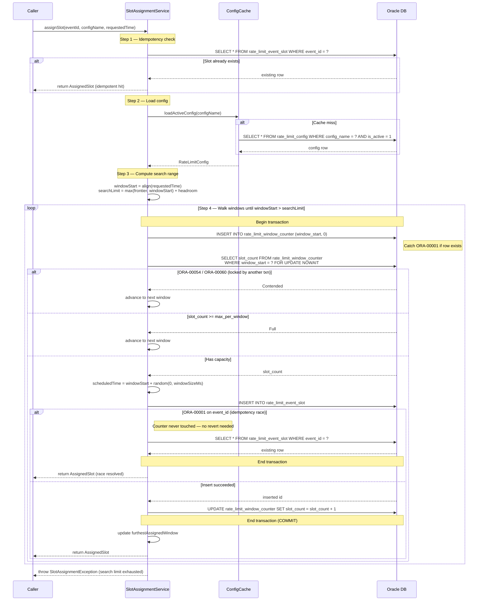
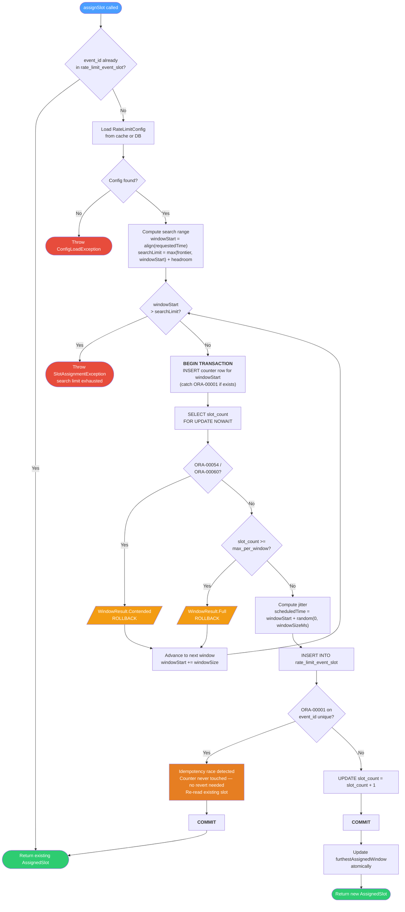

# Payments Rate Limiter

Oracle-based rate limiter for high-throughput event scheduling. Exposes a REST API that assigns
rate-limited time slots to events, enforcing a configurable maximum events per time window.

## Quick Start

### Prerequisites

- **JDK**: 21
- **Docker & Docker Compose**: For local Oracle 19c

### 1. Start Oracle and create the schema user

```bash
./scripts/setup-oracle.sh
```

This script:
- Starts Oracle 19c via Docker Compose (`codeassertion/oracledb-arm64-standalone`)
- Waits for the database to be ready (2-4 minutes on first run)
- Creates the `rate_limiter` user in the `ORCLPDB1` pluggable database
- Grants necessary permissions

### 2. Start the application

```bash
./gradlew quarkusDev
```

Flyway will automatically create the tables on startup.

### 3. Seed the default rate limit config

```bash
curl -X POST http://localhost:8080/admin/rate-limit/config \
  -H 'Content-Type: application/json' \
  -d '{
    "configName": "default",
    "maxPerWindow": 100,
    "windowSizeSecs": 4
  }'
```

### 4. Assign a slot

```bash
curl -X POST http://localhost:8080/api/v1/slots \
  -H 'Content-Type: application/json' \
  -d '{
    "eventId": "pay-123",
    "configName": "default",
    "requestedTime": "2025-06-01T12:00:00Z"
  }'
```

Response:
```json
{
  "eventId": "pay-123",
  "scheduledTime": "2025-06-01T12:00:02.371Z",
  "delayMs": 2371
}
```

## System Overview

```
                     CALLER (up to 1M events/day)
                                |
                                v
                +-------------------------------+
                |    POST /api/v1/slots          |
                |    SlotAssignmentResource      |
                |                               |
                |  Request:                     |
                |    eventId, configName,        |
                |    requestedTime              |
                +-------------------------------+
                                |
                +-------------------------------+
                |   SlotAssignmentService        |
                |                               |
                |  1. Idempotency check         |
                |  2. Load config (cached)      |
                |  3. Walk windows until slot    |
                |     found                     |
                +-------------------------------+
                                |
           +--------------------+--------------------+
           |                    |                    |
    +-----------+        +-----------+        +-----------+
    | Window 0  |        | Window 1  |        | Window N  |
    | t+0s..t+4s|        | t+4s..t+8s|        | ...       |
    | max 100   |        | max 100   |        | max 100   |
    +-----------+        +-----------+        +-----------+
                                |
                                v
                +-------------------------------+
                |  Response:                    |
                |    eventId, scheduledTime,     |
                |    delayMs                    |
                +-------------------------------+
```

## REST API

### Slot Assignment

**POST** `/api/v1/slots`

Assigns a rate-limited time slot for the given event. Idempotent: calling with the same
`eventId` returns the same slot.

**Request:**
```json
{
  "eventId": "pay-123",
  "configName": "default",
  "requestedTime": "2025-06-01T12:00:00Z"
}
```

**Response (200 OK):**
```json
{
  "eventId": "pay-123",
  "scheduledTime": "2025-06-01T12:00:02.371Z",
  "delayMs": 2371
}
```

| Field | Description |
|---|---|
| `eventId` | Echo of the input event ID |
| `scheduledTime` | Actual assigned execution time (ISO-8601) |
| `delayMs` | Milliseconds between `requestedTime` and `scheduledTime` |

**Error Responses:**
- `404` — Config not found for the given `configName`
- `503` — All windows within the dynamic lookahead range are full

### Admin: Config Management

**GET** `/admin/rate-limit/config?name=default` — Get active config

**POST** `/admin/rate-limit/config` — Create/update config (deactivates previous)
```json
{
  "configName": "default",
  "maxPerWindow": 100,
  "windowSizeSecs": 4
}
```

**POST** `/admin/rate-limit/cache/flush` — Force-evict in-memory config cache

## How the Rate Limiter Works

### Window Model

Time is divided into fixed-size windows (default: 4 seconds). Each window has a maximum
capacity (default: 100 events). When an event requests execution at time T:

1. **Snap** T to the nearest window boundary: `windowStart = T - (T % windowSize)`
2. **Lock** the window counter row with `SELECT FOR UPDATE NOWAIT`
3. **Check** if `slot_count < max_per_window`
4. **If yes**: insert slot record, increment counter, compute `scheduled_time = windowStart + random(0, windowSize)`
5. **If no (full)** or **contended (NOWAIT bounce)**: advance to the next window and repeat
6. **Return** the `AssignedSlot` with `scheduledTime` and `delay`

### Random Jitter

All offsets within a window use uniformly random jitter:

```
offset = Random.nextLong(0, windowSizeMs)
scheduled_time = windowStart + offset
```

Random jitter is used exclusively because when `max_per_window` is increased dynamically,
new events must not cluster on deterministic grid points left by previously assigned events.
At high volumes (100+ per window), random distribution is practically uniform.

### Config-Agnostic Counters

The `rate_limit_window_counter` table tracks total events assigned to each window,
regardless of which config version was active when each slot was assigned. This means:

- **Increasing capacity**: New config sees existing occupancy. If window has 80 slots
  and new config allows 200, 120 more slots are available.
- **Decreasing capacity**: Window with 80 slots under old max=100, new max=50: window
  is treated as full. Already-scheduled events are immutable.

### Concurrency Control

- `SELECT FOR UPDATE NOWAIT` serializes concurrent writers per window row.
- `NOWAIT` means threads that lose the lock race immediately skip to the next window.
- This prevents thread convoys during bulk ingestion — essential when 10K+ events
  target the same time window.

### Idempotency

Each event is identified by a unique `event_id`. Calling `assignSlot()` twice with the
same `event_id` returns the same `AssignedSlot`. A UNIQUE constraint on `event_id`
prevents duplicate assignments under concurrent access.

### Slot Assignment Sequence Diagram



### Slot Assignment Flow Diagram



## Configuration Reference

All properties are set in `src/main/resources/application.yaml`:

| Property | Description | Default |
|---|---|---|
| `rate-limiter.default-config-name` | Name of the default rate limit config | `default` |
| `rate-limiter.headroom-windows` | How many windows beyond the frontier to search | `100` |
| `quarkus.datasource.db-kind` | Database type | `oracle` |
| `quarkus.datasource.jdbc.url` | Oracle JDBC URL | `jdbc:oracle:thin:@localhost:1521/ORCLPDB1` |
| `quarkus.datasource.username` | Oracle username | `rate_limiter` |
| `quarkus.datasource.password` | Oracle password | `rate_limiter` |
| `quarkus.datasource.jdbc.min-size` | Minimum connection pool size | `5` |
| `quarkus.datasource.jdbc.max-size` | Maximum connection pool size | `30` |
| `quarkus.flyway.migrate-at-start` | Run Flyway migrations at startup | `true` |

## Docker Setup

The project includes a `docker-compose.yml` and setup script for Oracle 19c:

```bash
# Start Oracle and create the rate_limiter user
./scripts/setup-oracle.sh

# Or manually via docker-compose
docker compose up -d oracle
```

The Docker setup uses [`codeassertion/oracledb-arm64-standalone:19.3.0-enterprise`](https://hub.docker.com/r/codeassertion/oracledb-arm64-standalone),
which supports ARM64 (Apple Silicon M1/M2/M3).

**Connection details after setup:**

| Parameter | Value |
|---|---|
| JDBC URL | `jdbc:oracle:thin:@localhost:1521/ORCLPDB1` |
| Username | `rate_limiter` |
| Password | `rate_limiter` |

### Stopping and cleaning up

```bash
# Stop Oracle (data persists in Docker volume)
docker compose down

# Stop and remove data
docker compose down -v
```

## Dynamic Config Update Guide

### Increasing Capacity

To increase from 100 to 200 events per window:

```bash
curl -X POST http://localhost:8080/admin/rate-limit/config \
  -H 'Content-Type: application/json' \
  -d '{
    "configName": "default",
    "maxPerWindow": 200,
    "windowSizeSecs": 4
  }'
```

This inserts a new config row and deactivates the old one. The change takes effect
within 5 seconds (cache TTL) on all nodes.

**What happens**: Windows partially filled under the old config continue filling under
the new limit. Existing scheduled events are never modified.

### Decreasing Capacity

Same API, lower value. Windows already exceeding the new limit are treated as full.
No existing events are cancelled.

**What NOT to change**:
- Do not change `window_size_secs` while events are in-flight. This changes the window
  boundaries and makes existing counter rows meaningless.
- Do not manually edit `rate_limit_window_counter` rows.
- Do not delete `rate_limit_config` rows — deactivate them instead.

### Cache Flush (Urgent Changes)

For immediate propagation across all nodes:

```bash
curl -X POST http://localhost:8080/admin/rate-limit/cache/flush
```

## Observability

### Key Log Messages

- `WARN  SlotAssignmentService - Window contention on {windowStart}, skipping to next`
- `ERROR SlotAssignmentService - Lookahead exhausted for event {eventId}, searched {depth} windows`
- `INFO  RateLimitConfigRepository - Config cache miss for {configName}, loaded from DB`
- `INFO  RateLimitConfigRepository - Config updated: {configName} maxPerWindow={old}->{new}`

## Known Limitations

1. **TPS guarantee is statistical, not absolute**: Random jitter within windows means
   instantaneous bursts can theoretically exceed the per-window limit for brief
   sub-second intervals.

2. **Lookahead exhaustion**: If a single burst exceeds `headroom-windows * maxPerWindow`
   events (default: 100 * 100 = 10,000), slot assignment fails for remaining events.
   The dynamic lookahead grows with load, so this is only a concern for sudden massive spikes.

3. **Config propagation delay**: Config changes take up to 5 seconds (cache TTL) to
   propagate to all nodes. Use the cache flush endpoint for immediate propagation.

4. **No business-hours awareness**: The window model advances linearly through time
   with no concept of business hours or blackout periods.

## Operational Runbook

### Windows Filling Up (Lookahead Approaching Limit)

**Symptom**: Logs show `Lookahead exhausted` errors or high lookahead depths.

**Action**:
1. Check current config: `GET /admin/rate-limit/config`
2. If safe, increase `maxPerWindow`: `POST /admin/rate-limit/config`
3. Check logs for `SlotAssignmentException` — if present, events are being rejected.

### Oracle Slow / Unavailable

**Symptom**: Logs show slow assignment times or connection pool exhaustion warnings.

**Action**:
1. Check Oracle AWR/ASH reports for contention.
2. Verify connection pool is not exhausted: check Quarkus Agroal datasource logs.
3. If Oracle is down, the caller should retry with backoff.
