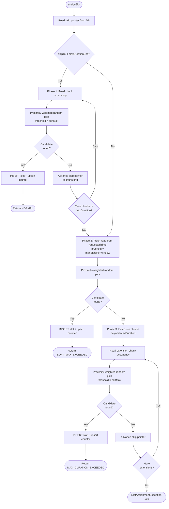

# SlotAssignmentServiceV5

Optimistic, lock-free rate-limiter that assigns time slots to events within fixed windows. Designed for multi-pod deployments (20+ pods) handling sustained traffic at 30+ TPS downstream, with per-request control over how far into the future slots can be placed.

---

## What Problem Does This Solve?

A payment system can process **30 transactions per second**. When 500,000 payment requests arrive in a burst, they can't all execute at once. This service acts as a **traffic shaper**: it assigns each request a specific future time slot, spreading the load evenly across time windows.

```
Without rate limiting:              With V5 rate limiting:

  Requests   Downstream               Requests    V5 Service    Downstream
  ────────   ──────────               ────────    ──────────    ──────────
  ██████████ → 500K/sec  → CRASH!     ██████████ → schedules  → ▓▓▓▓ 30/sec
                                                    future    → ▓▓▓▓ 30/sec
                                                    time      → ▓▓▓▓ 30/sec
                                                    slots     → ▓▓▓▓ 30/sec
                                                              → ... (spread
                                                                 over hours)
```

---

## Key Design Features

### 1. Global Rate-Limiting Across Independent Traffic Streams

The window counter (`RL_WNDW_CT`) is keyed **solely by window start time** — not by `requestedTime`, caller, or traffic type. Every slot assignment, regardless of origin, increments the same shared counter for a given time window. This provides a single, global rate limit that the downstream system actually experiences.

```
Traffic A: requestedTime = 14:00   ──┐
Traffic B: requestedTime = 14:02   ──┤── all share window counters ──→  downstream sees
Traffic C: requestedTime = 15:00   ──┤                                  ≤ 30 TPS per window
Batch job: requestedTime = tomorrow ─┘
```

**Why this matters**: Without global counters, two independent bursts targeting overlapping windows could each fill windows to capacity — doubling the downstream load. Global counting prevents this by construction. A window at `14:02:00` that was filled to softMax by Traffic A is seen as full by Traffic B, Traffic C, and the batch job. No coordination between callers is needed — the DB counter is the single source of truth.

**Trade-off**: High-volume traffic can "crowd out" lower-volume traffic that shares the same time range. This is intentional — the downstream system doesn't care where load comes from, only that it stays under the rate limit.

### 2. Proximity + Occupancy Weighted Random Window Selection

V5 doesn't pick the first available window (sequential hot-spotting) or a purely random window (ignores proximity). It uses a **two-factor weighted random** that balances closeness to `requestedTime` with remaining window capacity.

```
weight(window) = capacityWeight × proximityWeight

  capacityWeight  = max(0, threshold − currentOccupancy)
  proximityWeight = rangeSize − index     (linear decay from range start)
```

```
Example: 4 windows in a chunk, threshold = 810

  Window    Occupancy   Capacity   Proximity   Weight    P(select)
  ──────    ─────────   ────────   ─────────   ──────    ─────────
  W+0       200         610        4           2440      48%  ████████████████████████
  W+1       500         310        3           930       18%  █████████
  W+2       0           810        2           1620      32%  ████████████████
  W+3       750         60         1           60         1%  ▌
```

**Key behaviors**:
- **Closer + emptier wins**: W+0 (48%) beats W+3 (1%) despite W+2 being completely empty — proximity dominates at the extremes.
- **Not strictly earliest**: W+2 (32%) beats W+1 (18%) because W+2 has much more capacity. An empty window slightly further out can win over a half-full close window, spreading load naturally.
- **Full windows excluded**: Any window at or above the threshold gets weight 0 — never selected.
- **Self-balancing**: As close windows fill, their capacity weight drops, naturally shifting load to later windows. No cliff — smooth transition.

**Why not first-available?** Under 20-pod concurrency, all pods would race for the same earliest window, causing update contention and counter skew. Weighted random naturally spreads load across the nearest windows while still strongly preferring closer ones.

**Why not uniform random?** A uniform pick could land a slot 7 hours from now when nearby windows are empty. Proximity weighting ensures requests cluster close to their requested time.

### 3. Incremental Chunk-Based Claims Within maxDuration

With an 8-hour `maxDuration` and 30-second windows, there are **960 windows** to search. V5 does not scan all 960 at once. Instead, Phase 1 advances through the range in small configurable chunks (default: 15 minutes = 30 windows):

```
maxDuration = 8 hours
chunk size  = 15 minutes

            skipTo
              │
              ▼
Phase 1:  [chunk 1] → [chunk 2] → [chunk 3] → ... → [chunk 32]
           15 min      15 min      15 min              15 min
              │
              └── 1. Read occupancy for this chunk only (30 windows)
                  2. Pick via proximity-weighted random (tight distribution)
                  3. Claim the slot
                  4. If chunk exhausted → advance skip pointer → next chunk
```

**Three benefits of chunking**:

1. **Tight proximity weighting** — Selecting from 30 windows gives the closest window ~30x the weight of the farthest. Selecting from 960 would spread the probability so thin that proximity barely matters.

2. **Small DB reads** — Each chunk reads ~30 counter rows instead of 960. At 20 pods, that's 20 × 30-row reads vs 20 × 960-row reads per cycle.

3. **Progressive skip pointer advancement** — Each exhausted chunk advances the skip pointer. Other pods (and subsequent requests on the same pod) skip already-exhausted chunks immediately. The skip pointer acts as a distributed cursor that ensures the search window narrows over time rather than re-scanning from the beginning.

**Per-request flow**: Each `assignSlot` call claims exactly one slot. It starts at the first non-exhausted chunk (via skip pointer), reads occupancy for that chunk, picks a window, and claims. Most requests complete in a single chunk read — 3 DB calls total.

### 4. Three-Phase Graceful Degradation

When Phase 1 exhausts all chunks within `maxDuration`, V5 doesn't give up. It escalates through two more phases, each with a different strategy and a distinct status code that tells the caller exactly what happened.

```
Request arrives: assignSlot(eventId, requestedTime, maxDuration)
│
├─ PHASE 1: Normal (softMax threshold, chunked within maxDuration)
│      → Returns NORMAL
│
├─ PHASE 2: Overflow (maxSlots threshold, full rescan within maxDuration)
│      → Returns SOFT_MAX_EXCEEDED
│
├─ PHASE 3: Extension (softMax threshold, beyond maxDuration)
│      → Returns MAX_DURATION_EXCEEDED
│
└─ All exhausted → SlotAssignmentException (503)
```

| Phase | Range | Threshold | When triggered | What it means |
|-------|-------|-----------|----------------|---------------|
| **1** | `[skipTo, requestedTime + maxDuration)` | softMax | First attempt | Normal operation — plenty of capacity |
| **2** | `[requestedTime, requestedTime + maxDuration)` | maxSlots | All windows in range ≥ softMax | Nearing capacity — using the 10% buffer between softMax and maxSlots |
| **3** | Beyond `maxDuration`, in chunks | softMax | All windows in maxDuration range ≥ maxSlots | Capacity exhausted within maxDuration — extending into fresh windows |

**Phase 2 rescans from `requestedTime`**, not from the skip pointer. The skip pointer tracks softMax exhaustion, but windows between softMax and maxSlots may exist before the skip pointer. Phase 2 catches these.

**Phase 3 uses fresh occupancy reads per extension chunk** — the data from Phase 1 is stale by this point.

### 5. DB-Backed Skip Pointer for Multi-Pod Coordination

With 20 pods processing requests concurrently, each pod needs to know where to start searching. The skip pointer (`RL_SKIP_PTR`) is a DB-backed, append-only coordination primitive that tracks the furthest exhausted chunk boundary per `requestedTime`.

```
Pod 1: exhausts chunk [14:00, 14:15) → INSERT skipTo = 14:15
Pod 2: reads skipTo = 14:15 → starts at 14:15 (skips chunk 1)
Pod 3: exhausts chunk [14:15, 14:30) → INSERT skipTo = 14:30
Pod 4: reads skipTo = 14:30 → starts at 14:30 (skips chunks 1-2)
```

**Append-only design (zero write contention)**: The table uses a composite PK `(REQ_TS, SKIP_TO_TS)`. Writes are INSERT-only — no UPDATE, no row-level locking. Reads use `ORDER BY SKIP_TO_TS DESC FETCH FIRST 1 ROW ONLY` (index backward scan). Duplicate inserts are caught by the PK constraint — no-op. Two pods inserting different skip-to values simultaneously never block each other.

### 6. On-Demand Counter Creation (No Pre-Provisioning)

Counter rows in `RL_WNDW_CT` are created when the first slot is claimed in a window — not ahead of time. This means:
- No background provisioning job
- No wasted storage for empty windows
- No limit on how far into the future requests can target
- Zero setup for new deployments

The counter upsert uses UPDATE-first (common path: row exists) with INSERT fallback (cold start: row doesn't exist). Both paths are handled in the same transaction as the slot INSERT.

### 7. Advisory Capacity — No Rollback

Occupancy reads are advisory — stale by the time a claim is made. Under 20-pod concurrency, multiple pods may pick the same window based on the same stale snapshot. Capacity enforcement is handled entirely by the picker's `softMax` and `maxSlotsPerWindow` thresholds, which filter out windows that appear full. No rollback occurs if a window overshoots `maxSlotsPerWindow` due to racing — downstream tolerance absorbs the marginal overshoot (~1-5 events per window).

### 8. Optimistic Inserts — No Row Locks

V5 uses no `FOR UPDATE`, no `SELECT ... FOR UPDATE SKIP LOCKED`, no pessimistic locking of any kind. All writes are plain INSERTs and UPDATEs. Concurrency is handled by:
- Advisory counter reads (non-locking)
- Counter upsert (fire-and-forget, no return value needed)
- UNIQUE constraint on EVENT_ID (idempotency)
- Append-only skip pointer (no write contention)

This eliminates deadlocks by construction and allows throughput to scale linearly with pod count.

### 9. Per-Request maxDuration

Each caller specifies how far into the future their slot can be placed. Different callers can have different tolerances:

- Time-sensitive payment: `maxDuration = PT4H`
- Standard payment: `maxDuration = PT8H` (default)
- Batch processing: `maxDuration = PT24H`

Phase transitions are per-request: a request with `maxDuration=4h` enters Phase 2 when 4 hours of windows are at softMax, while a concurrent request with `maxDuration=8h` for the same `requestedTime` may still find fresh windows in Phase 1 between hours 4-8.

### 10. Zero-Cost Idempotency

Idempotency is enforced by the `UNIQUE(EVENT_ID)` constraint on `RL_EVENT_SLOT_DTL`. There is no upfront "does this event already exist?" query. On the happy path (new event), this costs zero extra DB calls. On a duplicate, the UNIQUE violation is caught, the existing slot is re-read within the same transaction, and the counter is not incremented. Both the original and duplicate callers return the same `AssignedSlot`.

---

## Capacity Model

```
softMax          = floor(maxSlotsPerWindow × softMaxPercent / 100)
maxSlotsPerWindow = configured absolute ceiling
```

| Tier | Formula | Production (maxSlots=900, 90%) | Purpose |
|------|---------|-------------------------------|---------|
| **softMax** | `floor(maxSlots × softMaxPercent / 100)` | 810 | Phase 1 operating limit |
| **maxSlotsPerWindow** | configured directly | 900 | Absolute ceiling — enforced atomically |

```
  softMax (810)                    maxSlots (900)
      │                                │
      ▼                                ▼
  ┌───────────────────────────────────────┐
  │░░░░░░░░░░░░░░░░░░░░░│▓▓▓▓▓▓▓▓▓▓▓▓▓▓▓▓▓│
  │  Phase 1 territory  │  Phase 2        │
  │  (normal)           │  (overflow)     │
  └───────────────────────────────────────┘
  0                                    900
```

The 10% gap absorbs concurrent overbooking. When 20 pods read stale occupancy and simultaneously pick the same window, actual fill may exceed softMax. Phase 2 uses maxSlotsPerWindow as the picker threshold to fill this gap before extending beyond maxDuration. Downstream tolerance absorbs any marginal overshoot from racing.

---

## Algorithm Flow

### Flow Diagram



### Pseudocode

```
assignSlot(eventId, requestedTime, maxDuration)
│
├─ Step 1: Read skip pointer from DB
│  └─ skipTo = fetchSkipTo(requestedTime) ?: requestedTime
│
├─ Step 2: Phase 1 — chunked scan [max(skipTo, requestedTime), maxDurationEnd)
│  ├─ For each chunk:
│  │   ├─ Read occupancy (30 windows)
│  │   ├─ Pick via proximity+occupancy weighted random (threshold = softMax)
│  │   ├─ Claim: INSERT slot + upsert counter in single transaction
│  │   └─ If chunk exhausted → advance skip pointer, next chunk
│  └─ If found → return NORMAL
│
├─ Step 3: Phase 2 — full rescan [requestedTime, maxDurationEnd)
│  ├─ Fresh occupancy read (ignores skip pointer)
│  ├─ Pick via weighted random (threshold = maxSlots)
│  ├─ Claim slot
│  └─ If found → return SOFT_MAX_EXCEEDED
│
├─ Step 4: Phase 3 — extension chunks beyond maxDuration
│  ├─ For each extension chunk (up to maxExtensionsBeyond):
│  │   ├─ Fresh occupancy read
│  │   ├─ Pick via weighted random (threshold = softMax)
│  │   ├─ Claim slot
│  │   └─ Advance skip pointer
│  └─ If found → return MAX_DURATION_EXCEEDED
│
└─ All exhausted → throw SlotAssignmentException (503)
```

### DB Calls Per Request

| Scenario | Calls | Operations |
|----------|-------|------------|
| Happy path (Phase 1, 1st chunk) | 3 | skip pointer read + occupancy read + claim |
| Phase 1, 3rd chunk | 5 | skip pointer + 3 occupancy reads + claim |
| Phase 2 | +2 | fresh occupancy read + claim |
| Phase 3 (1st extension) | +2 | fresh occupancy read + claim |
| Idempotent duplicate | 3 | skip pointer + occupancy + claim (catches UNIQUE, re-reads) |

---

## Database Schema

```
┌─────────────────────┐     ┌─────────────────────┐     ┌──────────────────┐
│  RL_EVENT_SLOT_DTL  │     │     RL_WNDW_CT      │     │   RL_SKIP_PTR    │
│─────────────────────│     │─────────────────────│     │──────────────────│
│ WNDW_SLOT_ID    PK  │     │ WNDW_STRT_TS    PK  │     │ REQ_TS       PK  │
│ EVENT_ID      UQ    │     │ SLOT_CT             │     │ SKIP_TO_TS   PK  │
│ REQ_TS              │     │ CREAT_TS            │     │ CREAT_TS         │
│ WNDW_STRT_TS        │     └─────────────────────┘     └──────────────────┘
│ COMPUTED_SCHED_TS   │       Advisory counter            Skip pointer
│ RL_WNDW_CONFIG_ID   │       (created on demand)         (append-only, DESC read)
│ CREAT_TS            │
└─────────────────────┘
  Immutable slot record
  (idempotency via UQ)
```

| Table | Purpose | Write Pattern |
|-------|---------|---------------|
| `RL_EVENT_SLOT_DTL` | Immutable slot assignments | INSERT only (never updated) |
| `RL_WNDW_CT` | Per-window occupancy counter | Upsert (INSERT or UPDATE +1) |
| `RL_SKIP_PTR` | Per-requestedTime skip pointer | Append-only INSERT (read via ORDER BY DESC) |

### Why Each Table Exists

**`RL_EVENT_SLOT_DTL`** — The source of truth for every assigned slot. Each row records which event was placed in which window, at what scheduled time. Two roles: (1) the immutable audit trail that downstream consumers read to know when to execute an event, and (2) the idempotency mechanism — the `UNIQUE(EVENT_ID)` constraint guarantees exactly one slot per event across all pods, with zero coordination beyond the DB constraint itself. Without this table, there is no record of assignments and no way to prevent double-scheduling.

**`RL_WNDW_CT`** — An advisory counter that tracks how many slots have been assigned to each window. The weighted random window picker reads this to decide which windows have capacity. Without it, every request would need to `COUNT(*)` all slot rows per window in the range — a full table scan of potentially thousands of rows per chunk. The counter table turns that into a cheap PK range scan (~30 rows per chunk). In V5, the counter is updated via `RETURNING INTO` after `UPDATE SLOT_CT = SLOT_CT + 1` to get the exact post-increment value. Capacity enforcement is advisory — the picker uses the counter to steer traffic away from full windows, but no rollback occurs on overshoot (downstream tolerance absorbs marginal racing). The counter is created on-demand (no pre-provisioning) — a row appears the first time a slot is claimed in that window.

**`RL_SKIP_PTR`** — A distributed cursor that tracks the furthest exhausted chunk boundary per `requestedTime`. When a pod exhausts a chunk (all windows at or above softMax), it writes a skip pointer so that other pods — and subsequent requests on the same pod — skip directly past that chunk instead of re-scanning it. Without it, every request would start from `requestedTime` and re-read chunks that are already known to be full. With 20 pods and high TPS, this avoids O(exhausted_chunks) redundant reads per request. The composite PK `(REQ_TS, SKIP_TO_TS)` and append-only writes ensure zero contention: concurrent pods inserting different skip-to values never block each other.

---

## Configuration

### Production Config (30 TPS target, 30-second windows)

```yaml
rate-limiter:
  v5:
    window-size: 30s                 # Window duration
    max-slots-per-window: 900        # 30 TPS × 30s = absolute ceiling per window
    soft-max-percent: 90             # softMax = floor(900 × 90 / 100) = 810
    default-max-duration: 8h         # Default: slots can go up to 8h out
    window-chunk-duration: 15m       # Chunked scan batch size for proximity weighting
    extension-windows: 40            # 20-min extension chunks
    max-extensions-beyond: 5         # Up to 5 extensions beyond maxDuration
```

### Capacity Math

```
Window size:       30 seconds
maxSlotsPerWindow: 900
softMaxPercent:    90%

softMax:           floor(900 × 90 / 100) = 810 slots/window
Sustained TPS:     810 / 30 = 27 TPS (Phase 1)

maxSlots:          900 slots/window (absolute ceiling)
Burst TPS:         900 / 30 = 30 TPS (Phase 2 overflow)

Default maxDuration: 8 hours
Phase 1 capacity:    8h × 120 windows/hr × 810 slots = 777,600 events
Total capacity:      8h × 120 windows/hr × 900 slots = 864,000 events
```

### Recommended Configs by Traffic Pattern

#### Near-Term Sustained (100-400 TPS inbound, 30 TPS downstream)

```yaml
v5:
  max-slots-per-window: 900
  soft-max-percent: 90
  default-max-duration-hours: 8
  window-chunk-duration: 15m      # 15 min — tight proximity
```

At 400 TPS inbound / 30 TPS outbound, each second produces ~13 "excess" requests that spill forward. An 8-hour maxDuration holds 864K events — sufficient for sustained bursts up to ~30 minutes (720K events).

#### Long-Horizon Batch (500K requests at 100 TPS, requestedTime days out)

```yaml
v5:
  max-slots-per-window: 900
  soft-max-percent: 90
  default-max-duration: 24h          # Allow wider spread
  window-chunk-duration: 30m         # 30-min chunks (less DB round-trips)
  max-extensions-beyond: 10         # More room to extend
```

500K events / 810 per window = 618 windows = ~5.2 hours. With 24-hour maxDuration, Phase 1 alone handles it. Larger chunks reduce DB round-trips since proximity matters less for batch jobs.

---

## API

### Request

```
POST /api/v2/slots
```

```json
{
  "eventId": "pay-123",
  "requestedTime": "2025-06-01T14:00:00Z",
  "maxDuration": "PT4H"
}
```

| Field | Required | Default | Description |
|-------|----------|---------|-------------|
| `eventId` | Yes | — | Unique idempotency key |
| `requestedTime` | Yes | — | Desired execution time (ISO-8601) |
| `maxDuration` | No | `PT8H` | How far from requestedTime slots can go (ISO-8601 duration) |

### Response

```json
{
  "eventId": "pay-123",
  "scheduledTime": "2025-06-01T14:02:17.483Z",
  "delayMs": 137483,
  "allocationStatus": "NORMAL"
}
```

| `allocationStatus` | Meaning | Caller Action |
|--------------------|---------|---------------|
| `NORMAL` | Slot within maxDuration, below softMax | None — optimal placement |
| `SOFT_MAX_EXCEEDED` | Slot within maxDuration, between softMax and maxSlots | Monitor — nearing capacity |
| `MAX_DURATION_EXCEEDED` | Slot placed beyond caller's maxDuration | Alert — may need to adjust processing timeline |

---

## Scenarios

All scenarios use the following config for readability:

| Parameter | Value |
|-----------|-------|
| `windowSize` | 60 seconds (1 minute) |
| `maxSlotsPerWindow` | 7 |
| `softMaxPercent` | 71% (softMax = 4) |
| `maxDuration` | 10 minutes (default) |
| `phase1ChunkSize` | 4 minutes (4 windows) |
| `extensionWindows` | 3 |
| `maxExtensionsBeyond` | 2 |

---

### Scenario 1: Empty Table — First Request

**Request**: `assignSlot("evt-1", 14:00:00)`

| Step | Value | Reasoning |
|------|-------|-----------|
| Skip pointer | `null` → use `requestedTime` | No pointer for 14:00 |
| Phase 1, chunk 1 | `[W+0, W+1, W+2, W+3]` | `[14:00, 14:04)` |
| Occupancy read | `{}` (empty) | No counter rows exist |
| Proximity pick | W+0 (40%), W+1 (30%), W+2 (20%), W+3 (10%) | Closer windows favored |
| Picked | W+0 *(example)* | |
| Claim | INSERT slot + upsert counter (count=1) | Counter row created on demand |

**Result**: `AssignedSlot(evt-1, 14:00:23.456, NORMAL)` — Counter row created on demand, no skip pointer written (chunk not exhausted).

---

### Scenario 2: First Chunk Full → Skip Pointer Advances

**Request**: `assignSlot("evt-20", 14:00:00)` — W+0..W+3 all at softMax (4), W+4..W+6 available.

| Step | Value |
|------|-------|
| Phase 1, chunk 1 `[W+0..W+3]` | All at softMax → no candidates |
| Advance skip pointer | INSERT `(14:00, 14:04)` |
| Phase 1, chunk 2 `[W+4..W+7]` | W+4(1), W+5(0), W+6(2) → picks W+4 |
| Claim | INSERT + upsert counter (count=2) |

**Result**: `AssignedSlot(evt-20, 14:04:XX.XXX, NORMAL)` — Next request for `requestedTime=14:00` starts at chunk 2 (even on a different pod).

---

### Scenario 3: Phase 2 — Overflow Within maxDuration

**Request**: `assignSlot("evt-50", 14:00:00, maxDuration=10min)` — All 10 windows at softMax (4), skip pointer past maxDurationEnd.

| Step | Value |
|------|-------|
| Phase 1 | `phase1Start >= maxDurationEnd` → no chunks to scan |
| Phase 2 | Fresh read `[14:00, 14:10)`, threshold = maxSlots (7) |
| Candidates | All 10 windows: capacityWeight = 7 - 4 = 3 each |
| Claim | INSERT + upsert counter (count=5), 5 ≤ 7 → success |

**Result**: `AssignedSlot(evt-50, 14:01:XX.XXX, SOFT_MAX_EXCEEDED)` — Phase 2 scans from `requestedTime` (not skip pointer), finding windows between softMax and maxSlots.

---

### Scenario 4: Phase 3 — Extension Beyond maxDuration

**Request**: `assignSlot("evt-80", 14:00:00, maxDuration=10min)` — All windows in maxDuration at maxSlots (7).

| Step | Value |
|------|-------|
| Phase 1 | Exhausted (all ≥ softMax) |
| Phase 2 | Exhausted (all at maxSlots) |
| Phase 3, ext 1 `[W+10..W+12]` | Fresh read → empty → picks W+10 |

**Result**: `AssignedSlot(evt-80, 14:10:XX.XXX, MAX_DURATION_EXCEEDED)` — Caller notified the slot exceeds their stated tolerance.

---

### Scenario 5: Global Capacity — Different requestedTimes Share Windows

Requests for `requestedTime=14:00` have filled window `14:02:00` to softMax (4). A new request arrives with `requestedTime=14:02:00`.

| Step | Value | Reasoning |
|------|-------|-----------|
| Phase 1, chunk 1 | `[14:02, 14:03, 14:04, 14:05]` | |
| Occupancy | `{14:02:00: 4}` | **Global** counter — sees all slots regardless of requestedTime |
| Candidates | `[14:03, 14:04, 14:05]` | 14:02 excluded (at softMax) |

**Result**: Slot lands in 14:03 — the global counter prevented overbooking window `14:02:00` even though the two traffic streams have different `requestedTime` values.

---

### Scenario 6: Per-Request maxDuration → Different Phase Outcomes

**State**: W+0..W+3 at softMax (4), W+4+ empty.

| Request | maxDuration | Outcome |
|---------|-------------|---------|
| `evt-short` | 4 min | Phase 1 exhausted → Phase 2 picks W+0 → **SOFT_MAX_EXCEEDED** |
| `evt-long` | 8 min | Phase 1 chunk 2 `[W+4..W+7]` has capacity → **NORMAL** |

Same window state, different outcomes based on `maxDuration`.

---

### Scenario 7: Concurrent Duplicate — Idempotency

```
Thread A                              Thread B
────────                              ────────
Pick W+1                              Pick W+2
INSERT slot (evt-99, W+1) → OK       INSERT slot (evt-99, W+2) → UNIQUE violation!
Upsert counter (W+1) → count=1       Re-read existing slot → returns A's slot
COMMIT                                COMMIT (counter not incremented)
```

Both threads return identical `AssignedSlot`. One row in DB. Counter incremented exactly once.

---

### Scenario 8: MaxSlots Rollback and Retry

**State**: W+0 at SLOT_CT=6 (one below maxSlots=7). Two threads pick W+0.

```
Thread A: Upsert counter → returns 7  →  7 ≤ maxSlots → COMMIT
Thread B: Upsert counter → returns 8  →  8 > maxSlots → ROLLBACK!
          Re-read occupancy → W+0: 7 → pick W+1 → claim → COMMIT
```

W+0 has exactly 7 slots. No window ever exceeds maxSlotsPerWindow.

---

### Scenario 9: Skip Pointer Coordination Across Pods

```
Pod 1: Exhausts chunk [14:00, 14:04) → INSERT skipTo = 14:04
Pod 2: Reads skipTo = 14:04 → starts at [14:04, 14:08) → finds slot
Pod 3: Exhausts [14:04, 14:08) → INSERT skipTo = 14:08
Pod 1: New request → reads skipTo = 14:08 → starts at [14:08, 14:12)
```

No pod re-scans exhausted chunks. The skip pointer is a distributed cursor that advances monotonically.

---

### Scenario 10: Full Exhaustion — All Phases Fail

All windows in maxDuration + all extension ranges at maxSlots.

| Phase | Result |
|-------|--------|
| Phase 1 | All chunks exhausted |
| Phase 2 | All windows at maxSlots |
| Phase 3 (ext 1, ext 2) | All extension windows filled |

**Result**: `SlotAssignmentException` → **503 Service Unavailable**. Caller should retry later or increase `maxDuration`.

---

## Design Trade-offs

| Design Choice | Benefit | Trade-off |
|---------------|---------|-----------|
| **Global window counters** | Single rate limit regardless of traffic source | High-volume requestedTimes can crowd out lower-volume ones |
| **Proximity+occupancy weighted random** | Balances closeness and load spreading; no hot-spotting | Non-deterministic — harder to predict exact fill order |
| **Incremental chunk claims** | Tight proximity, small DB reads, progressive skip pointer | More DB round-trips if many chunks are exhausted |
| **Three-phase degradation** | Graceful capacity handling with caller visibility | Caller must handle three status values |
| **DB-backed skip pointer** | Multi-pod coordination without Redis/external cache | Extra DB call per request (PK lookup, ~0.1ms) |
| **Optimistic inserts (no row locks, no rollback)** | No deadlocks, no retries, linear throughput scaling | Advisory reads can be stale — marginal overshoot possible under racing |
| **On-demand counter creation** | Zero setup, no background jobs | First slot in a window pays INSERT cost (~0.5ms) |
| **Per-request maxDuration** | Flexible per-caller SLAs | Different maxDurations can cause fragmented fill patterns |
| **Zero-cost idempotency** | No extra DB call on happy path | Duplicate handling adds ~1ms (re-read within same transaction) |

---

## Comparison with V3

| Aspect | V3 (Pessimistic) | V5 (Optimistic) |
|--------|-------------------|-----------------|
| Locking | `FOR UPDATE SKIP LOCKED` | None |
| Pre-provisioning | Required (60-day batch cron) | Not needed |
| Counter accuracy | Exact (locked increment) | Advisory read + atomic upsert |
| Capacity model | Single `maxPerWindow` | softMax (90%) + maxSlotsPerWindow |
| Window selection | Sequential (first available) | Proximity+occupancy weighted random |
| Multi-pod coordination | Row locks provide implicit coordination | DB-backed skip pointer |
| Allocation control | Fixed search depth | Per-request `maxDuration` + 3-phase |
| Best for | Strict ordering, exact capacity | High throughput, multi-pod, flexible SLAs |

---

## Key Files

| File | Role |
|------|------|
| `slot/SlotAssignmentServiceV5.kt` | Core three-phase algorithm |
| `repo/WindowSlotCounterRepository.kt` | Occupancy reads, `upsertCounter` |
| `repo/SkipPointerRepository.kt` | DB-backed skip pointer (monotonic) |
| `repo/EventSlotRepository.kt` | Slot insertion, idempotency |
| `db/Tables.kt` | `WindowCounterTable`, `SkipPointerTable`, `RateLimitEventSlotTable` |
| `api/SlotAssignmentV2Resource.kt` | REST endpoint with `maxDuration` and `AllocationStatus` |
| `slot/AllocationStatus.kt` | `NORMAL`, `SOFT_MAX_EXCEEDED`, `MAX_DURATION_EXCEEDED` enum |
