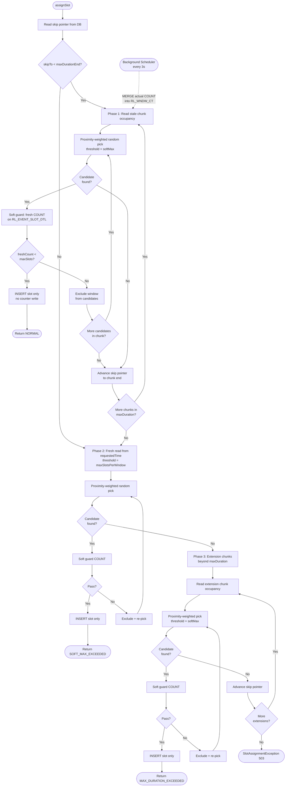
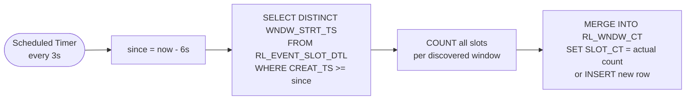

# SlotAssignmentServiceV6 — Async Counter + Soft Guard

Optimistic, lock-free rate-limiter that assigns time slots to events within fixed windows. Identical three-phase algorithm to V5 but eliminates counter-table write contention by moving counter updates to a background scheduler and replacing atomic maxSlots enforcement with a soft guard.

---

## What Problem Does This Solve?

A payment system can process **30 transactions per second**. When 500,000 payment requests arrive in a burst, they can't all execute at once. This service acts as a **traffic shaper**: it assigns each request a specific future time slot, spreading the load evenly across time windows.

```
Without rate limiting:              With V6 rate limiting:

  Requests   Downstream               Requests    V6 Service    Downstream
  ────────   ──────────               ────────    ──────────    ──────────
  ██████████ → 500K/sec  → CRASH!     ██████████ → schedules  → ▓▓▓▓ 30/sec
                                                    future    → ▓▓▓▓ 30/sec
                                                    time      → ▓▓▓▓ 30/sec
                                                    slots     → ▓▓▓▓ 30/sec
                                                              → ... (spread
                                                                 over hours)
```

### Why V6 over V5?

V5 solves this problem but its hot path serializes on counter rows: every claim does `UPDATE RL_WNDW_CT SET SLOT_CT = SLOT_CT + 1 RETURNING SLOT_CT INTO :newCount`. At 500+ TPS across 20 pods, concurrent claims on the same window serialize on that single counter row. V6 eliminates this bottleneck.

```
V5 under high TPS:              V6 under high TPS:

Thread 1 ─┐                     Thread 1 ─── INSERT slot ─── done
Thread 2 ─┤─ serialize on       Thread 2 ─── INSERT slot ─── done
Thread 3 ─┤  counter UPDATE     Thread 3 ─── INSERT slot ─── done
Thread 4 ─┘                     Scheduler ── MERGE counters ─ (async, every 3s)
```

---

## Key Design Features

### 1. Global Rate-Limiting Across Independent Traffic Streams

The window counter (`RL_WNDW_CT`) is keyed **solely by window start time** — not by `requestedTime`, caller, or traffic type. Every slot assignment, regardless of origin, shares the same counter for a given time window. This provides a single, global rate limit that the downstream system actually experiences.

```
Traffic A: requestedTime = 14:00   ──┐
Traffic B: requestedTime = 14:02   ──┤── all share window counters ──→  downstream sees
Traffic C: requestedTime = 15:00   ──┤                                  ≤ 30 TPS per window
Batch job: requestedTime = tomorrow ─┘
```

**Why this matters**: Without global counters, two independent bursts targeting overlapping windows could each fill windows to capacity — doubling the downstream load. Global counting prevents this by construction.

### 2. Proximity + Occupancy Weighted Random Window Selection

V6 uses a **two-factor weighted random** that balances closeness to `requestedTime` with remaining window capacity.

```
weight(window) = capacityWeight × proximityWeight

  capacityWeight  = max(0, threshold − currentOccupancy)
  proximityWeight = rangeSize − index     (linear decay from range start)
```

```
Example: 4 windows in a chunk, threshold = 810

  Window    Occupancy   Capacity   Proximity   Weight    P(select)
  ──────    ─────────   ────────   ─────────   ──────    ─────────
  W+0       200         610        4           2440      48%  ████████████████████████
  W+1       500         310        3           930       18%  █████████
  W+2       0           810        2           1620      32%  ████████████████
  W+3       750         60         1           60         1%  ▌
```

**Key behaviors**:
- **Closer + emptier wins**: W+0 (48%) beats W+3 (1%) despite W+2 being completely empty — proximity dominates at the extremes.
- **Not strictly earliest**: W+2 (32%) beats W+1 (18%) because W+2 has much more capacity.
- **Full windows excluded**: Any window at or above the threshold gets weight 0 — never selected.
- **Self-balancing**: As close windows fill, their capacity weight drops, naturally shifting load to later windows.

**Why not first-available?** Under 20-pod concurrency, all pods would race for the same earliest window, causing contention. Weighted random naturally spreads load while preferring closer windows.

### 3. Incremental Chunk-Based Claims Within maxDuration

With an 8-hour `maxDuration` and 30-second windows, there are **960 windows** to search. V6 does not scan all 960 at once. Phase 1 advances through the range in small configurable chunks (default: 15 minutes = 30 windows):

```
maxDuration = 8 hours
chunk size  = 15 minutes

            skipTo
              │
              ▼
Phase 1:  [chunk 1] → [chunk 2] → [chunk 3] → ... → [chunk 32]
           15 min      15 min      15 min              15 min
              │
              └── 1. Read stale occupancy for this chunk (30 windows)
                  2. Pick via proximity-weighted random
                  3. Soft guard: fresh COUNT(*) on picked window
                  4. INSERT slot (no counter write)
                  5. If chunk exhausted → advance skip pointer → next chunk
```

**Three benefits of chunking**:

1. **Tight proximity weighting** — Selecting from 30 windows gives the closest window ~30x the weight of the farthest. Selecting from 960 would spread probability so thin that proximity barely matters.

2. **Small DB reads** — Each chunk reads ~30 counter rows instead of 960.

3. **Progressive skip pointer advancement** — Each exhausted chunk advances the skip pointer. Other pods skip exhausted chunks immediately.

### 4. Three-Phase Graceful Degradation

When Phase 1 exhausts all chunks within `maxDuration`, V6 escalates through two more phases.

```
Request arrives: assignSlot(eventId, requestedTime, maxDuration)
│
├─ PHASE 1: Normal (softMax threshold, chunked within maxDuration)
│      → Returns NORMAL
│
├─ PHASE 2: Overflow (maxSlots threshold, full rescan within maxDuration)
│      → Returns SOFT_MAX_EXCEEDED
│
├─ PHASE 3: Extension (softMax threshold, beyond maxDuration)
│      → Returns MAX_DURATION_EXCEEDED
│
└─ All exhausted → SlotAssignmentException (503)
```

| Phase | Range | Threshold | When triggered | What it means |
|-------|-------|-----------|----------------|---------------|
| **1** | `[skipTo, requestedTime + maxDuration)` | softMax | First attempt | Normal operation — plenty of capacity |
| **2** | `[requestedTime, requestedTime + maxDuration)` | maxSlots | All windows in range ≥ softMax | Nearing capacity — using the 10% buffer |
| **3** | Beyond `maxDuration`, in chunks | softMax | All windows in maxDuration ≥ maxSlots | Extending into fresh windows |

**Phase 2 rescans from `requestedTime`**, not from the skip pointer. The skip pointer tracks softMax exhaustion, but windows between softMax and maxSlots may exist before the skip pointer.

### 5. DB-Backed Skip Pointer for Multi-Pod Coordination

With 20 pods processing requests concurrently, each pod needs to know where to start searching. The skip pointer (`RL_SKIP_PTR`) is a DB-backed, append-only coordination primitive.

```
Pod 1: exhausts chunk [14:00, 14:15) → INSERT skipTo = 14:15
Pod 2: reads skipTo = 14:15 → starts at 14:15 (skips chunk 1)
Pod 3: exhausts chunk [14:15, 14:30) → INSERT skipTo = 14:30
Pod 4: reads skipTo = 14:30 → starts at 14:30 (skips chunks 1-2)
```

**Append-only design (zero write contention)**: Composite PK `(REQ_TS, SKIP_TO_TS)`. Writes are INSERT-only — no UPDATE, no row-level locking. Reads use `ORDER BY SKIP_TO_TS DESC FETCH FIRST 1 ROW ONLY`. Duplicate inserts caught by PK — no-op.

### 6. Soft Guard: Fresh COUNT(*) Before INSERT

This is V6's core innovation. After the weighted random picks a window, a fresh `COUNT(*)` on `RL_EVENT_SLOT_DTL` checks if the window is actually full. If `freshCount >= maxSlotsPerWindow`, the window is excluded and another is picked from the remaining candidates.

```
Phase 1 window selection:

  Stale occupancy read  →  Weighted random pick  →  Soft guard COUNT(*)
  (from RL_WNDW_CT)        (excludes ≥ softMax)     (from RL_EVENT_SLOT_DTL)
                                                          │
                                              ┌───────────┴───────────┐
                                      freshCount < maxSlots     freshCount ≥ maxSlots
                                              │                       │
                                      INSERT slot              Exclude window,
                                      (no counter write)       re-pick from remaining
```

**Key properties**:
- Runs in its own short-lived transaction (separate from INSERT) so it sees committed data from other pods
- Not atomic with the INSERT — the core V6 trade-off. Between COUNT and INSERT, another pod may insert, causing rare over-allocation
- Similar to V5's approach — neither version uses rollbacks or retries

### 7. Zero Counter Contention in Hot Path

The hot path never writes to `RL_WNDW_CT`. Only the background scheduler writes to it.

| Source | Writes/sec on counter rows | Nature |
|--------|---------------------------|--------|
| V5 hot path | 500 competing increments | Conflicting — serialize on same row |
| V6 hot path | 0 | No writes |
| V6 scheduler (20 pods) | ~7 non-overlapping SETs | Non-conflicting — idempotent |

This is the fundamental architectural change: V5 pays for accuracy with write contention; V6 pays for no contention with eventual consistency.

### 8. Background Counter Reconciliation via CREAT_TS Discovery

`WindowCounterRefreshScheduler` reconciles `RL_WNDW_CT` counters with actual slot counts from `RL_EVENT_SLOT_DTL`.

Instead of scanning a fixed time range (which would need to cover 30+ days = 86,400+ windows), the scheduler asks: "which windows received new slots recently?" It uses the `RL_EVENT_SLOT_DTL_I02X(CREAT_TS)` index to find recently inserted slots, extracts distinct windows, then counts ALL slots for just those windows.

```sql
MERGE INTO RL_WNDW_CT tgt
USING (
    SELECT d.WNDW_STRT_TS, COUNT(*) cnt
    FROM RL_EVENT_SLOT_DTL d
    WHERE d.WNDW_STRT_TS IN (
        SELECT DISTINCT WNDW_STRT_TS
        FROM RL_EVENT_SLOT_DTL
        WHERE CREAT_TS >= :since
    )
    GROUP BY d.WNDW_STRT_TS
) src ON (tgt.WNDW_STRT_TS = src.WNDW_STRT_TS)
WHEN MATCHED THEN UPDATE SET SLOT_CT = src.cnt
WHEN NOT MATCHED THEN INSERT (WNDW_STRT_TS, SLOT_CT, CREAT_TS)
    VALUES (src.WNDW_STRT_TS, src.cnt, SYSTIMESTAMP)
```

**Why CREAT_TS discovery works for 30-day spread:** A request with `requestedTime = now + 25 days` inserts a slot with `CREAT_TS = now`. The scheduler finds it via `CREAT_TS >= since`, extracts the window at day 25, and counts it.

**Multi-pod coordination** — With N pods (e.g., 20), N independent `@Scheduled` timers fire at staggered times:

- **Effective refresh rate:** N / interval = 20 / 3s = one refresh every ~150ms
- **No locking needed:** Writes are idempotent (SET, not INCREMENT). Last writer wins, and last writer has the freshest data.

### 9. Per-Request maxDuration

Each caller specifies how far into the future their slot can be placed:

- Time-sensitive payment: `maxDuration = PT4H`
- Standard payment: `maxDuration = PT8H` (default)
- Batch processing: `maxDuration = PT24H`

Phase transitions are per-request: a request with `maxDuration=4h` enters Phase 2 when 4 hours of windows are at softMax, while a concurrent request with `maxDuration=8h` for the same `requestedTime` may still find fresh windows in Phase 1 between hours 4-8.

### 10. Zero-Cost Idempotency

Idempotency is enforced by the `UNIQUE(EVENT_ID)` constraint on `RL_EVENT_SLOT_DTL`. There is no upfront "does this event already exist?" query. On the happy path (new event), this costs zero extra DB calls. On a duplicate, the UNIQUE violation is caught, the existing slot is re-read within the same transaction. Both the original and duplicate callers return the same `AssignedSlot`.

---

## Capacity Model

```
softMax          = floor(maxSlotsPerWindow × softMaxPercent / 100)
maxSlotsPerWindow = configured absolute ceiling
```

| Tier | Formula | Production (maxSlots=900, 90%) | Purpose |
|------|---------|-------------------------------|---------|
| **softMax** | `floor(maxSlots × softMaxPercent / 100)` | 810 | Phase 1 operating limit |
| **maxSlotsPerWindow** | configured directly | 900 | Soft guard hard limit |

```
  softMax (810)                    maxSlots (900)
      │                                │
      ▼                                ▼
  ┌───────────────────────────────────────┐
  │░░░░░░░░░░░░░░░░░░░░░│▓▓▓▓▓▓▓▓▓▓▓▓▓▓▓▓▓│
  │  Phase 1 territory  │  Phase 2        │
  │  (normal)           │  (overflow)     │
  └───────────────────────────────────────┘
  0                                    900
```

The 10% gap between softMax and maxSlots serves the same purpose in both V5 and V6:
- **V5**: Absorbs racing — multiple pods may claim past softMax between occupancy read and INSERT. No rollback; downstream tolerance absorbs the marginal overshoot.
- **V6**: Absorbs stale-counter-based mis-picks. The stale occupancy read may show a window below softMax when it's actually above; the soft guard (fresh COUNT) catches it at the maxSlots boundary.

---

## Algorithm Flow

### Flow Diagram



### Scheduler Flow



### Pseudocode

```
assignSlot(eventId, requestedTime, maxDuration)
│
├─ Step 1: Read skip pointer from DB
│  └─ skipTo = fetchSkipTo(requestedTime) ?: requestedTime
│
├─ Step 2: Phase 1 — chunked scan [max(skipTo, requestedTime), maxDurationEnd)
│  ├─ For each chunk:
│  │   ├─ Read stale occupancy (30 windows)
│  │   ├─ Pick via proximity+occupancy weighted random (threshold = softMax)
│  │   ├─ Soft guard: COUNT(*) on RL_EVENT_SLOT_DTL for picked window
│  │   │   └─ If freshCount >= maxSlots → exclude window, re-pick
│  │   ├─ INSERT slot (no counter write)
│  │   └─ If chunk exhausted → advance skip pointer, next chunk
│  └─ If found → return NORMAL
│
├─ Step 3: Phase 2 — full rescan [requestedTime, maxDurationEnd)
│  ├─ Fresh occupancy read (ignores skip pointer)
│  ├─ Pick via weighted random (threshold = maxSlots)
│  ├─ Soft guard + INSERT
│  └─ If found → return SOFT_MAX_EXCEEDED
│
├─ Step 4: Phase 3 — extension chunks beyond maxDuration
│  ├─ For each extension chunk (up to maxExtensionsBeyond):
│  │   ├─ Fresh occupancy read
│  │   ├─ Pick + soft guard + INSERT
│  │   └─ Advance skip pointer
│  └─ If found → return MAX_DURATION_EXCEEDED
│
└─ All exhausted → throw SlotAssignmentException (503)
```

### DB Calls Per Request

| Scenario | Calls | Operations |
|----------|-------|------------|
| Happy path (Phase 1, 1st chunk) | 4 | skip pointer read + occupancy read + soft guard COUNT + INSERT |
| Phase 1, 3rd chunk | 8 | skip pointer + 3 × (occupancy + soft guard COUNT) + INSERT |
| Phase 2 | +3 | fresh occupancy + soft guard COUNT + INSERT |
| Phase 3 (1st extension) | +3 | fresh occupancy + soft guard COUNT + INSERT |
| Idempotent duplicate | 4 | skip pointer + occupancy + soft guard + INSERT (catches UNIQUE, re-reads) |

---

## Database Schema

```
┌─────────────────────┐     ┌─────────────────────┐     ┌──────────────────┐
│  RL_EVENT_SLOT_DTL  │     │     RL_WNDW_CT      │     │   RL_SKIP_PTR    │
│─────────────────────│     │─────────────────────│     │──────────────────│
│ WNDW_SLOT_ID    PK  │     │ WNDW_STRT_TS    PK  │     │ REQ_TS       PK  │
│ EVENT_ID      UQ    │     │ SLOT_CT             │     │ SKIP_TO_TS   PK  │
│ REQ_TS              │     │ CREAT_TS            │     │ CREAT_TS         │
│ WNDW_STRT_TS        │     └─────────────────────┘     └──────────────────┘
│ COMPUTED_SCHED_TS   │       Eventually-consistent       Skip pointer
│ RL_WNDW_CONFIG_ID   │       counter (scheduler-         (append-only, DESC read)
│ CREAT_TS            │       managed, not hot path)
└─────────────────────┘
  Immutable slot record
  (idempotency via UQ)
```

### Indexes

| Index | Table | Columns | Purpose |
|-------|-------|---------|---------|
| `RL_WNDW_CT_I01X` | `RL_WNDW_CT` | `(WNDW_STRT_TS, SLOT_CT)` | Composite for occupancy range scans |
| `RL_EVENT_SLOT_DTL_I01X` | `RL_EVENT_SLOT_DTL` | `(WNDW_STRT_TS)` | Soft guard `COUNT(*)` per window |
| `RL_EVENT_SLOT_DTL_I02X` | `RL_EVENT_SLOT_DTL` | `(CREAT_TS)` | Scheduler CREAT_TS-based discovery |
| `RL_EVENT_SLOT_DTL_I03X` | `RL_EVENT_SLOT_DTL` | `(REQ_TS, WNDW_STRT_TS)` | Multi-column index |

| Table | Purpose | Write Pattern |
|-------|---------|---------------|
| `RL_EVENT_SLOT_DTL` | Immutable slot assignments | INSERT only (hot path) |
| `RL_WNDW_CT` | Per-window occupancy counter | MERGE by scheduler only (not hot path) |
| `RL_SKIP_PTR` | Per-requestedTime skip pointer | Append-only INSERT |

### Why Each Table Exists

**`RL_EVENT_SLOT_DTL`** — The source of truth for every assigned slot. Each row records which event was placed in which window, at what scheduled time. Three roles in V6: (1) the immutable audit trail that downstream consumers read to know when to execute an event, (2) the idempotency mechanism — the `UNIQUE(EVENT_ID)` constraint guarantees exactly one slot per event across all pods, and (3) the soft guard data source — `COUNT(*) WHERE WNDW_STRT_TS = ?` gives the fresh, authoritative slot count for a window before INSERT. In V5, this table is read-only after insert; in V6, it is also the real-time capacity enforcement layer (via the soft guard COUNT). Without this table, there is no record of assignments, no idempotency, and no soft guard.

**`RL_WNDW_CT`** — An eventually-consistent counter that tracks how many slots have been assigned to each window. The weighted random window picker reads this to decide which windows have capacity. Without it, every request would need to COUNT all slot rows across every window in the chunk — expensive range scans on the slot table. The counter table turns that into a cheap PK range scan (~30 rows per chunk). Unlike V5, the hot path never writes to this table. The background `WindowCounterRefreshScheduler` reconciles it asynchronously via MERGE using CREAT_TS-based discovery. The counters are therefore stale by up to ~150ms (effective refresh rate with 20 pods at 3s interval), but that staleness is acceptable because the soft guard on `RL_EVENT_SLOT_DTL` provides the authoritative check before INSERT. The counter table exists purely to make window selection efficient — it is an optimization, not a correctness mechanism.

**`RL_SKIP_PTR`** — A distributed cursor that tracks the furthest exhausted chunk boundary per `requestedTime`. When a pod exhausts a chunk (all windows at or above softMax), it writes a skip pointer so that other pods — and subsequent requests on the same pod — skip directly past that chunk instead of re-scanning it. Without it, every request would start from `requestedTime` and re-read chunks that are already known to be full. With 20 pods and high TPS, this avoids O(exhausted_chunks) redundant reads per request. The composite PK `(REQ_TS, SKIP_TO_TS)` and append-only writes ensure zero contention: concurrent pods inserting different skip-to values never block each other.

---

## Configuration

### Production Config (30 TPS target, 30-second windows)

```yaml
rate-limiter:
  v6:
    window-size: 30s                 # Window duration
    max-slots-per-window: 900        # 30 TPS × 30s = absolute ceiling per window
    soft-max-percent: 90             # softMax = floor(900 × 90 / 100) = 810
    default-max-duration: 8h         # Default: slots can go up to 8h out
    window-chunk-duration: 15m       # Chunked scan batch size
    extension-windows: 40            # 20-min extension chunks
    max-extensions-beyond: 5         # Up to 5 extensions beyond maxDuration
    counter-refresh-every: 3s        # Scheduler interval
    counter-refresh-since: 6s        # Look-back window (2× interval)
```

### Capacity Math

```
Window size:       30 seconds
maxSlotsPerWindow: 900
softMaxPercent:    90%

softMax:           floor(900 × 90 / 100) = 810 slots/window
Sustained TPS:     810 / 30 = 27 TPS (Phase 1)

maxSlots:          900 slots/window (absolute ceiling)
Burst TPS:         900 / 30 = 30 TPS (Phase 2 overflow)

Default maxDuration: 8 hours
Phase 1 capacity:    8h × 120 windows/hr × 810 slots = 777,600 events
Total capacity:      8h × 120 windows/hr × 900 slots = 864,000 events
```

### Recommended Configs by Traffic Pattern

#### Near-Term Sustained (100-400 TPS inbound, 30 TPS downstream)

```yaml
v6:
  max-slots-per-window: 900
  soft-max-percent: 90
  default-max-duration: 8h
  window-chunk-duration: 15m
  counter-refresh-every: 3s     # 20 pods → effective refresh ~150ms
  counter-refresh-since: 6s
```

#### Long-Horizon Batch (500K requests at 100 TPS, requestedTime days out)

```yaml
v6:
  max-slots-per-window: 900
  soft-max-percent: 90
  default-max-duration: 24h
  window-chunk-duration: 30m     # Larger chunks (less DB round-trips)
  max-extensions-beyond: 10
  counter-refresh-every: 5s     # Longer interval OK for batch
  counter-refresh-since: 10s
```

---

## API

### Request

```
POST /api/v2/slots
```

```json
{
  "eventId": "pay-123",
  "requestedTime": "2025-06-01T14:00:00Z",
  "maxDuration": "PT4H"
}
```

| Field | Required | Default | Description |
|-------|----------|---------|-------------|
| `eventId` | Yes | — | Unique idempotency key |
| `requestedTime` | Yes | — | Desired execution time (ISO-8601) |
| `maxDuration` | No | `PT8H` | How far from requestedTime slots can go (ISO-8601 duration) |

### Response

```json
{
  "eventId": "pay-123",
  "scheduledTime": "2025-06-01T14:02:17.483Z",
  "delayMs": 137483,
  "allocationStatus": "NORMAL"
}
```

| `allocationStatus` | Meaning | Caller Action |
|--------------------|---------|---------------|
| `NORMAL` | Slot within maxDuration, below softMax | None — optimal placement |
| `SOFT_MAX_EXCEEDED` | Slot within maxDuration, between softMax and maxSlots | Monitor — nearing capacity |
| `MAX_DURATION_EXCEEDED` | Slot placed beyond caller's maxDuration | Alert — may need to adjust processing timeline |

---

## Scenarios

All scenarios use the following config for readability:

| Parameter | Value |
|-----------|-------|
| `windowSize` | 60 seconds (1 minute) |
| `maxSlotsPerWindow` | 7 |
| `softMaxPercent` | 71% (softMax = 4) |
| `maxDuration` | 10 minutes (default) |
| `phase1ChunkSize` | 4 minutes (4 windows) |
| `extensionWindows` | 3 |
| `maxExtensionsBeyond` | 2 |

---

### Scenario 1: Empty Table — First Request

**Request**: `assignSlot("evt-1", 14:00:00)`

| Step | Value | Reasoning |
|------|-------|-----------|
| Skip pointer | `null` → use `requestedTime` | No pointer for 14:00 |
| Phase 1, chunk 1 | `[W+0, W+1, W+2, W+3]` | `[14:00, 14:04)` |
| Stale occupancy read | `{}` (empty) | No counter rows exist |
| Proximity pick | W+0 (40%), W+1 (30%), W+2 (20%), W+3 (10%) | Closer windows favored |
| Picked | W+0 *(example)* | |
| Soft guard | `COUNT(*) = 0` → 0 < 7 → pass | Fresh check confirms empty |
| INSERT slot | Single row into RL_EVENT_SLOT_DTL | No counter write |

**Result**: `AssignedSlot(evt-1, 14:00:23.456, NORMAL)` — Counter table remains empty. Scheduler will reconcile later.

---

### Scenario 2: First Chunk Full — Skip Pointer Advances

**Request**: `assignSlot("evt-20", 14:00:00)` — W+0..W+3 all at softMax (4), W+4..W+6 available.

| Step | Value |
|------|-------|
| Phase 1, chunk 1 `[W+0..W+3]` | All at softMax → no candidates |
| Advance skip pointer | INSERT `(14:00, 14:04)` |
| Phase 1, chunk 2 `[W+4..W+7]` | W+4(1), W+5(0), W+6(2) → picks W+4 |
| Soft guard | `COUNT(*) = 1` → pass |
| INSERT slot | Single row |

**Result**: `AssignedSlot(evt-20, 14:04:XX.XXX, NORMAL)` — Next request for `requestedTime=14:00` starts at chunk 2.

---

### Scenario 3: Soft Guard Rejects Stale-Counter-Based Pick

**State**: W+0 has counter=0 (stale) but 7 actual slots (maxSlots). W+1 is genuinely empty.

| Step | Value | Reasoning |
|------|-------|-----------|
| Stale occupancy read | `{W+0: 0, W+1: 0}` | Counter is stale |
| Proximity pick | W+0 *(example)* | Counter says empty |
| Soft guard | `COUNT(*) = 7` → 7 ≥ 7 → **reject** | Fresh count catches the stale counter |
| Exclude W+0, re-pick | W+1 | Remaining candidate |
| Soft guard | `COUNT(*) = 0` → pass | |
| INSERT slot | Single row into W+1 | |

**Result**: Slot lands in W+1, not W+0. The soft guard prevented over-allocation despite the stale counter.

---

### Scenario 4: Phase 2 — Overflow Within maxDuration

**Request**: `assignSlot("evt-50", 14:00:00, maxDuration=10min)` — All 10 windows at softMax (4), skip pointer past maxDurationEnd.

| Step | Value |
|------|-------|
| Phase 1 | `phase1Start >= maxDurationEnd` → no chunks to scan |
| Phase 2 | Fresh read `[14:00, 14:10)`, threshold = maxSlots (7) |
| Candidates | All 10 windows: capacityWeight = 7 - 4 = 3 each |
| Soft guard | `COUNT(*) = 4` → 4 < 7 → pass |
| INSERT slot | Single row |

**Result**: `AssignedSlot(evt-50, 14:01:XX.XXX, SOFT_MAX_EXCEEDED)` — Phase 2 scans from `requestedTime` (not skip pointer), finding windows between softMax and maxSlots.

---

### Scenario 5: Phase 3 — Extension Beyond maxDuration

**Request**: `assignSlot("evt-80", 14:00:00, maxDuration=10min)` — All windows in maxDuration at maxSlots (7).

| Step | Value |
|------|-------|
| Phase 1 | Exhausted (all ≥ softMax) |
| Phase 2 | Exhausted (all at maxSlots — soft guard rejects all) |
| Phase 3, ext 1 `[W+10..W+12]` | Fresh read → empty → picks W+10 |
| Soft guard | `COUNT(*) = 0` → pass |

**Result**: `AssignedSlot(evt-80, 14:10:XX.XXX, MAX_DURATION_EXCEEDED)` — Caller notified the slot exceeds their stated tolerance.

---

### Scenario 6: Global Capacity — Different requestedTimes Share Windows

Requests for `requestedTime=14:00` have filled window `14:02:00` to softMax (4). A new request arrives with `requestedTime=14:02:00`.

| Step | Value | Reasoning |
|------|-------|-----------|
| Phase 1, chunk 1 | `[14:02, 14:03, 14:04, 14:05]` | |
| Stale occupancy | `{14:02:00: 4}` | **Global** counter — sees all slots regardless of requestedTime |
| Candidates | `[14:03, 14:04, 14:05]` | 14:02 excluded (at softMax) |

**Result**: Slot lands in 14:03 — the global counter prevented overbooking window `14:02:00`.

---

### Scenario 7: Concurrent Soft Guard Race — Bounded Over-Allocation

Two threads pick the same window (W+0, actual count = 6, maxSlots = 7).

```
Thread A                              Thread B
────────                              ────────
Soft guard: COUNT(*) = 6              Soft guard: COUNT(*) = 6
6 < 7 → pass                         6 < 7 → pass
INSERT slot (W+0) → OK               INSERT slot (W+0) → OK
                                      (W+0 now has 8 slots — 1 over maxSlots)
```

**Result**: W+0 has 8 slots, exceeding maxSlots by 1. This is the documented V6 trade-off. The over-allocation is bounded by the concurrency level (number of threads that can pass the soft guard simultaneously for the same window). At production scale, the over-allocation is ~0.55% (see Over-Allocation Analysis below).

**Contrast with V5**: V5 also accepts this race — it no longer rolls back on maxSlots exceeded. Both V5 and V6 rely on downstream tolerance for marginal over-allocation. The key difference is that V6 eliminates counter write contention entirely by moving counter updates to a background scheduler.

---

### Scenario 8: Scheduler Reconciliation After Burst

100 requests assigned in rapid succession. Counter table is empty (hot path doesn't write to it).

```
Time 0s:   100 slots inserted into RL_EVENT_SLOT_DTL
           RL_WNDW_CT has 0 rows — stale reads return empty
           Stale reads incorrectly show all windows as "available"
           Soft guard (fresh COUNT) still protects against over-allocation

Time 3s:   Scheduler fires on Pod 7
           → Discovers 100 recent slots via CREAT_TS index
           → Counts actual slots per window
           → MERGE: inserts 15 counter rows (e.g., 7 slots each)

Time 3s+:  New requests read accurate occupancy from RL_WNDW_CT
           Proximity weighting now distributes load correctly
```

---

### Scenario 9: Per-Request maxDuration — Different Phase Outcomes

**State**: W+0..W+3 at softMax (4), W+4+ empty.

| Request | maxDuration | Outcome |
|---------|-------------|---------|
| `evt-short` | 4 min | Phase 1 exhausted → Phase 2 picks W+0 → **SOFT_MAX_EXCEEDED** |
| `evt-long` | 8 min | Phase 1 chunk 2 `[W+4..W+7]` has capacity → **NORMAL** |

Same window state, different outcomes based on `maxDuration`.

---

### Scenario 10: Full Exhaustion — All Phases Fail

All windows in maxDuration + all extension ranges at maxSlots.

| Phase | Result |
|-------|--------|
| Phase 1 | All chunks exhausted (stale reads show ≥ softMax) |
| Phase 2 | All windows at maxSlots (soft guard rejects all) |
| Phase 3 (ext 1, ext 2) | All extension windows filled |

**Result**: `SlotAssignmentException` → **503 Service Unavailable**. Caller should retry later or increase `maxDuration`.

---

## Over-Allocation Analysis (500 TPS, 20 pods)

| Metric | Value |
|--------|-------|
| Effective refresh interval | ~150ms (3s / 20 pods) |
| Events between effective ticks | 75 (500 × 0.15) |
| Phase 1 chunk windows | 30 |
| Hottest window share (proximity-weighted) | ~6.5% |
| Max stale drift on hottest window | ~5 events |
| Worst-case overshoot | ~5 events beyond maxSlotsPerWindow on hottest window |

The over-allocation is bounded by the number of concurrent threads that can pass the soft guard simultaneously for the same window. In practice, with proximity-weighted distribution across 30 windows, the concentration on any single window is low.

---

## Design Trade-offs

| Design Choice | Benefit | Trade-off |
|---------------|---------|-----------|
| **Soft guard (fresh COUNT)** | No write contention, no rollbacks | Non-atomic — rare over-allocation (bounded by concurrency) |
| **Background counter reconciliation** | Stale reads improve over time | ~150ms eventual consistency lag (20 pods, 3s interval) |
| **CREAT_TS-based discovery** | Works for any requestedTime spread (1 min to 30 days) | Scheduler scans all recent slots, not just relevant ones |
| **4 DB calls vs V5's 3** | Eliminates write contention worth more than 1 extra read | 1 extra round-trip per request (~0.5ms) |
| **Global window counters** | Single rate limit regardless of traffic source | High-volume requestedTimes can crowd out lower-volume ones |
| **Proximity+occupancy weighted random** | Balances closeness and load spreading; no hot-spotting | Non-deterministic — harder to predict exact fill order |
| **Incremental chunk claims** | Tight proximity, small DB reads, progressive skip pointer | More DB round-trips if many chunks are exhausted |
| **Three-phase degradation** | Graceful capacity handling with caller visibility | Caller must handle three status values |
| **DB-backed skip pointer** | Multi-pod coordination without Redis/external cache | Extra DB call per request (PK lookup, ~0.1ms) |
| **Per-request maxDuration** | Flexible per-caller SLAs | Different maxDurations can cause fragmented fill patterns |
| **Zero-cost idempotency** | No extra DB call on happy path | Duplicate handling adds ~1ms (re-read within same transaction) |

---

## Comparison with V5

| Aspect | V5 (Atomic Counter) | V6 (Async Counter + Soft Guard) |
|--------|---------------------|--------------------------------|
| **Hot path DB writes** | INSERT slot + UPDATE counter | INSERT slot only |
| **Counter updates** | Inline upsert in hot path | Background scheduler (MERGE via CREAT_TS) |
| **Capacity enforcement** | Advisory (picker threshold, no rollback) | Soft guard (fresh COUNT before INSERT) |
| **Over-allocation** | Rare, bounded by racing between occupancy read and INSERT | Rare, bounded by concurrency window (~0.55% at 500 TPS) |
| **Counter contention** | Every claim serializes on counter row | Zero in hot path |
| **Rollback rate** | Zero | Zero |
| **DB calls per request** | 3: skip ptr + occupancy + (INSERT+UPDATE) | 4: skip ptr + occupancy + COUNT + INSERT |
| **Window selection** | Proximity+occupancy weighted random | Same |
| **Skip pointer** | DB-backed, append-only | Same |
| **Phase model** | Three-phase (Normal/Overflow/Extension) | Same |
| **Idempotency** | UNIQUE(EVENT_ID) constraint | Same |
| **Best for** | Simple hot path (atomic counter in same transaction) | High throughput, zero counter contention |

---

## Key Files

| File | Role |
|------|------|
| `SlotAssignmentServiceV6.kt` | Core algorithm — three-phase with soft guard |
| `WindowCounterRefreshScheduler.kt` | Background counter reconciliation |
| `EventSlotRepository.kt` | `countSlotsInWindow()` for soft guard, `insertEventSlot()` |
| `WindowSlotCounterRepository.kt` | `readOccupancy()`, `refreshRecentlyActiveCounters()` for scheduler |
| `SkipPointerRepository.kt` | DB-backed skip pointer (monotonic) |
| `db/Tables.kt` | `WindowCounterTable`, `SkipPointerTable`, `RateLimitEventSlotTable` |
| `slot/AllocationStatus.kt` | `NORMAL`, `SOFT_MAX_EXCEEDED`, `MAX_DURATION_EXCEEDED` enum |
| `slot/WindowPicker.kt` | Proximity+occupancy weighted random selection |
