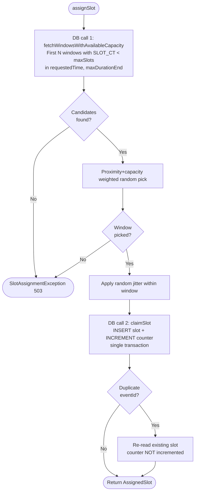

# SlotAssignmentServiceV8 — Synchronous Counter + Proximity-Biased Selection

Simplified, single-phase rate-limiter that assigns time slots to events within pre-provisioned windows. Combines V7's architectural simplicity with synchronous counter updates and proximity-biased window selection, eliminating the need for a background scheduler.

---

## What Problem Does This Solve?

A payment system can process **30 transactions per second**. When 500,000 payment requests arrive in a burst, they can't all execute at once. This service acts as a **traffic shaper**: it assigns each request a specific future time slot, spreading the load evenly across time windows.

```
Without rate limiting:              With V8 rate limiting:

  Requests   Downstream               Requests    V8 Service    Downstream
  ────────   ──────────               ────────    ──────────    ──────────
  ██████████ → 500K/sec  → CRASH!     ██████████ → schedules  → ▓▓▓▓ 30/sec
                                                    future    → ▓▓▓▓ 30/sec
                                                    time      → ▓▓▓▓ 30/sec
                                                    slots     → ▓▓▓▓ 30/sec
                                                              → ... (spread
                                                                 over hours)
```

### Why V8 over V7?

V7 delegates counter updates to a background `WindowCounterRefreshJob`. This introduces eventual consistency: the `SLOT_CT` column is stale between scheduler ticks, and the `WNDW_STATUS` flag can lag behind reality. V8 eliminates both by updating the counter synchronously in the same transaction as the slot INSERT and filtering purely on `SLOT_CT < maxSlots` — no status flag needed.

```
V7 hot path:                        V8 hot path:

Thread 1 ─── INSERT slot ── done    Thread 1 ─── INSERT slot + INCREMENT counter ── done
Thread 2 ─── INSERT slot ── done    Thread 2 ─── INSERT slot + INCREMENT counter ── done
Scheduler ── MERGE counters ─       (no scheduler needed)
             UPDATE status
```

V8 also restores proximity-biased selection (V5/V6's `proximityWeight` factor) that V7 dropped. This biases slots toward `requestedTime`, producing tighter scheduling without sacrificing load-spreading.

---

## Key Design Features

### 1. Global Rate-Limiting Across Independent Traffic Streams

The window counter (`RL_WNDW_CT`) is keyed **solely by window start time** — not by `requestedTime`, caller, or traffic type. Every slot assignment, regardless of origin, increments the same shared counter for a given time window. This provides a single, global rate limit that the downstream system actually experiences.

```
Traffic A: requestedTime = 14:00   ──┐
Traffic B: requestedTime = 14:02   ──┤── all share window counters ──→  downstream sees
Traffic C: requestedTime = 15:00   ──┤                                  ≤ 30 TPS per window
Batch job: requestedTime = tomorrow ─┘
```

**Why this matters**: Without global counters, two independent bursts targeting overlapping windows could each fill windows to capacity — doubling the downstream load. Global counting prevents this by construction.

### 2. Proximity + Capacity Weighted Random Window Selection

V8 uses a **two-factor weighted random** that balances closeness to `requestedTime` with remaining window capacity.

```
weight(window) = capacityWeight × proximityWeight

  capacityWeight  = max(0, maxSlotsPerWindow − currentSlotCount)
  proximityWeight = rangeSize − index     (linear decay from range start)
```

```
Example: 4 candidate windows, maxSlotsPerWindow = 900

  Window    SlotCount   Capacity   Proximity   Weight    P(select)
  ──────    ─────────   ────────   ─────────   ──────    ─────────
  W+0       200         700        4           2800      47%  ███████████████████████
  W+1       500         400        3           1200      20%  ██████████
  W+2       0           900        2           1800      30%  ███████████████
  W+3       850         50         1           50         1%  ▌
```

**Key behaviors**:
- **Closer + emptier wins**: W+0 (47%) beats W+3 (1%) despite W+2 being completely empty — proximity dominates at the extremes.
- **Not strictly earliest**: W+2 (30%) beats W+1 (20%) because W+2 has much more capacity. An empty window slightly further out can win over a half-full close window, spreading load naturally.
- **Full windows excluded**: Any window at or above `maxSlotsPerWindow` gets weight 0 — never selected. These are also pre-filtered by the SQL query (`SLOT_CT < maxSlots`).
- **Self-balancing**: As close windows fill, their capacity weight drops, naturally shifting load to later windows. No cliff — smooth transition.

**Why not first-available?** Under 20-pod concurrency, all pods would race for the same earliest window, causing update contention and counter skew. Weighted random naturally spreads load across the nearest windows while still strongly preferring closer ones.

**Why not occupancy-only (V7)?** Occupancy-only weighting ignores proximity — a request could land in a nearly-empty window far from `requestedTime` when nearby windows have capacity. Proximity weighting ensures requests cluster close to their requested time.

### 3. Single-Phase Simplicity

V8 uses a single-phase algorithm with no escalation:

```
Request arrives: assignSlot(eventId, requestedTime, maxDuration)
│
├─ Fetch candidate windows in [requestedTime, requestedTime + maxDuration)
│  └─ First N windows with SLOT_CT < maxSlotsPerWindow
│
├─ Pick via proximity+capacity weighted random
│
├─ Claim: INSERT slot + INCREMENT counter (single transaction)
│
└─ No candidates? → SlotAssignmentException (503)
```

No softMax/maxSlots distinction, no Phase 2 overflow, no Phase 3 extension beyond maxDuration. The caller's `maxDuration` is a hard boundary — if no window has capacity within that range, the request fails.

**Why no multi-phase?** Multi-phase adds complexity (three status codes, skip pointer, extension logic) for a scenario that rarely occurs in practice. V8 trades that flexibility for simplicity: one status, one range, one pass. Callers that need larger search ranges simply set a wider `maxDuration`.

### 4. Synchronous Counter Updates

The counter is incremented in the **same transaction** as the slot INSERT. This means the counter is always accurate (modulo in-flight transactions) — no staleness, no background reconciliation needed.

```
BEGIN TRANSACTION
  INSERT INTO RL_EVENT_SLOT_DTL (...)     -- slot record
  UPDATE RL_WNDW_CT SET SLOT_CT = SLOT_CT + 1
    WHERE WNDW_STRT_TS = :windowStart     -- counter increment
COMMIT
```

**Key properties**:
- **Atomicity**: Slot and counter are always in sync. A committed slot is always counted; a rolled-back slot is never counted.
- **No stale reads**: The next request's `fetchWindowsWithAvailableCapacity()` sees the incremented counter (read-committed isolation).
- **No background job**: Eliminates `WindowCounterRefreshJob` (V7) and `WindowCounterRefreshScheduler` (V6) entirely.

**Trade-off**: Every claim writes to both `RL_EVENT_SLOT_DTL` and `RL_WNDW_CT` in the hot path. Under extreme concurrency, multiple pods claiming slots in the same window will serialize on the counter row's `UPDATE`. However, the proximity+capacity weighted random naturally spreads claims across many windows, reducing per-window contention.

### 5. Count-Based Filtering (No Status Flag)

V7 uses a `WNDW_STATUS` column (`AVAILABLE`/`FULL`) maintained by a background scheduler. V8 eliminates this in favor of direct count comparison:

```sql
-- V7: status-based filtering (requires background scheduler to maintain)
SELECT WNDW_STRT_TS, SLOT_CT FROM RL_WNDW_CT
WHERE WNDW_STATUS = 'AVAILABLE' AND WNDW_STRT_TS >= ? AND WNDW_STRT_TS < ?

-- V8: count-based filtering (always accurate with synchronous counter)
SELECT WNDW_STRT_TS, SLOT_CT FROM RL_WNDW_CT
WHERE SLOT_CT < ? AND WNDW_STRT_TS >= ? AND WNDW_STRT_TS < ?
```

**Why this works**: Since the counter is updated synchronously, `SLOT_CT` reflects reality at read time. A separate status flag would be redundant — the count itself is the status.

**Index**: Uses `RL_WNDW_CT_I01X(WNDW_STRT_TS, SLOT_CT)` for efficient range scans filtered by count.

### 6. Pre-Provisioned Windows

Windows are pre-provisioned 60 days ahead by `WindowPreProvisioningScheduler`. This means:
- Counter rows exist before any slot is claimed
- `incrementSlotCount()` is a simple UPDATE (no upsert needed)
- The candidate query always has rows to scan

```
WindowPreProvisioningScheduler:
  Runs at startup + daily at 2 AM
  Provisions from MAX(WNDW_STRT_TS) to now + 60 days
  Batch-inserts counter rows with SLOT_CT = 0
  Idempotent (duplicate keys caught silently)
```

**Why pre-provisioning?** V5/V6 create counter rows on-demand, which adds upsert complexity (UPDATE-first with INSERT fallback). Pre-provisioning guarantees the row exists, so the hot path can use a simple `UPDATE ... SET SLOT_CT = SLOT_CT + 1`.

### 7. Per-Request maxDuration

Each caller specifies how far into the future their slot can be placed:

- Time-sensitive payment: `maxDuration = PT4H`
- Standard payment: `maxDuration = PT8H`
- Batch processing: `maxDuration = PT24H`

The search range `[requestedTime, requestedTime + maxDuration)` is a hard boundary. No extension beyond it — if all windows in range are full, the request fails with 503.

### 8. Zero-Cost Idempotency

Idempotency is enforced by the `UNIQUE(EVENT_ID)` constraint on `RL_EVENT_SLOT_DTL`. There is no upfront "does this event already exist?" query. On the happy path (new event), this costs zero extra DB calls. On a duplicate, the UNIQUE violation is caught, the existing slot is re-read within the same transaction, and the counter is **not** incremented. Both the original and duplicate callers return the same `AssignedSlot`.

---

## Capacity Model

V8 uses a single capacity tier — `maxSlotsPerWindow` is both the operating limit and the absolute ceiling. No softMax/overflow distinction.

```
maxSlotsPerWindow = configured absolute ceiling (default: 900)
```

| Parameter | Production Value | Purpose |
|-----------|-----------------|---------|
| **maxSlotsPerWindow** | 900 | Single capacity limit — operating ceiling and hard cap |

```
  maxSlotsPerWindow (900)
      │
      ▼
  ┌─────────────────────────────────────┐
  │░░░░░░░░░░░░░░░░░░░░░░░░░░░░░░░░░░░░│
  │  Full operating range               │
  │  (single tier — no softMax/overflow) │
  └─────────────────────────────────────┘
  0                                   900
```

**Why single tier?** V5/V6's softMax exists because their stale counters could mis-pick a full window — the gap between softMax and maxSlots absorbs racing. V8's synchronous counter is accurate at read time, so the gap is unnecessary. The counter itself is the gate.

**Concurrency overshoot**: Under heavy concurrency, multiple pods may read the same counter value and all attempt to claim slots in the same window. The UPDATE serializes these — no overshoot beyond one per concurrent transaction. With proximity+capacity weighted random spreading claims across ~30 candidate windows, the per-window concurrency is low.

---

## Algorithm Flow

### Flow Diagram



### Pseudocode

```
assignSlot(eventId, requestedTime, maxDuration)
│
├─ Step 1: Fetch candidates (DB call 1)
│  └─ fetchWindowsWithAvailableCapacity(requestedTime, maxDurationEnd, maxSlots, candidateCount)
│     └─ First N windows with SLOT_CT < maxSlotsPerWindow in [requestedTime, maxDurationEnd)
│
├─ Step 2: Pick window
│  └─ pickProximityWeightedRandom(windows, occupancy, maxSlotsPerWindow)
│     └─ weight = capacityWeight × proximityWeight
│
├─ Step 3: Apply jitter
│  └─ scheduledTime = picked + random(0, windowSizeMs)
│
├─ Step 4: Claim slot (DB call 2 — single transaction)
│  ├─ INSERT into RL_EVENT_SLOT_DTL
│  │   └─ If duplicate eventId → re-read existing (no counter touch) → return
│  ├─ UPDATE RL_WNDW_CT SET SLOT_CT = SLOT_CT + 1
│  └─ Return AssignedSlot(eventId, scheduledTime, delay)
│
└─ No candidates → throw SlotAssignmentException (503)
```

### DB Calls Per Request

| Scenario | Calls | Operations |
|----------|-------|------------|
| Happy path | 2 | candidate fetch + (INSERT slot + INCREMENT counter) |
| No candidates in range | 1 | candidate fetch → empty → throw 503 |
| Idempotent duplicate | 2 | candidate fetch + (INSERT catches UNIQUE, re-read existing) |

---

## Database Schema

```
┌─────────────────────┐     ┌─────────────────────┐
│  RL_EVENT_SLOT_DTL  │     │     RL_WNDW_CT      │
│─────────────────────│     │─────────────────────│
│ WNDW_SLOT_ID    PK  │     │ WNDW_STRT_TS    PK  │
│ EVENT_ID      UQ    │     │ SLOT_CT             │
│ REQ_TS              │     │ CREAT_TS            │
│ WNDW_STRT_TS        │     └─────────────────────┘
│ COMPUTED_SCHED_TS   │       Synchronous counter
│ RL_WNDW_CONFIG_ID   │       (pre-provisioned, incremented
│ CREAT_TS            │        in hot path transaction)
└─────────────────────┘
  Immutable slot record
  (idempotency via UQ)
```

**No `RL_SKIP_PTR` table** — V8 always starts from `requestedTime`. No multi-chunk progression, no skip pointer needed.

| Table | Purpose | Write Pattern |
|-------|---------|---------------|
| `RL_EVENT_SLOT_DTL` | Immutable slot assignments | INSERT only (hot path) |
| `RL_WNDW_CT` | Per-window occupancy counter | Pre-provisioned with SLOT_CT=0; incremented in hot path |

### Indexes

| Index | Table | Columns | Purpose |
|-------|-------|---------|---------|
| `RL_WNDW_CT_I01X` | `RL_WNDW_CT` | `(WNDW_STRT_TS, SLOT_CT)` | Candidate fetch: range scan filtered by count |

### Why Each Table Exists

**`RL_EVENT_SLOT_DTL`** — The source of truth for every assigned slot. Each row records which event was placed in which window, at what scheduled time. Two roles in V8: (1) the immutable audit trail that downstream consumers read to know when to execute an event, and (2) the idempotency mechanism — the `UNIQUE(EVENT_ID)` constraint guarantees exactly one slot per event across all pods, with zero coordination beyond the DB constraint itself. Without this table, there is no record of assignments and no way to prevent double-scheduling.

**`RL_WNDW_CT`** — The synchronous counter table that tracks how many slots have been assigned to each window. Two roles in V8: (1) the window candidate source — `fetchWindowsWithAvailableCapacity()` reads it to find windows with remaining capacity, and (2) the capacity enforcement layer — counter is incremented atomically in the same transaction as the slot INSERT, so it always reflects committed state. Pre-provisioned by `WindowPreProvisioningScheduler` so that rows exist before any claim. Unlike V6/V7, the hot path writes to this table (INCREMENT), making it both the read source and the write target for capacity tracking.

---

## Configuration

### Production Config (30 TPS target, 30-second windows)

```yaml
rate-limiter:
  v8:
    window-size: 30s                   # Window duration
    max-slots-per-window: 900          # 30 TPS × 30s = absolute ceiling per window
    candidate-window-count: 30         # Windows fetched per candidate query
```

### Capacity Math

```
Window size:          30 seconds
maxSlotsPerWindow:    900
candidateWindowCount: 30

Effective TPS:        900 / 30 = 30 TPS per window

maxDuration = 8 hours:
  Total windows:      8h × 120 windows/hr = 960 windows
  Total capacity:     960 × 900 = 864,000 events

maxDuration = 24 hours:
  Total windows:      24h × 120 windows/hr = 2,880 windows
  Total capacity:     2,880 × 900 = 2,592,000 events
```

### Recommended Configs by Traffic Pattern

#### Near-Term Sustained (100-400 TPS inbound, 30 TPS downstream)

```yaml
v8:
  max-slots-per-window: 900
  candidate-window-count: 30    # Tight proximity weighting
  # Caller sets maxDuration = PT8H
```

At 400 TPS inbound / 30 TPS outbound, each second produces ~13 "excess" requests that spill forward. An 8-hour maxDuration holds 864K events — sufficient for sustained bursts up to ~30 minutes.

#### Long-Horizon Batch (500K requests at 100 TPS, requestedTime days out)

```yaml
v8:
  max-slots-per-window: 900
  candidate-window-count: 60    # Wider selection pool (proximity matters less for batch)
  # Caller sets maxDuration = PT24H
```

500K events / 900 per window = 556 windows = ~4.6 hours. With 24-hour maxDuration, the candidate query always finds capacity in the first pass.

---

## API

### Request

```
POST /api/v2/slots
```

```json
{
  "eventId": "pay-123",
  "requestedTime": "2025-06-01T14:00:00Z",
  "maxDuration": "PT8H"
}
```

| Field | Required | Default | Description |
|-------|----------|---------|-------------|
| `eventId` | Yes | — | Unique idempotency key |
| `requestedTime` | Yes | — | Desired execution time (ISO-8601) |
| `maxDuration` | Yes | — | How far from requestedTime slots can go (ISO-8601 duration) |

### Response

```json
{
  "eventId": "pay-123",
  "scheduledTime": "2025-06-01T14:02:17.483Z",
  "delayMs": 137483
}
```

| Status | Condition |
|--------|-----------|
| 200 | Slot assigned (or existing returned via idempotency) |
| 503 | All windows in range exhausted |

**Note**: V8 returns no `allocationStatus` field. There is no softMax/overflow/extension distinction — the slot either fits within maxDuration or it doesn't.

---

## Scenarios

All scenarios use the following config for readability:

| Parameter | Value |
|-----------|-------|
| `windowSize` | 60 seconds (1 minute) |
| `maxSlotsPerWindow` | 7 |
| `candidateWindowCount` | 4 |
| `maxDuration` | 10 minutes |

---

### Scenario 1: Empty Table — First Request

**Request**: `assignSlot("evt-1", 14:00:00, PT10M)`

| Step | Value | Reasoning |
|------|-------|-----------|
| Candidate fetch | `[W+0(0), W+1(0), W+2(0), W+3(0)]` | First 4 windows with SLOT_CT < 7 |
| Proximity pick | W+0 (40%), W+1 (30%), W+2 (20%), W+3 (10%) | All empty — proximity dominates |
| Picked | W+0 *(example)* | |
| Claim | INSERT slot + INCREMENT counter (count → 1) | Single transaction |

**Result**: `AssignedSlot(evt-1, 14:00:23.456)` — Counter immediately reflects the new slot.

---

### Scenario 2: Proximity Bias Under Uneven Occupancy

**Request**: `assignSlot("evt-50", 14:00:00, PT10M)` — W+0 has 5 slots, W+1 has 6, W+2 has 0, W+3 has 0.

| Step | Value | Reasoning |
|------|-------|-----------|
| Candidate fetch | `[W+0(5), W+1(6), W+2(0), W+3(0)]` | All have SLOT_CT < 7 |
| Weights | W+0: 2×4=8, W+1: 1×3=3, W+2: 7×2=14, W+3: 7×1=7 | capacity × proximity |
| Probabilities | W+0: 25%, W+1: 9%, W+2: 44%, W+3: 22% | |

**Result**: W+2 most likely (44%) despite being further — its empty capacity outweighs W+0's proximity. W+1 least likely (9%) — nearly full and not the closest.

---

### Scenario 3: All Candidates Full — 503

**Request**: `assignSlot("evt-100", 14:00:00, PT10M)` — All 10 windows in range at maxSlots (7).

| Step | Value |
|------|-------|
| Candidate fetch | `[]` (empty) — no windows with SLOT_CT < 7 |
| Result | `SlotAssignmentException` → **503** |

**Result**: No escalation to overflow or extension. Caller must retry later or increase `maxDuration`.

---

### Scenario 4: Global Capacity — Different requestedTimes Share Windows

Requests for `requestedTime=14:00` have filled window `14:02:00` to maxSlots (7). A new request arrives with `requestedTime=14:02:00`.

| Step | Value | Reasoning |
|------|-------|-----------|
| Candidate fetch | `[14:03(0), 14:04(0), 14:05(0), 14:06(0)]` | 14:02 excluded (SLOT_CT = 7, not < 7) |

**Result**: Slot lands in 14:03 — the synchronous counter prevented overbooking window `14:02:00` even though the two traffic streams have different `requestedTime` values.

---

### Scenario 5: Concurrent Duplicate — Idempotency

```
Thread A                              Thread B
────────                              ────────
Pick W+1                              Pick W+2
INSERT slot (evt-99, W+1) → OK       INSERT slot (evt-99, W+2) → UNIQUE violation!
INCREMENT counter (W+1) → count=1    Re-read existing slot → returns A's slot
COMMIT                                COMMIT (counter NOT incremented)
```

Both threads return identical `AssignedSlot`. One row in DB. Counter incremented exactly once.

---

### Scenario 6: Per-Request maxDuration — Different Outcomes

**State**: W+0..W+3 all at maxSlots (7), W+4+ empty.

| Request | maxDuration | Outcome |
|---------|-------------|---------|
| `evt-short` | 4 min | No candidates in [14:00, 14:04) → **503** |
| `evt-long` | 8 min | Candidates [W+4, W+5, W+6, W+7] → slot assigned |

Same window state, different outcomes based on `maxDuration`.

---

### Scenario 7: Concurrent Claims on Same Window — Counter Serialization

**State**: W+0 at SLOT_CT=5. Three threads pick W+0.

```
Thread A: UPDATE SET SLOT_CT = SLOT_CT + 1 → 6    (serializes)
Thread B: UPDATE SET SLOT_CT = SLOT_CT + 1 → 7    (serializes)
Thread C: already committed — next fetch sees SLOT_CT=7 → W+0 excluded
```

Counter serializes concurrent increments. No overshoot — each UPDATE sees the prior increment. The next candidate fetch excludes full windows.

---

### Scenario 8: Proximity Weighting With candidateWindowCount

**State**: Windows W+0 through W+29 pre-provisioned, all empty. `candidateWindowCount = 30`.

```
Proximity weights:   W+0: 30, W+1: 29, W+2: 28, ..., W+29: 1
Capacity weights:    All 900 (empty)

P(W+0)  = 30/465 = 6.5%
P(W+1)  = 29/465 = 6.2%
P(W+15) = 15/465 = 3.2%
P(W+29) = 1/465  = 0.2%
```

The closest window is ~32x more likely to be picked than the farthest. As close windows fill, their capacity weight drops and load shifts outward naturally.

---

## Design Trade-offs

| Design Choice | Benefit | Trade-off |
|---------------|---------|-----------|
| **Synchronous counter** | Always accurate — no stale reads, no background job | Hot path writes to counter row — serializes under extreme same-window concurrency |
| **Count-based filtering (no status flag)** | Simpler schema, no background status transitions | Every candidate query evaluates `SLOT_CT < ?` (vs indexed status flag) |
| **Proximity+capacity weighted random** | Balances closeness and load spreading; restores V5/V6 behavior | Non-deterministic — harder to predict exact fill order |
| **Single-phase (no overflow/extension)** | Simplest algorithm, one status, one range | No graceful degradation — hard fail at maxDuration boundary |
| **Pre-provisioned windows** | Simple UPDATE (no upsert), guaranteed row exists | Requires background provisioning job; storage for future windows |
| **No skip pointer** | No skip pointer reads/writes, simpler flow | Cannot skip known-full regions — relies on SQL filter instead |
| **No soft guard** | One fewer DB call in hot path (2 vs 4) | No cross-check between counter and actual slot count |
| **Global window counters** | Single rate limit regardless of traffic source | High-volume requestedTimes can crowd out lower-volume ones |
| **Per-request maxDuration** | Flexible per-caller SLAs | Different maxDurations can cause fragmented fill patterns |
| **Zero-cost idempotency** | No extra DB call on happy path | Duplicate handling adds ~1ms (re-read within same transaction) |
| **2 DB calls per request** | Minimal round-trips — fastest hot path of any version | Counter contention replaces V7's zero-write hot path |

---

## Comparison with V7

| Aspect | V7 (Async Counter + Status Flag) | V8 (Synchronous Counter) |
|--------|----------------------------------|--------------------------|
| **Counter updates** | Background scheduler (async MERGE) | Synchronous INCREMENT in hot path |
| **Window filtering** | `WNDW_STATUS = 'AVAILABLE'` (index scan) | `SLOT_CT < maxSlots` (count comparison) |
| **Window selection** | Occupancy-only weighted random | Proximity+capacity weighted random |
| **Background scheduler** | Required (`WindowCounterRefreshJob`) | Not needed |
| **Counter accuracy** | Eventually consistent (stale between ticks) | Always accurate (synchronous) |
| **Hot path DB writes** | INSERT slot only | INSERT slot + UPDATE counter |
| **DB calls per request** | 2: candidate fetch + INSERT | 2: candidate fetch + (INSERT + UPDATE) |
| **Counter contention** | Zero in hot path | Serializes on same-window UPDATEs |
| **Status transitions** | AVAILABLE → FULL (scheduler-managed) | N/A (no status flag) |
| **Proximity bias** | No (occupancy-only) | Yes (proximity × capacity) |
| **Pre-provisioning** | Required | Required |
| **Skip pointer** | None | None |
| **Phase model** | Single-phase | Single-phase |
| **Idempotency** | UNIQUE(EVENT_ID) constraint | Same |
| **Best for** | Zero hot-path write contention | Accurate counters, proximity-biased placement |

---

## Key Files

| File | Role |
|------|------|
| `SlotAssignmentServiceV8.kt` | Core single-phase algorithm |
| `WindowPicker.kt` | `pickProximityWeightedRandom()` — dual-factor weighted selection |
| `WindowSlotCounterRepository.kt` | `fetchWindowsWithAvailableCapacity()`, `incrementSlotCount()` |
| `EventSlotRepository.kt` | `insertEventSlot()`, `queryAssignedSlot()` for idempotency |
| `WindowPreProvisioningScheduler.kt` | Pre-provisions windows 60 days ahead |
| `db/Tables.kt` | `WindowCounterTable`, `RateLimitEventSlotTable` |
| `api/SlotAssignmentV2Resource.kt` | REST endpoint for slot assignment |
